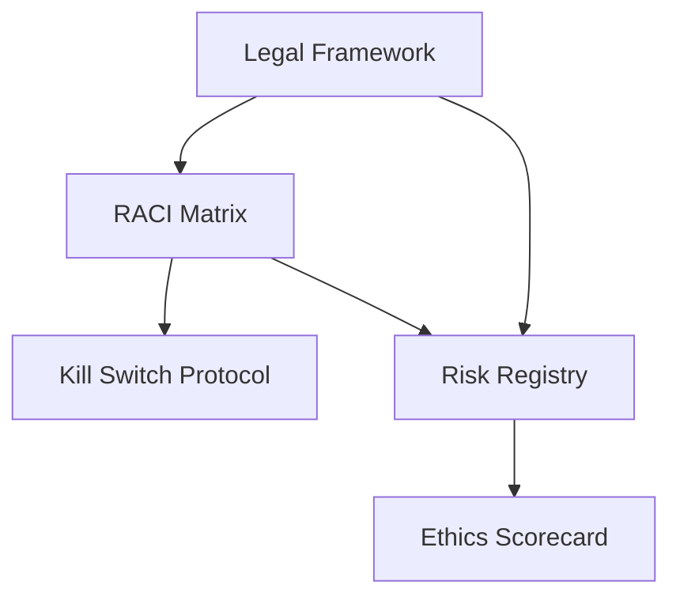

# Volume I: Governance & Legal

## The "Why" - Strategy, Ethics, Liability, and Access Control

This volume establishes the **strategic foundation** for the KOSMOS AI-Native Operating System. It answers critical questions:

- Who has authority to make decisions?
- How do we ensure ethical AI deployment?
- What are our legal liabilities and regulatory obligations?
- How do we manage risk in AI systems?

## Core Documents

### 🎯 [RACI Matrix](raci-matrix.md)
**Purpose:** Define clear accountability for AI system decisions  
**Audience:** Leadership, Legal, Operations  
**Update Frequency:** Quarterly or on organizational changes

Establishes who is:
- **Responsible** - Does the work
- **Accountable** - Ultimately answerable
- **Consulted** - Provides input
- **Informed** - Kept in the loop

### 📊 [AI Ethics Scorecard](ethics-scorecard.md)
**Purpose:** Track fairness, bias, and ethical compliance metrics  
**Audience:** Data Science, Legal, Ethics Committee  
**Update Frequency:** Per model deployment

Key metrics:
- Bias detection scores
- Fairness across demographics
- Transparency ratings
- Explainability scores

### ⚠️ [Risk Registry](risk-registry.md)
**Purpose:** Comprehensive AI risk tracking aligned with NIST AI RMF  
**Audience:** Risk Management, Security, Compliance  
**Update Frequency:** Monthly review, immediate updates for critical risks

Covers:
- Technical risks (model drift, hallucination)
- Operational risks (downtime, performance)
- Legal/Compliance risks (GDPR, EU AI Act)
- Reputational risks

### 🔴 [Kill Switch Protocol](kill-switch-protocol.md)
**Purpose:** Emergency shutdown procedures for AI systems  
**Audience:** Executive Leadership, Security Operations  
**Update Frequency:** Annually, tested quarterly

Critical for:
- Security incidents
- Regulatory violations
- Ethical breaches
- System malfunctions

### ⚖️ [Legal Framework](legal-framework.md)
**Purpose:** Licensing, liability, and regulatory compliance structure  
**Audience:** Legal Team, Compliance, Leadership  
**Update Frequency:** As regulations change

Includes:
- Software licensing
- Data protection obligations
- AI-specific regulations (EU AI Act, etc.)
- Liability frameworks

---

## Compliance Standards

KOSMOS Governance is aligned with:

- **NIST AI Risk Management Framework (AI RMF)**
- **ISO 42001** - AI Management System
- **EU AI Act** - High-Risk AI Systems
- **GDPR** - Data Protection
- **SOC 2** - Security & Availability

---

## Quick Actions

!!! tip "Getting Started"
    1. **Week 1:** Complete RACI Matrix with stakeholders
    2. **Week 2:** Initialize Risk Registry with top 10 risks
    3. **Week 3:** Set up Ethics Scorecard baseline
    4. **Week 4:** Review and approve Kill Switch Protocol

!!! warning "Critical Requirements"
    - [ ] RACI Matrix approved by C-Suite
    - [ ] Risk Registry reviewed monthly
    - [ ] Ethics Scorecard automated via CI/CD
    - [ ] Kill Switch tested quarterly

---

## Document Dependencies

**Read Next:** [RACI Matrix →](raci-matrix.md)
