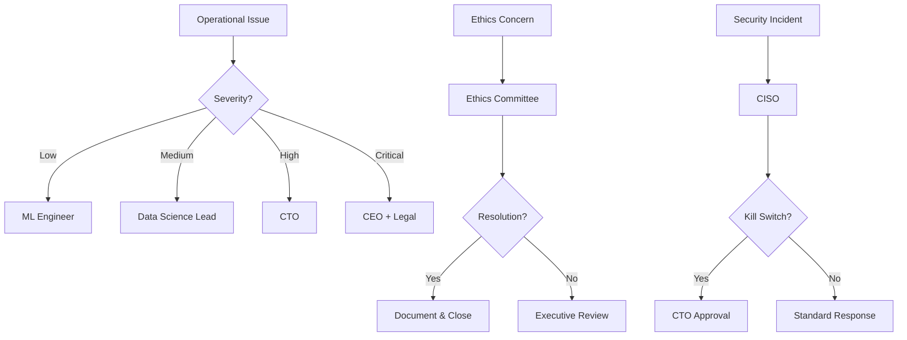

# RACI Matrix

## Overview

The RACI Matrix defines **clear accountability** for all AI system decisions and operations. Every stakeholder must understand their role in the AI governance framework.

**RACI Legend:**
- **R** - Responsible: Does the work to complete the task
- **A** - Accountable: Ultimately answerable for correct and thorough completion
- **C** - Consulted: Provides input and expertise
- **I** - Informed: Kept up-to-date on progress

!!! warning "Golden Rule"
    Each activity must have **exactly one** person who is Accountable (A). Multiple people can be Responsible (R), but accountability cannot be shared.

---

## Core Decision Matrix

### AI System Lifecycle Decisions

| Decision/Activity | CTO | CISO | Legal | Data Science Lead | ML Engineer | Product Owner | Ethics Committee |
|-------------------|-----|------|-------|-------------------|-------------|---------------|------------------|
| **Model Selection** | A | C | C | R | C | I | C |
| **Production Deployment** | A | C | I | R | R | C | I |
| **Emergency Shutdown (Kill Switch)** | A | R | I | C | I | I | C |
| **Data Collection Authorization** | C | C | A | R | I | C | R |
| **Privacy Impact Assessment** | C | A | R | C | I | C | C |
| **Bias/Fairness Review** | I | C | C | R | C | I | A |
| **Third-Party Model Integration** | A | C | R | C | R | C | C |
| **Budget Allocation (AI Infrastructure)** | A | I | I | C | I | R | I |
| **Regulatory Compliance Review** | C | C | A | C | I | I | C |
| **Prompt Engineering Standards** | C | I | C | A | R | C | I |
| **Model Monitoring & Drift Detection** | C | C | I | A | R | I | I |
| **Incident Response (AI-related)** | C | A | C | R | R | I | I |
| **Ethics Violation Escalation** | I | C | C | C | I | I | A |
| **User-Facing AI Features** | C | I | C | C | C | A | C |
| **Training Data Retention Policy** | C | C | A | C | I | I | C |

---

## Operational Activities

### Day-to-Day AI Operations

| Activity | DevOps Lead | ML Engineer | Data Engineer | QA Lead | Support Team |
|----------|-------------|-------------|---------------|---------|--------------|
| **Model Training Pipeline Execution** | C | A/R | R | I | I |
| **Feature Engineering** | I | R | A/R | C | I |
| **Data Quality Validation** | C | C | A/R | R | I |
| **Model Performance Monitoring** | R | A | C | C | I |
| **Alert Response (Non-Critical)** | A/R | C | C | I | I |
| **Cost Optimization** | A | C | C | I | I |
| **Infrastructure Scaling** | A/R | C | C | I | I |
| **API Rate Limiting** | A/R | C | C | C | I |
| **Log Analysis** | R | C | C | C | A |
| **User Feedback Integration** | C | C | I | C | A/R |

---

## Governance & Compliance

### Strategic & Oversight Activities

| Activity | CEO | CTO | CFO | Legal/Compliance | Ethics Committee | Board of Directors |
|----------|-----|-----|-----|------------------|------------------|--------------------|
| **AI Strategy Approval** | A | R | C | C | C | I |
| **Annual Risk Review** | A | R | C | C | R | I |
| **Regulatory Filing** | C | C | I | A/R | C | I |
| **Ethics Policy Updates** | C | C | I | C | A/R | I |
| **High-Risk AI Classification** | C | R | I | C | A | I |
| **Major Incident Review** | A | R | I | C | C | C |
| **Vendor Selection (AI Services)** | C | A | C | C | I | I |
| **AI Budget Approval** | A | R | R | I | I | C |
| **Whistleblower Investigation** | A | C | I | R | R | I |
| **Public AI Transparency Reports** | A | R | I | R | C | C |

---

## Escalation Path



---

## Contact Directory

!!! info "Stakeholder Contacts"
    Maintain up-to-date contact information for all RACI participants. Update this section quarterly.

### Executive Leadership
- **CEO:** ceo@nuvanta-holding.com
- **CTO:** cto@nuvanta-holding.com
- **CISO:** ciso@nuvanta-holding.com
- **CFO:** cfo@nuvanta-holding.com

### Technical Leadership
- **Data Science Lead:** data-science@nuvanta-holding.com
- **DevOps Lead:** devops@nuvanta-holding.com
- **Engineering Manager:** engineering@nuvanta-holding.com

### Compliance & Legal
- **General Counsel:** legal@nuvanta-holding.com
- **Compliance Officer:** compliance@nuvanta-holding.com
- **Privacy Officer:** privacy@nuvanta-holding.com

### Ethics & Oversight
- **Ethics Committee Chair:** ethics@nuvanta-holding.com
- **Ethics Committee:** ethics@nuvanta-holding.com

---

## Decision-Making Principles

### 1. Speed vs. Caution Trade-off
- **Experimental/R&D:** Fast iteration, minimal approval
- **Production (Non-Critical):** Standard review process
- **Production (Customer-Facing):** Full governance review
- **High-Risk AI Systems:** Extended review + ethics approval

### 2. Delegation Authority
Accountable parties may delegate Responsible tasks but **never delegate Accountability**.

### 3. Conflict Resolution
If two Accountable parties disagree:
1. Escalate to next level (CTO → CEO)
2. Document disagreement in ADR (see Volume II)
3. Final decision maker: CEO or Board

### 4. Emergency Override
In critical situations (security breach, regulatory emergency):
- **CISO** has authority to override normal process
- **CTO** must be informed within 1 hour
- **Post-mortem** required within 48 hours

---

## Maintenance

**Update Frequency:** Quarterly review, or immediately upon:
- Organizational restructuring
- New AI system deployment
- Regulatory requirement changes
- Audit findings

**Last Reviewed:** 2025-12-11  
**Next Review Due:** 2026-03-11  
**Owner:** CTO

---

## Templates & Tools

### RACI Decision Template
Use this template when adding new activities:

```markdown
| Decision/Activity | Role 1 | Role 2 | Role 3 | ... |
|-------------------|--------|--------|--------|-----|
| [Activity Name]   | A      | R      | C      | I   |

**Rationale:** [Why this RACI assignment?]
**Escalation:** [Who to contact if there's a problem?]
**SLA:** [How quickly must this be completed?]
```

---

**Related Documents:**
- [Kill Switch Protocol](kill-switch-protocol.md) - Emergency authority
- [Risk Registry](risk-registry.md) - Who owns which risks
- [Volume IV: Incident Response](../04-operations/incident-response/README.md) - Operational procedures

**Next:** [AI Ethics Scorecard →](ethics-scorecard.md)
