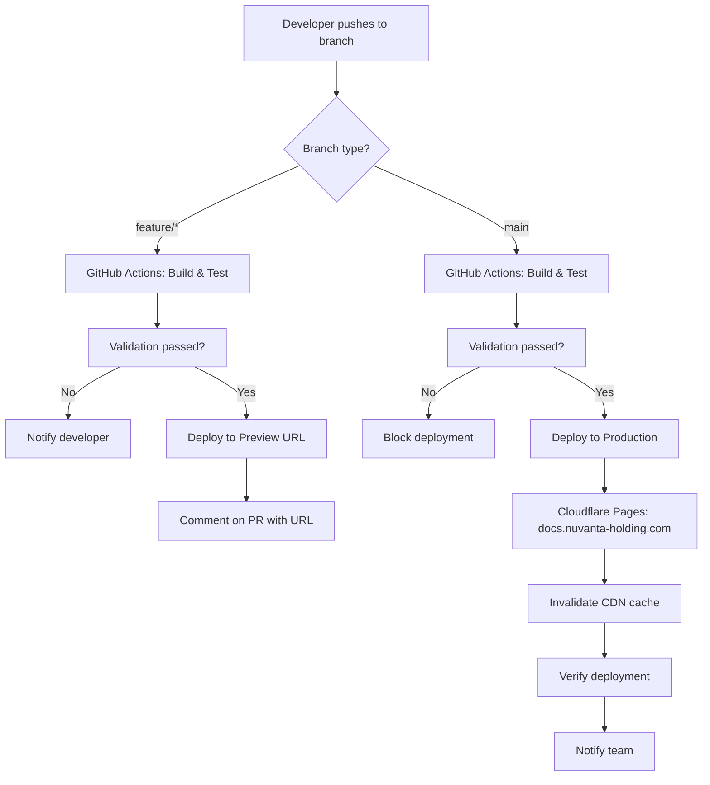

# ADR-003: Deployment Pipeline Architecture

**Status:** Accepted  
**Date:** 2025-12-11  
**Deciders:** Chief Technology Officer, DevOps Team, Security Team  
**Technical Story:** [KOSMOS-CI-001] Need for automated, secure deployment pipeline

---

## Context and Problem Statement

KOSMOS documentation requires a robust CI/CD pipeline that:

- **Automates Deployment:** Push to `main` → automatic deployment
- **Validates Quality:** Run tests, linting, and validation before deployment
- **Ensures Security:** Scan for secrets, vulnerabilities, and compliance issues
- **Provides Visibility:** Clear deployment status and rollback capability
- **Supports Preview:** Preview changes before merging to production
- **Maintains Compliance:** Audit trail of all deployments (ISO 42001)
- **Minimizes Downtime:** Zero-downtime deployments
- **Scales Efficiently:** Handle growing documentation and traffic

The key decisions are:

1. **Which CI/CD platform?** (GitHub Actions, GitLab CI, Jenkins, CircleCI)
2. **Which hosting platform?** (Cloudflare Pages, GitHub Pages, Netlify, Vercel)
3. **What validation steps?** (Build, lint, test, security scan)
4. **How to handle rollback?** (Git revert, platform rollback, feature flags)

---

## Decision Drivers

- **Integration:** Seamless integration with Git hosting (GitHub)
- **Cost:** Prefer usage-based pricing with generous free tier
- **Performance:** Fast builds (<5 minutes) and deployments
- **Reliability:** 99.9%+ uptime SLA
- **Developer Experience:** Easy to configure and debug
- **Security:** Built-in security scanning and secrets management
- **Preview Deployments:** Automatic preview for pull requests
- **Compliance:** Audit logs and deployment history
- **Global CDN:** Fast content delivery worldwide

---

## Decision 1: CI/CD Platform

### Considered Options

#### Option 1: GitHub Actions ⭐ (Selected)

**Pros:**
- ✅ Native GitHub integration (no additional accounts)
- ✅ Excellent ecosystem of actions (marketplace)
- ✅ Free for public repos, 2000 min/month for private
- ✅ Matrix builds for testing multiple environments
- ✅ Secrets management built-in
- ✅ YAML-based configuration (easy to version)
- ✅ Parallel job execution
- ✅ Self-hosted runners option
- ✅ Great documentation and community

**Cons:**
- ❌ Limited to GitHub (vendor lock-in)
- ❌ Usage limits on free tier (2000 min/month)

**Cost:** $0 (within free tier limits)

---

#### Option 2: GitLab CI

**Pros:**
- ✅ Integrated with GitLab
- ✅ Good performance
- ✅ Generous free tier (400 min/month)

**Cons:**
- ❌ Requires GitLab (we chose GitHub)
- ❌ Additional platform to manage

**Cost:** $0-$29/user/month

**Decision:** Rejected - using GitHub, not GitLab

---

#### Option 3: Jenkins

**Pros:**
- ✅ Highly customizable
- ✅ Large plugin ecosystem
- ✅ Self-hosted (full control)

**Cons:**
- ❌ High operational burden
- ❌ Requires dedicated infrastructure
- ❌ Configuration complexity
- ❌ Less modern UI/UX

**Cost:** Infrastructure costs ($100-500/month)

**Decision:** Rejected - operational overhead too high

---

#### Option 4: CircleCI

**Pros:**
- ✅ Fast builds
- ✅ Good Docker support
- ✅ Free tier available

**Cons:**
- ❌ Additional service to manage
- ❌ Less integrated with GitHub
- ❌ Limited free tier (2500 credits/week)

**Cost:** $0-$30/month

**Decision:** Rejected - GitHub Actions more integrated

---

### Decision Outcome: GitHub Actions

**Rationale:**
- Native GitHub integration (no additional login)
- Free tier sufficient for documentation builds
- Excellent marketplace of pre-built actions
- YAML configuration in repo (version controlled)
- Secrets management integrated

---

## Decision 2: Hosting Platform

### Considered Options

#### Option 1: Cloudflare Pages ⭐ (Selected)

**Pros:**
- ✅ **Free tier:** Unlimited sites, unlimited bandwidth
- ✅ **Global CDN:** 310+ data centers worldwide
- ✅ **Performance:** Sub-100ms response times
- ✅ **Security:** DDoS protection, SSL/TLS automatic
- ✅ **Preview deploys:** Automatic for every PR
- ✅ **Custom domains:** Easy DNS management
- ✅ **Build integration:** GitHub integration built-in
- ✅ **Analytics:** Basic analytics included
- ✅ **99.99% uptime SLA**

**Cons:**
- ❌ 500 builds/month limit (free tier)
- ❌ 1 concurrent build (free tier)

**Cost:** $0 (within free tier)

---

#### Option 2: GitHub Pages

**Pros:**
- ✅ Native GitHub integration
- ✅ Free for public repos
- ✅ Simple setup
- ✅ Jekyll support built-in

**Cons:**
- ❌ Single site per repo limitation
- ❌ No preview deployments
- ❌ Slower CDN vs. Cloudflare
- ❌ Limited custom build process
- ❌ 100 GB bandwidth/month soft limit

**Cost:** $0

**Decision:** Rejected - no preview deployments, slower CDN

---

#### Option 3: Netlify

**Pros:**
- ✅ Excellent developer experience
- ✅ Preview deployments
- ✅ Form handling and functions
- ✅ Good analytics

**Cons:**
- ❌ 100 GB bandwidth/month limit
- ❌ 300 build minutes/month (free tier)
- ❌ Pricing scales with usage

**Cost:** $0-19/month

**Decision:** Rejected - bandwidth limits, Cloudflare CDN superior

---

#### Option 4: Vercel

**Pros:**
- ✅ Excellent for Next.js
- ✅ Great developer experience
- ✅ Preview deployments
- ✅ Edge functions

**Cons:**
- ❌ 100 GB bandwidth/month limit
- ❌ Optimized for JavaScript frameworks
- ❌ Less suitable for static sites

**Cost:** $0-20/month

**Decision:** Rejected - not optimized for MkDocs, bandwidth limits

---

### Decision Outcome: Cloudflare Pages

**Rationale:**
- Best global CDN (310+ locations)
- Unlimited bandwidth (free tier)
- Automatic preview deployments
- 99.99% uptime SLA
- Sub-100ms response times
- Free SSL/TLS certificates
- DDoS protection included

**Custom Domain:** https://docs.nuvanta-holding.com

---

## Pipeline Architecture

### Deployment Flow



---

## CI/CD Workflow Configuration

### Main Workflow (.github/workflows/deploy.yml)

```yaml
name: Deploy Documentation

on:
  push:
    branches:
      - main
  pull_request:
    branches:
      - main

jobs:
  # Job 1: Build and validate
  build:
    name: Build Documentation
    runs-on: ubuntu-latest
    
    steps:
      - name: Checkout repository
        uses: actions/checkout@v4
        with:
          fetch-depth: 0  # Full history for git-revision-date plugin
      
      - name: Set up Python
        uses: actions/setup-python@v5
        with:
          python-version: '3.11'
          cache: 'pip'
      
      - name: Install dependencies
        run: |
          pip install --upgrade pip
          pip install -r requirements.txt
      
      - name: Build documentation (strict mode)
        run: mkdocs build --strict
      
      - name: Upload build artifacts
        uses: actions/upload-artifact@v4
        with:
          name: site
          path: site/
          retention-days: 7
  
  # Job 2: Lint markdown
  lint:
    name: Lint Markdown
    runs-on: ubuntu-latest
    
    steps:
      - name: Checkout repository
        uses: actions/checkout@v4
      
      - name: Lint markdown files
        uses: DavidAnson/markdownlint-cli2-action@v14
        with:
          globs: '**/*.md'
          config: '.markdownlint.json'
  
  # Job 3: Validate links
  validate-links:
    name: Validate Links
    runs-on: ubuntu-latest
    needs: build
    
    steps:
      - name: Download build artifacts
        uses: actions/download-artifact@v4
        with:
          name: site
          path: site/
      
      - name: Check links
        uses: lycheeverse/lychee-action@v1
        with:
          args: --verbose --no-progress 'site/**/*.html'
          fail: true
  
  # Job 4: Security scan
  security:
    name: Security Scan
    runs-on: ubuntu-latest
    
    steps:
      - name: Checkout repository
        uses: actions/checkout@v4
      
      - name: Run Trivy vulnerability scanner
        uses: aquasecurity/trivy-action@master
        with:
          scan-type: 'fs'
          scan-ref: '.'
          format: 'sarif'
          output: 'trivy-results.sarif'
      
      - name: Upload Trivy results to GitHub Security
        uses: github/codeql-action/upload-sarif@v3
        with:
          sarif_file: 'trivy-results.sarif'
      
      - name: Check for secrets
        uses: trufflesecurity/trufflehog@main
        with:
          path: ./
          base: ${{ github.event.repository.default_branch }}
          head: HEAD
  
  # Job 5: Deploy to Cloudflare Pages (production)
  deploy-production:
    name: Deploy to Production
    runs-on: ubuntu-latest
    needs: [build, lint, validate-links, security]
    if: github.ref == 'refs/heads/main'
    
    steps:
      - name: Checkout repository
        uses: actions/checkout@v4
      
      - name: Download build artifacts
        uses: actions/download-artifact@v4
        with:
          name: site
          path: site/
      
      - name: Deploy to Cloudflare Pages
        uses: cloudflare/pages-action@v1
        with:
          apiToken: ${{ secrets.CLOUDFLARE_API_TOKEN }}
          accountId: ${{ secrets.CLOUDFLARE_ACCOUNT_ID }}
          projectName: kosmos-docs
          directory: site
          gitHubToken: ${{ secrets.GITHUB_TOKEN }}
      
      - name: Verify deployment
        run: |
          sleep 10  # Wait for propagation
          STATUS=$(curl -s -o /dev/null -w "%{http_code}" https://docs.nuvanta-holding.com)
          if [ $STATUS -eq 200 ]; then
            echo "✅ Deployment successful"
          else
            echo "❌ Deployment failed (HTTP $STATUS)"
            exit 1
          fi
      
      - name: Notify team
        if: always()
        uses: slackapi/slack-github-action@v1
        with:
          payload: |
            {
              "text": "Documentation deployed to production",
              "status": "${{ job.status }}",
              "url": "https://docs.nuvanta-holding.com"
            }
        env:
          SLACK_WEBHOOK_URL: ${{ secrets.SLACK_WEBHOOK_URL }}
  
  # Job 6: Deploy preview (for PRs)
  deploy-preview:
    name: Deploy Preview
    runs-on: ubuntu-latest
    needs: [build, lint]
    if: github.event_name == 'pull_request'
    
    steps:
      - name: Checkout repository
        uses: actions/checkout@v4
      
      - name: Download build artifacts
        uses: actions/download-artifact@v4
        with:
          name: site
          path: site/
      
      - name: Deploy preview to Cloudflare Pages
        id: deploy
        uses: cloudflare/pages-action@v1
        with:
          apiToken: ${{ secrets.CLOUDFLARE_API_TOKEN }}
          accountId: ${{ secrets.CLOUDFLARE_ACCOUNT_ID }}
          projectName: kosmos-docs
          directory: site
          gitHubToken: ${{ secrets.GITHUB_TOKEN }}
      
      - name: Comment PR with preview URL
        uses: actions/github-script@v7
        with:
          github-token: ${{ secrets.GITHUB_TOKEN }}
          script: |
            github.rest.issues.createComment({
              issue_number: context.issue.number,
              owner: context.repo.owner,
              repo: context.repo.repo,
              body: '## 🚀 Preview Deployment\n\nYour changes are ready for review!\n\n' +
                    `🔗 **Preview URL:** ${{ steps.deploy.outputs.url }}\n\n` +
                    '✅ Build successful\n' +
                    '✅ Linting passed\n' +
                    '✅ Security scan passed\n\n' +
                    '_Preview will be automatically deleted when PR is closed._'
            })
```

---

## Validation Steps

### 1. Build Validation

**Purpose:** Ensure documentation builds successfully

**Command:** `mkdocs build --strict`

**Checks:**
- ✅ No broken internal links
- ✅ No missing images
- ✅ Valid YAML frontmatter
- ✅ Mermaid diagrams render
- ✅ No markdown syntax errors

**Failure Action:** Block deployment, notify developer

---

### 2. Markdown Linting

**Purpose:** Enforce markdown style consistency

**Tool:** markdownlint-cli2

**Configuration (.markdownlint.json):**
```json
{
  "default": true,
  "MD013": false,
  "MD033": false,
  "MD041": false,
  "line-length": false,
  "no-inline-html": false,
  "first-line-heading": false
}
```

**Rules Enforced:**
- Consistent heading styles
- No trailing spaces
- Proper list formatting
- Code block language specification

---

### 3. Link Validation

**Purpose:** Detect broken external links

**Tool:** Lychee

**Configuration:**
- Check all `<a>` tags in HTML
- Timeout: 30 seconds per link
- Retry: 3 times
- Exclude: localhost, nuvanta-holding.com

**Failure Action:** Warning (non-blocking for external links)

---

### 4. Security Scanning

**Purpose:** Detect vulnerabilities and secrets

**Tools:**
- **Trivy:** Vulnerability scanner for dependencies
- **TruffleHog:** Secret detection in commits

**Scans:**
- Python dependencies (requirements.txt)
- Secrets in commit history
- API keys, tokens, passwords
- Hardcoded credentials

**Failure Action:** Block deployment, create security alert

---

## Secrets Management

### Required Secrets

Stored in GitHub repository settings (Settings > Secrets > Actions):

| Secret Name | Purpose | Rotation Schedule |
|-------------|---------|-------------------|
| `CLOUDFLARE_API_TOKEN` | Deploy to Cloudflare Pages | 90 days |
| `CLOUDFLARE_ACCOUNT_ID` | Cloudflare account identifier | Never (not sensitive) |
| `SLACK_WEBHOOK_URL` | Deployment notifications | 180 days |
| `GITHUB_TOKEN` | Automatic (provided by GitHub) | Automatic |

**Security Best Practices:**
- ✅ Use scoped tokens (minimum required permissions)
- ✅ Rotate secrets quarterly
- ✅ Monitor secret usage in audit logs
- ✅ Never log secrets in workflow output
- ✅ Use environment-specific secrets for staging/prod

---

## Deployment Environments

### Production

**URL:** https://docs.nuvanta-holding.com  
**Branch:** `main`  
**Deployment:** Automatic on merge to main  
**CDN:** Cloudflare (310+ locations)  
**SSL:** Automatic (Let's Encrypt via Cloudflare)

**Protection:**
- Branch protection rules enabled
- Required status checks
- Required code review
- No force pushes

---

### Preview (Per-PR)

**URL:** `https://<commit-hash>.kosmos-docs.pages.dev`  
**Branch:** Any feature branch with open PR  
**Deployment:** Automatic on PR open/update  
**Lifecycle:** Deleted when PR closed  

**Use Cases:**
- Preview documentation changes
- Share with stakeholders for review
- Test navigation and layout
- Verify Mermaid diagrams

---

## Monitoring and Observability

### Build Metrics

**Tracked Metrics:**
- Build duration (target: <3 minutes)
- Build success rate (target: >95%)
- Deployment frequency (current: 5-10/week)
- Time to deployment (target: <10 minutes)

**Dashboard:** GitHub Actions insights page

---

### Deployment Notifications

**Channels:**
- **Slack:** `#kosmos-deployments` channel
- **GitHub:** Commit status checks
- **Email:** On failure only

**Notification Content:**
- Deployment status (success/failure)
- Deployment URL
- Commit SHA and message
- Build duration
- Link to workflow run

---

## Rollback Procedures

### Strategy 1: Git Revert (Preferred)

**Process:**
```bash
# Identify problematic commit
git log

# Revert the commit
git revert <commit-sha>

# Push revert commit
git push origin main

# Automatic redeployment triggered
```

**Advantages:**
- ✅ Preserves history
- ✅ Reversible
- ✅ Audit trail maintained

**Time to Rollback:** 5-10 minutes

---

### Strategy 2: Cloudflare Pages Rollback

**Process:**
1. Go to Cloudflare Pages dashboard
2. Select `kosmos-docs` project
3. Navigate to "Deployments" tab
4. Find previous successful deployment
5. Click "..." → "Rollback to this deployment"

**Advantages:**
- ✅ Instant rollback (no rebuild)
- ✅ No Git changes needed

**Disadvantages:**
- ❌ Main branch still has bad commit
- ❌ Next deployment will re-deploy bad version

**Time to Rollback:** 1-2 minutes

**Use Case:** Emergency rollback while preparing proper revert

---

## Performance Optimization

### Build Optimization

**Current Build Time:** 2.56 seconds

**Optimization Techniques:**
- ✅ Dependency caching (pip cache)
- ✅ Incremental builds (not needed for small docs)
- ✅ Parallel jobs (lint + build simultaneously)
- ✅ Artifact reuse (build once, deploy multiple times)

---

### Deployment Optimization

**Cloudflare Optimizations:**
- ✅ Brotli compression (automatic)
- ✅ HTTP/2 (automatic)
- ✅ Edge caching (automatic)
- ✅ Auto-minify HTML/CSS/JS (enabled)

**Expected Performance:**
- **TTFB (Time to First Byte):** <50ms
- **FCP (First Contentful Paint):** <1s
- **LCP (Largest Contentful Paint):** <2.5s

---

## Cost Analysis

### Monthly Costs

| Service | Usage | Cost |
|---------|-------|------|
| GitHub Actions | ~1000 min/month | $0 (within free tier) |
| Cloudflare Pages | Unlimited bandwidth, 500 builds | $0 (free tier) |
| Cloudflare DNS | Domain hosting | $0 (included) |
| **Total** | | **$0/month** |

**Future Scaling:**
- If builds exceed 2000 min/month: $0.008/minute
- If builds exceed 500/month: Cloudflare Pages Pro ($20/month)

**Estimated at 100 developers:** Still $0/month (well within limits)

---

## Compliance and Audit

### Deployment Audit Trail

**Recorded Information:**
- Timestamp of deployment
- Deploying user (GitHub actor)
- Commit SHA deployed
- Build duration
- Test results
- Security scan results

**Retention:** 90 days in GitHub, 3 years in S3 export

**Compliance Mapping:**
- **ISO 42001:** Change management (documented)
- **SOC 2:** Deployment controls (automated)
- **GDPR Article 32:** Security measures (scanning)

---

## Disaster Recovery

### Failure Scenarios

#### 1. Build Failure

**Detection:** Automated (GitHub Actions)  
**Notification:** Slack + Email  
**Resolution:** Developer fixes issue, pushes update  
**Impact:** No deployment, production unaffected

---

#### 2. Cloudflare Pages Outage

**Detection:** Monitoring (uptime check)  
**Notification:** Cloudflare status page  
**Workaround:** GitHub Pages fallback  
**Impact:** Minimal (99.99% uptime SLA)

**Mitigation:** 
- Static site can be hosted anywhere
- Keep `site/` directory in CI artifacts
- Quick migration to alternate host possible

---

#### 3. GitHub Actions Outage

**Detection:** GitHub status page  
**Workaround:** Manual deployment  
**Impact:** Delayed deployments (non-critical)

**Manual Deployment Process:**
```bash
# Local machine
mkdocs build
wrangler pages publish site --project-name=kosmos-docs
```

---

## Future Enhancements

### Planned Improvements

**Q1 2026:**
- [ ] Add performance testing (Lighthouse CI)
- [ ] Implement visual regression testing
- [ ] Add automated accessibility checks (axe-core)
- [ ] Set up synthetic monitoring

**Q2 2026:**
- [ ] Add staging environment
- [ ] Implement blue-green deployments
- [ ] Add deployment metrics dashboard
- [ ] Integrate with Datadog/New Relic

**Q3 2026:**
- [ ] Multi-region deployment
- [ ] A/B testing capability
- [ ] Automated changelog generation
- [ ] Release notes automation

---

## Consequences

### Positive

- ✅ **Zero Manual Effort:** Push → automated deployment
- ✅ **Fast Feedback:** Build results in <5 minutes
- ✅ **Preview Deployments:** Review changes before merge
- ✅ **High Reliability:** 99.99% uptime SLA
- ✅ **Security:** Automated scanning catches issues early
- ✅ **Cost-Effective:** $0/month for all services
- ✅ **Global Performance:** Sub-100ms response times
- ✅ **Audit Trail:** Full deployment history

### Negative

- ⚠️ **Build Limits:** 500 builds/month (unlikely to hit)
- ⚠️ **Vendor Lock-in:** Cloudflare Pages specific (but portable static site)
- ⚠️ **Complexity:** Multiple tools to learn initially

### Neutral

- 📊 **GitHub Dependency:** Tied to GitHub (acceptable given Git is portable)

---

## Related Decisions

- [ADR-001: Documentation Framework Selection](ADR-001-documentation-framework.md)
- [ADR-002: Version Control Strategy](ADR-002-version-control-strategy.md)

---

## References

### External Resources

- **GitHub Actions Documentation:** https://docs.github.com/en/actions
- **Cloudflare Pages Documentation:** https://developers.cloudflare.com/pages
- **MkDocs Deployment:** https://www.mkdocs.org/user-guide/deploying-your-docs/

### Internal Documents

- [CLOUDFLARE_DEPLOYMENT.md](https://github.com/Nuvanta-Holding/kosmos-docs/blob/main/CLOUDFLARE_DEPLOYMENT.md)
- [.github/workflows/deploy.yml](https://github.com/Nuvanta-Holding/kosmos-docs/blob/main/.github/workflows/deploy.yml)

---

## Change Log

| Date | Version | Author | Change Description |
|------|---------|--------|-------------------|
| 2025-12-11 | 1.0 | Architecture Team | Initial decision document |

---

**Decision Owner:** Chief Technology Officer  
**Implementation Lead:** DevOps Lead  
**Review Date:** 2026-06-11 (6 months)

---

**Notes:**

This ADR can be revised if:
- Build times exceed 10 minutes consistently
- Cloudflare Pages becomes unreliable
- Cost exceeds $100/month
- Better alternatives emerge with compelling advantages

**Current Implementation Status:**
- GitHub Actions: ⏳ Workflow file to be created
- Cloudflare Pages: ✅ Connected to GitHub
- Branch protection: ✅ Enabled
- Secrets configured: ⏳ In progress
- Monitoring: ⏳ To be implemented
