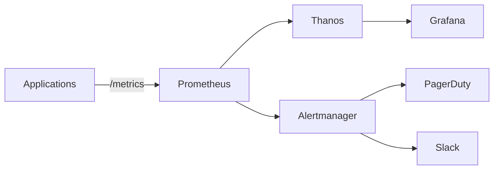

# ADR-007: Observability Stack Selection

**Status:** Accepted  
**Date:** 2025-12-12  
**Deciders:** Chief Technology Officer, DevOps Team, SRE Team  
**Technical Story:** [KOSMOS-OPS-001] Need for comprehensive observability across AI systems

---

## Context and Problem Statement

KOSMOS requires comprehensive observability to monitor:

- **Metrics** - System and application performance
- **Logs** - Application logs, audit trails
- **Traces** - Distributed request tracing
- **AI-Specific** - Model performance, drift detection, cost tracking

The key decision is: **Which observability stack should KOSMOS adopt?**

---

## Decision Drivers

- **AI-Native** - Support for ML-specific metrics
- **Scalability** - Handle high-volume telemetry
- **Cost** - Balance features vs. expense
- **Integration** - Work with existing tools
- **Alerting** - Robust alerting capabilities
- **Visualization** - Rich dashboards

---

## Decision Outcome

### Observability Stack

```yaml
observability_stack:
  metrics:
    collection: "Prometheus"
    storage: "Prometheus + Thanos"
    visualization: "Grafana"
    
  logs:
    collection: "Fluentd"
    storage: "Elasticsearch"
    visualization: "Kibana"
    
  traces:
    collection: "OpenTelemetry"
    storage: "Jaeger"
    visualization: "Jaeger UI"
    
  ai_observability:
    model_monitoring: "Custom + Prometheus"
    drift_detection: "Evidently AI"
    cost_tracking: "Custom FinOps Dashboard"
    
  alerting:
    primary: "Alertmanager"
    paging: "PagerDuty"
    chat: "Slack"
```

---

## Component Details

### 1. Metrics: Prometheus + Grafana

**Architecture:**


**Key Metrics:**
```yaml
ai_metrics:
  - kosmos_model_latency_seconds
  - kosmos_model_requests_total
  - kosmos_model_errors_total
  - kosmos_token_usage_total
  - kosmos_cost_usd_total
  - kosmos_accuracy_score
  - kosmos_drift_score
```

### 2. Logs: EFK Stack

**Log Format (Structured JSON):**
```json
{
  "timestamp": "2025-12-12T10:30:00Z",
  "level": "INFO",
  "service": "document-summarizer",
  "model_id": "MC-001",
  "request_id": "req-123",
  "user_id": "user-456",
  "tokens_in": 450,
  "tokens_out": 125,
  "latency_ms": 850,
  "message": "Summarization completed"
}
```

### 3. Traces: OpenTelemetry + Jaeger

**Trace Propagation:**
```python
from opentelemetry import trace

tracer = trace.get_tracer("kosmos.models")

@tracer.start_as_current_span("summarize_document")
def summarize_document(document):
    with tracer.start_as_current_span("tokenize"):
        tokens = tokenize(document)
    
    with tracer.start_as_current_span("llm_inference"):
        response = call_llm(tokens)
    
    with tracer.start_as_current_span("post_process"):
        result = format_response(response)
    
    return result
```

### 4. AI-Specific Observability

**Model Performance Dashboard:**
```yaml
dashboards:
  model_health:
    panels:
      - accuracy_over_time
      - latency_percentiles
      - error_rate
      - token_usage
      - cost_per_request
      
  drift_detection:
    panels:
      - data_drift_score
      - prediction_drift
      - feature_drift_heatmap
      - retraining_recommendations
      
  finops:
    panels:
      - daily_cost_by_model
      - cost_per_request_trend
      - budget_utilization
      - cost_anomalies
```

---

## Alerting Strategy

### Alert Levels

| Level | Response Time | Notification |
|-------|---------------|--------------|
| Critical (P0) | 5 min | PagerDuty + Slack + Email |
| High (P1) | 15 min | PagerDuty + Slack |
| Medium (P2) | 1 hour | Slack |
| Low (P3) | 24 hours | Email |

### Example Alerts

```yaml
alerts:
  - name: ModelLatencyHigh
    expr: histogram_quantile(0.95, kosmos_model_latency_seconds) > 2
    for: 5m
    severity: high
    
  - name: ModelErrorRateHigh
    expr: rate(kosmos_model_errors_total[5m]) / rate(kosmos_model_requests_total[5m]) > 0.02
    for: 5m
    severity: critical
    
  - name: DriftDetected
    expr: kosmos_drift_score > 0.3
    for: 1h
    severity: medium
    
  - name: CostBudgetExceeded
    expr: kosmos_monthly_cost_usd > 300000
    for: 1h
    severity: high
```

---

## Cost Estimates

| Component | Monthly Cost | Notes |
|-----------|--------------|-------|
| Prometheus/Thanos | $500 | Self-hosted on K8s |
| Grafana | $0 | OSS version |
| Elasticsearch | $2,000 | 3-node cluster |
| Jaeger | $300 | Self-hosted |
| PagerDuty | $500 | Team plan |
| **Total** | **$3,300** | |

---

## Consequences

### Positive

- Unified observability across all services
- AI-specific monitoring built-in
- Cost visibility and optimization
- Proactive drift detection

### Negative

- Multiple tools to maintain
- Learning curve for team
- Storage costs for telemetry

---

## Related Decisions

- [ADR-005: Data Storage Selection](ADR-005-data-storage-selection.md)
- [ADR-008: API Versioning Strategy](ADR-008-api-versioning-strategy.md)

---

**Last Updated:** 2025-12-12  
**Review Cycle:** Annually
