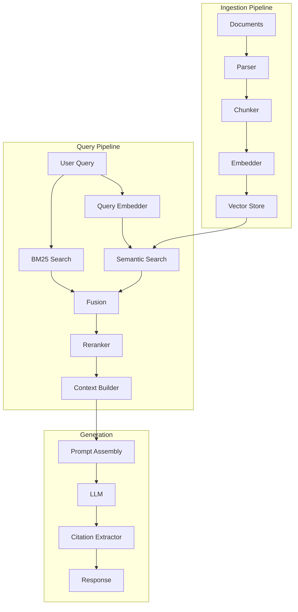

# ADR-011: RAG Architecture Design

**Status:** Accepted  
**Date:** 2025-10-15  
**Deciders:** Chief Architect, ML Lead, Data Team  
**Technical Area:** Knowledge Management

---

## Context

KOSMOS requires Retrieval-Augmented Generation (RAG) capabilities to enable agents to access and utilize enterprise knowledge effectively. The RAG system must address:

- Document ingestion and preprocessing
- Text chunking and embedding generation
- Vector storage and retrieval
- Context window optimization
- Response grounding and citation

Key decisions required:
1. Chunking strategy and size
2. Embedding model selection
3. Vector database selection
4. Retrieval algorithm
5. Reranking approach

---

## Decision

We will implement a **hybrid RAG architecture** with the following core decisions:

### 1. Chunking Strategy

**Decision:** Semantic chunking with recursive character splitting as fallback

```python
# Primary: Semantic chunking
semantic_chunker = SemanticChunker(
    embedding_model=embedding_model,
    breakpoint_threshold=0.5,
    min_chunk_size=100,
    max_chunk_size=1000
)

# Fallback: Recursive character splitting
recursive_splitter = RecursiveCharacterTextSplitter(
    chunk_size=512,
    chunk_overlap=50,
    separators=["\n\n", "\n", ". ", " "]
)
```

### 2. Embedding Model

**Decision:** `sentence-transformers/all-mpnet-base-v2` for production

| Model | Dimensions | Performance | Latency | Cost |
|-------|------------|-------------|---------|------|
| all-mpnet-base-v2 | 768 | Excellent | 15ms | Free |
| text-embedding-3-small | 1536 | Excellent | 50ms | $0.02/1M |
| all-MiniLM-L6-v2 | 384 | Good | 5ms | Free |
| BGE-large | 1024 | Excellent | 25ms | Free |

**Rationale:** Best balance of quality, latency, and cost for enterprise workloads.

### 3. Vector Database

**Decision:** PostgreSQL with pgvector extension

**Rationale:** Consolidates data layer, reduces operational complexity, sufficient performance for current scale.

### 4. Retrieval Strategy

**Decision:** Hybrid search with semantic + keyword (BM25)

```python
# Hybrid retrieval
hybrid_retriever = HybridRetriever(
    semantic_weight=0.7,
    keyword_weight=0.3,
    semantic_retriever=pgvector_retriever,
    keyword_retriever=bm25_retriever,
    fusion="reciprocal_rank"
)
```

### 5. Reranking

**Decision:** Cross-encoder reranking for top-k results

```python
# Reranking pipeline
reranker = CrossEncoderReranker(
    model="cross-encoder/ms-marco-MiniLM-L-6-v2",
    top_k=10,
    threshold=0.3
)
```

---

## Rationale

### Chunking Strategy Selection

| Strategy | Pros | Cons | Use Case |
|----------|------|------|----------|
| Fixed size | Predictable | Context loss | Simple docs |
| Sentence | Preserves meaning | Variable size | Short content |
| Semantic | Best coherence | Compute cost | Complex docs |
| Recursive | Flexible | Tuning needed | Mixed content |

**Selected:** Semantic with recursive fallback provides best coherence while handling edge cases.

### Vector Database Comparison

| Database | Query Latency | Scalability | Ops Complexity | Cost |
|----------|---------------|-------------|----------------|------|
| pgvector | 10-50ms | 10M vectors | Low (existing) | Low |
| Pinecone | 5-20ms | Unlimited | Low (managed) | High |
| Weaviate | 10-30ms | 100M vectors | Medium | Medium |
| Qdrant | 5-25ms | 100M vectors | Medium | Medium |
| Milvus | 5-20ms | Unlimited | High | Medium |

**Selected:** pgvector because we already operate PostgreSQL, reducing operational burden.


---

## Implementation

### RAG Pipeline Architecture



### Schema Design

```sql
-- pgvector schema for RAG
CREATE EXTENSION IF NOT EXISTS vector;

CREATE TABLE documents (
    id UUID PRIMARY KEY DEFAULT gen_random_uuid(),
    tenant_id UUID NOT NULL,
    source_url TEXT,
    title TEXT,
    content TEXT NOT NULL,
    metadata JSONB DEFAULT '{}',
    created_at TIMESTAMPTZ DEFAULT NOW(),
    updated_at TIMESTAMPTZ DEFAULT NOW()
);

CREATE TABLE chunks (
    id UUID PRIMARY KEY DEFAULT gen_random_uuid(),
    document_id UUID REFERENCES documents(id) ON DELETE CASCADE,
    tenant_id UUID NOT NULL,
    content TEXT NOT NULL,
    embedding vector(768),
    chunk_index INTEGER,
    metadata JSONB DEFAULT '{}',
    created_at TIMESTAMPTZ DEFAULT NOW()
);

-- Indexes for efficient retrieval
CREATE INDEX idx_chunks_embedding ON chunks 
    USING ivfflat (embedding vector_cosine_ops)
    WITH (lists = 100);

CREATE INDEX idx_chunks_tenant ON chunks(tenant_id);
CREATE INDEX idx_chunks_document ON chunks(document_id);

-- Full-text search for hybrid retrieval
ALTER TABLE chunks ADD COLUMN content_tsv tsvector
    GENERATED ALWAYS AS (to_tsvector('english', content)) STORED;
CREATE INDEX idx_chunks_fts ON chunks USING gin(content_tsv);
```

### Configuration

```yaml
# rag-config.yaml
rag:
  chunking:
    strategy: semantic
    fallback: recursive
    min_size: 100
    max_size: 1000
    overlap: 50
    
  embedding:
    model: sentence-transformers/all-mpnet-base-v2
    dimensions: 768
    batch_size: 32
    normalize: true
    
  retrieval:
    semantic_weight: 0.7
    keyword_weight: 0.3
    top_k: 20
    similarity_threshold: 0.5
    
  reranking:
    enabled: true
    model: cross-encoder/ms-marco-MiniLM-L-6-v2
    top_k: 10
    threshold: 0.3
    
  context:
    max_tokens: 4000
    include_metadata: true
    citation_format: "[{index}]"
```

---

## Consequences

### Positive

- **Unified data layer** - pgvector in existing PostgreSQL reduces complexity
- **Cost effective** - Open-source embedding models eliminate API costs
- **Hybrid search** - Combines semantic and keyword for better recall
- **Reranking** - Improves precision significantly
- **Multi-tenancy** - Built-in tenant isolation

### Negative

- **Scale limits** - pgvector less suited for >10M vectors
- **Index rebuilds** - IVF index requires periodic rebuilding
- **Resource usage** - Embedding generation is compute-intensive
- **Latency** - Reranking adds 50-100ms

### Trade-offs

| Factor | Our Choice | Alternative | Trade-off |
|--------|------------|-------------|-----------|
| Vector DB | pgvector | Dedicated vector DB | Simplicity vs scale |
| Embedding | Local model | API-based | Cost vs latency |
| Chunking | Semantic | Fixed | Quality vs speed |
| Retrieval | Hybrid | Semantic only | Recall vs complexity |

---

## Metrics & Monitoring

| Metric | Target | Alert Threshold |
|--------|--------|-----------------|
| Retrieval latency P50 | <100ms | >200ms |
| Retrieval latency P99 | <500ms | >1000ms |
| Embedding latency | <50ms/doc | >100ms/doc |
| Reranking latency | <100ms | >200ms |
| Recall@10 | >0.8 | <0.7 |
| MRR | >0.6 | <0.5 |

---

## References

- [ADR-005: Data Storage Selection](ADR-005-data-storage-selection.md)
- [Athena Agent Specification](../agents/athena-knowledge.md)
- [Data Lineage](../data-lineage.md)

---

**Last Updated:** 2025-12-13  
**Document Owner:** Chief Architect  
**Next Review:** 2026-03-13
