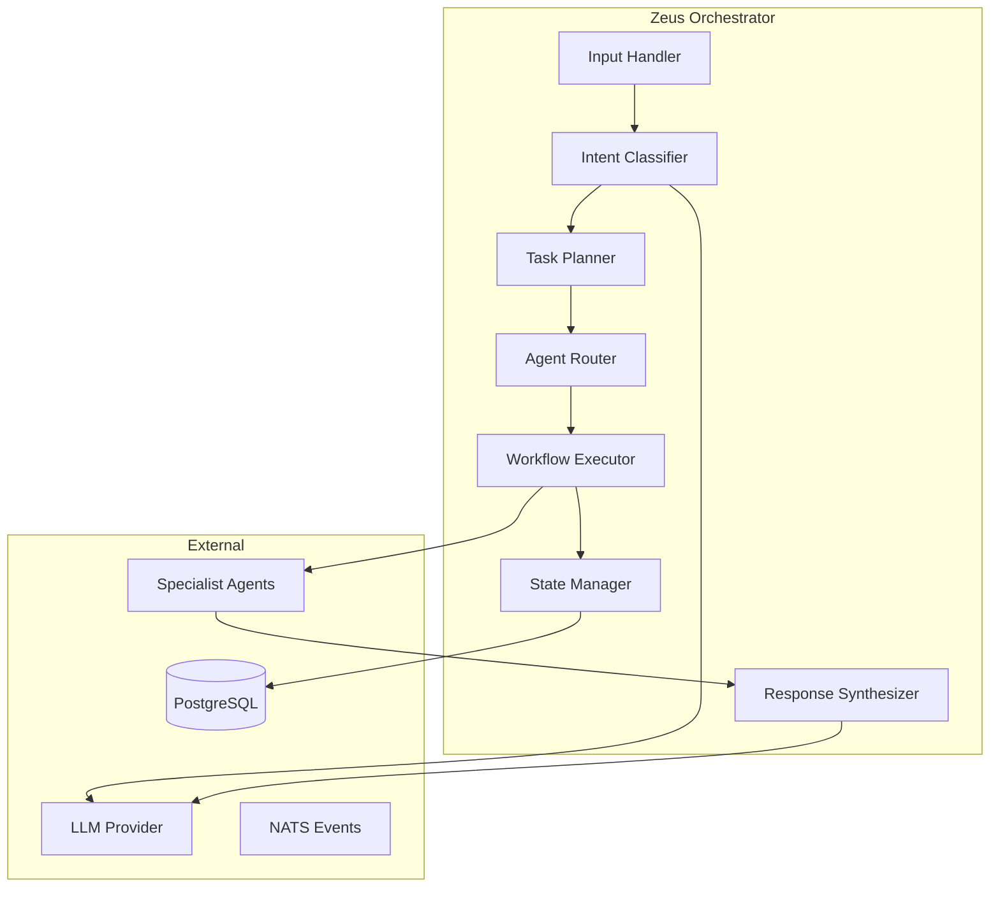
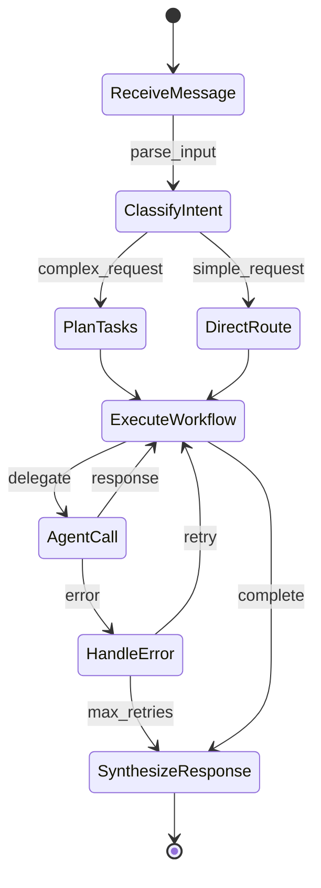

# Zeus Orchestrator Agent

**Domain:** Task Orchestration, Routing & Coordination  
**Greek Deity:** Zeus - King of the Gods, Ruler of Mount Olympus  
**Status:** Active  
**Version:** 2.0.0

---

## Overview

Zeus is the **central orchestrator** of the KOSMOS multi-agent system. Named after the king of the Greek gods, Zeus coordinates all agent interactions, routes requests to appropriate specialists, manages conversation state, and ensures coherent multi-step workflows complete successfully.

Zeus does not perform domain-specific work directly—instead, it excels at understanding intent, decomposing complex requests, delegating to specialists, and synthesizing their responses into coherent outputs.

### Key Capabilities

- **Intent Classification** - Analyze user requests to determine required agents
- **Task Decomposition** - Break complex requests into subtasks for specialists
- **Agent Routing** - Direct requests to the most appropriate agent(s)
- **Response Synthesis** - Combine multi-agent outputs into unified responses
- **Conversation Management** - Maintain context across multi-turn interactions
- **Workflow Orchestration** - Execute multi-step LangGraph workflows
- **Fallback Handling** - Gracefully degrade when agents are unavailable

### When to Use This Agent

| Use Case | Example |
|----------|---------|
| Complex multi-domain requests | "Schedule a meeting and draft an agenda about Q4 security findings" |
| Ambiguous user intent | Requests that could be handled by multiple agents |
| Multi-step workflows | Tasks requiring sequential agent coordination |
| All initial user requests | Every request enters through Zeus |

---

## Interface Specification

### Input Contract

```python
class ZeusInput(BaseModel):
    """Input schema for Zeus orchestrator."""
    user_message: str
    conversation_id: str
    user_context: Optional[UserContext] = None
    routing_hints: Optional[list[str]] = None
    priority: Literal["low", "normal", "high", "critical"] = "normal"
    
    class Config:
        extra = "forbid"


class UserContext(BaseModel):
    """User context for personalization."""
    user_id: str
    tenant_id: str
    roles: list[str]
    preferences: dict = {}
```

### Output Contract

```python
class ZeusOutput(BaseModel):
    """Output schema for Zeus orchestrator."""
    response: str
    agents_used: list[str]
    confidence: float
    follow_up_suggestions: list[str] = []
    metadata: ResponseMetadata


class ResponseMetadata(BaseModel):
    """Metadata about response generation."""
    processing_time_ms: int
    token_usage: TokenUsage
    trace_id: str
    conversation_turn: int
```

### Supported Actions

| Action | Description | Required Params | Returns |
|--------|-------------|-----------------|---------|
| `process_message` | Handle user message | `user_message`, `conversation_id` | Full response |
| `route_to_agent` | Direct routing bypass | `target_agent`, `payload` | Agent response |
| `get_conversation` | Retrieve conversation history | `conversation_id` | Conversation state |
| `reset_conversation` | Clear conversation state | `conversation_id` | Confirmation |

---

## Architecture

### Component Diagram



### LangGraph Workflow



### LangGraph State Definition

```python
from langgraph.graph import StateGraph
from typing import TypedDict, Annotated

class ZeusState(TypedDict):
    """State maintained throughout Zeus workflow."""
    messages: Annotated[list, add_messages]
    conversation_id: str
    user_context: dict
    intent: dict | None
    task_plan: list[dict]
    current_task_index: int
    agent_responses: dict[str, Any]
    final_response: str | None
    error_state: dict | None


def create_zeus_graph() -> StateGraph:
    """Build the Zeus orchestration graph."""
    graph = StateGraph(ZeusState)
    
    # Add nodes
    graph.add_node("classify_intent", classify_intent_node)
    graph.add_node("plan_tasks", plan_tasks_node)
    graph.add_node("route_to_agent", route_to_agent_node)
    graph.add_node("execute_agent", execute_agent_node)
    graph.add_node("synthesize", synthesize_response_node)
    graph.add_node("handle_error", handle_error_node)
    
    # Add edges
    graph.add_edge(START, "classify_intent")
    graph.add_conditional_edges(
        "classify_intent",
        route_by_complexity,
        {"simple": "route_to_agent", "complex": "plan_tasks"}
    )
    graph.add_edge("plan_tasks", "execute_agent")
    graph.add_edge("route_to_agent", "execute_agent")
    graph.add_conditional_edges(
        "execute_agent",
        check_completion,
        {"continue": "execute_agent", "complete": "synthesize", "error": "handle_error"}
    )
    graph.add_edge("synthesize", END)
    graph.add_conditional_edges(
        "handle_error",
        check_retry,
        {"retry": "execute_agent", "fail": "synthesize"}
    )
    
    return graph.compile(checkpointer=postgres_checkpointer)
```

---

## Routing Logic

### Intent Classification

Zeus uses a two-stage classification process:

**Stage 1: Domain Classification**

```python
AGENT_DOMAINS = {
    "athena": ["knowledge", "search", "documentation", "rag", "qa"],
    "hermes": ["email", "slack", "notification", "message", "communication"],
    "chronos": ["schedule", "calendar", "reminder", "meeting", "time"],
    "hephaestus": ["code", "tool", "build", "create", "implement"],
    "apollo": ["monitor", "dashboard", "status", "health", "observe"],
    "prometheus": ["alert", "metric", "threshold", "slo", "sli"],
    "dionysus": ["write", "creative", "content", "draft", "compose"],
    "ares": ["security", "threat", "vulnerability", "access", "permission"],
    "demeter": ["data", "pipeline", "etl", "transform", "storage"],
    "iris": ["display", "visualize", "render", "present", "ui"]
}
```

**Stage 2: Complexity Assessment**

```python
def assess_complexity(intent: Intent) -> Literal["simple", "complex"]:
    """Determine if request requires multi-agent coordination."""
    complexity_factors = [
        len(intent.required_agents) > 1,
        intent.requires_sequential_execution,
        intent.has_dependencies,
        intent.estimated_steps > 3
    ]
    return "complex" if any(complexity_factors) else "simple"
```

### Routing Table

| Intent Pattern | Primary Agent | Fallback Agent |
|----------------|---------------|----------------|
| Knowledge query | Athena | Dionysus |
| Send message | Hermes | None |
| Schedule event | Chronos | None |
| Create/build | Hephaestus | Dionysus |
| Check status | Apollo | Prometheus |
| Alert management | Prometheus | Apollo |
| Write content | Dionysus | Athena |
| Security check | Ares | None |
| Data operation | Demeter | None |
| Display/visualize | Iris | Dionysus |

---

## Dependencies

### Internal Dependencies

| Dependency | Purpose | Required |
|------------|---------|----------|
| All Specialist Agents | Task delegation | Yes (at least one) |
| PostgreSQL | State persistence | Yes |
| NATS | Event publication | No |
| Dragonfly | Response caching | No |

### External Dependencies

| Service | Purpose | Fallback |
|---------|---------|----------|
| LLM Provider (HuggingFace) | Intent classification, synthesis | Cached responses |
| OpenTelemetry Collector | Tracing | Continue without traces |

### MCP Server Connections

| MCP Server | Tools Used | Configuration |
|------------|------------|---------------|
| sequential-thinking | `think_step`, `plan_workflow` | Default config |

---

## Configuration

### Environment Variables

| Variable | Description | Default | Required |
|----------|-------------|---------|----------|
| `ZEUS_LLM_MODEL` | Model for classification | `mistralai/Mistral-7B-Instruct-v0.3` | Yes |
| `ZEUS_LOG_LEVEL` | Logging verbosity | `INFO` | No |
| `ZEUS_TIMEOUT_MS` | Total request timeout | `60000` | No |
| `ZEUS_AGENT_TIMEOUT_MS` | Per-agent timeout | `30000` | No |
| `ZEUS_MAX_RETRIES` | Agent call retries | `3` | No |
| `ZEUS_CACHE_TTL_S` | Response cache TTL | `300` | No |
| `ZEUS_MAX_CONVERSATION_TURNS` | Max turns before reset | `50` | No |

### Feature Flags

| Flag | Description | Default |
|------|-------------|---------|
| `ZEUS_PARALLEL_EXECUTION` | Enable parallel agent calls | `true` |
| `ZEUS_RESPONSE_CACHING` | Cache frequent responses | `true` |
| `ZEUS_DETAILED_LOGGING` | Log all agent interactions | `false` |

---

## Observability

### Key Metrics

| Metric | Type | Description |
|--------|------|-------------|
| `zeus_requests_total` | Counter | Total requests received |
| `zeus_request_duration_seconds` | Histogram | End-to-end latency |
| `zeus_agent_calls_total` | Counter | Calls per agent |
| `zeus_agent_call_duration_seconds` | Histogram | Per-agent latency |
| `zeus_routing_decisions` | Counter | Routing choices made |
| `zeus_active_conversations` | Gauge | Active conversation count |
| `zeus_errors_total` | Counter | Errors by type |

### Grafana Dashboard

Dashboard ID: `zeus-orchestrator-overview`

Key panels:
- Request rate and latency
- Agent utilization breakdown
- Error rate by agent
- Conversation statistics
- LLM token usage

### Log Events

| Event | Level | When |
|-------|-------|------|
| `zeus.request.received` | INFO | New request starts |
| `zeus.intent.classified` | DEBUG | Intent determined |
| `zeus.agent.delegating` | DEBUG | Delegating to agent |
| `zeus.agent.response` | DEBUG | Agent response received |
| `zeus.request.completed` | INFO | Request complete |
| `zeus.error` | ERROR | Any error |
| `zeus.fallback.triggered` | WARN | Using fallback agent |

---

## Error Handling

### Error Codes

| Code | Description | Recovery |
|------|-------------|----------|
| `ZEUS_001` | Intent classification failed | Use default routing |
| `ZEUS_002` | No available agents for intent | Return error to user |
| `ZEUS_003` | Agent timeout | Retry with exponential backoff |
| `ZEUS_004` | Agent returned error | Try fallback agent |
| `ZEUS_005` | Response synthesis failed | Return raw agent response |
| `ZEUS_006` | Conversation state corrupt | Reset conversation |

### Retry Policy

```python
zeus_retry_config = RetryConfig(
    max_attempts=3,
    backoff_type="exponential",
    initial_delay_ms=100,
    max_delay_ms=5000,
    retryable_errors=["ZEUS_003", "ZEUS_004"]
)
```

---

## Security Considerations

### Required Permissions

| Permission | Scope | Purpose |
|------------|-------|---------|
| `zeus:orchestrate` | Global | Process any request |
| `zeus:admin` | Global | Configuration changes |
| `agent:invoke` | Per-agent | Call specific agents |

### Data Handling

- **PII handling**: Zeus passes PII to agents but does not persist it
- **Data retention**: Conversation state retained per tenant policy
- **Encryption**: All agent communication TLS 1.3

---

## Performance

### SLOs

| Metric | Target | Current |
|--------|--------|---------|
| Availability | 99.95% | 99.97% |
| P50 Latency | <500ms | 320ms |
| P99 Latency | <2s | 1.8s |
| Error Rate | <0.5% | 0.3% |

### Scaling Characteristics

- **Horizontal scaling**: Fully supported
- **Max instances**: 20 (per cluster)
- **Memory per instance**: 2Gi
- **CPU per instance**: 1 core

---

## Operational Runbooks

- [Zeus Deployment](../../04-operations/runbooks/zeus-deployment.md)
- [Zeus Scaling](../../04-operations/runbooks/zeus-scaling.md)
- [Conversation Recovery](../../04-operations/runbooks/zeus-conversation-recovery.md)
- [Routing Issues](../../04-operations/runbooks/zeus-routing-troubleshooting.md)

---

## Changelog

| Version | Date | Changes |
|---------|------|---------|
| 2.0.0 | 2025-12-01 | LangGraph integration, parallel execution |
| 1.5.0 | 2025-10-15 | Added response caching |
| 1.0.0 | 2025-08-01 | Initial release |

---

**Last Updated:** 2025-12-12  
**Document Owner:** Chief Architect  
**Next Review:** 2026-03-12


## Auto-Detected Tools

| Tool Name | Status | Source |
|-----------|--------|--------|
| `conduct_pentarchy_vote` | Active | `src/agents/zeus/main.py` |
| `delegate_task` | Active | `src/agents/zeus/main.py` |
| `list_available_agents` | Active | `src/agents/zeus/main.py` |
| `process_message` | Active | `src/agents/zeus/main.py` |
