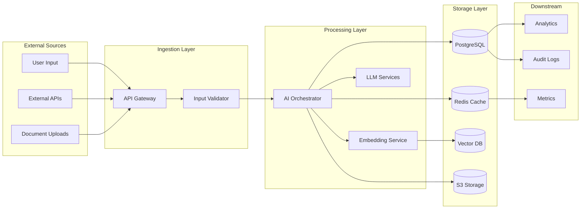
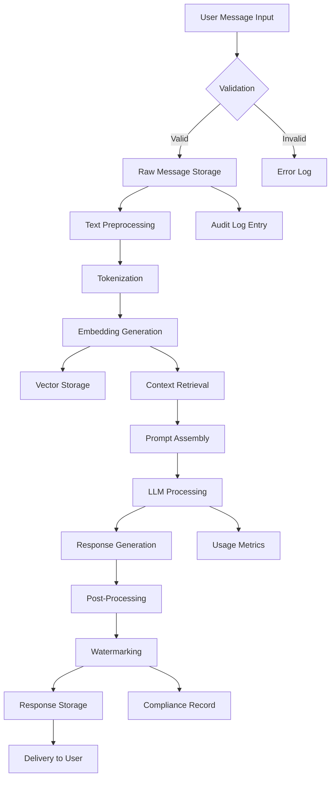

# Data Lineage

**Document Type:** Architecture & Data Governance  
**Owner:** Chief Data Officer  
**Reviewers:** Data Engineering Team, Compliance Team, Security Team  
**Review Cadence:** Quarterly  
**Last Updated:** 2025-12-11  
**Status:** 🟢 Active

---

## Purpose

This document provides comprehensive data lineage tracking for KOSMOS, documenting the flow of data from source systems through transformations to final destinations. Data lineage is critical for:

- **Compliance:** GDPR Article 30 (Records of Processing Activities), EU AI Act Article 10
- **Data Quality:** Understanding data transformations and potential quality issues
- **Impact Analysis:** Assessing downstream effects of data changes
- **Debugging:** Tracing data issues back to source
- **Audit Trail:** Complete history of data processing

---

## Data Lineage Framework

### Lineage Tracking Levels

#### 1. System-Level Lineage
**Scope:** High-level data flows between systems



---

#### 2. Dataset-Level Lineage
**Scope:** Specific datasets and their transformations

**Example: User Conversation Flow**



---

#### 3. Column-Level Lineage
**Scope:** Individual data fields and their transformations

**Example: User Data Processing**

| Source Field | Transformation | Destination Field | Purpose |
|--------------|----------------|-------------------|---------|
| `user.email` | None | `users.email` | User identification |
| `user.email` | Hash(email) | `users.email_hash` | Privacy-preserving analytics |
| `user.name` | None | `users.full_name` | User display |
| `user.consent` | Boolean | `users.has_consent` | GDPR compliance |
| `message.text` | Anonymize PII | `conversations.sanitized_text` | Compliance |
| `message.text` | Embedding | `vectors.embedding` | Semantic search |
| `response.text` | Watermark | `responses.watermarked_text` | Attribution |

---

## Critical Data Flows

### Flow 1: User Conversation Processing {#user-conversation-processing}

**Data Source:** User input via API  
**Data Destination:** Response delivery + audit logs

**Pipeline Stages:**

```yaml
flow_id: conversation-processing
version: 1.0
owner: AI Orchestrator Service

stages:
  - stage: 1-ingestion
    input: user_message (plaintext)
    transformations:
      - validate_schema
      - sanitize_input
      - detect_pii
    output: validated_message
    storage: postgres.conversations
    retention: 90 days
  
  - stage: 2-embedding
    input: validated_message
    transformations:
      - tokenize
      - generate_embedding (text-embedding-3)
    output: message_embedding (vector[1536])
    storage: vector_db.conversation_embeddings
    retention: 90 days
  
  - stage: 3-context-retrieval
    input: message_embedding
    transformations:
      - similarity_search (top_k=5)
      - rank_results
    output: relevant_context
    storage: redis.cache (temporary)
    retention: 1 hour
  
  - stage: 4-llm-processing
    input: [validated_message, relevant_context]
    transformations:
      - prompt_assembly
      - llm_inference (gpt-4 or claude)
      - response_parsing
    output: raw_response
    storage: postgres.responses
    retention: 90 days
  
  - stage: 5-post-processing
    input: raw_response
    transformations:
      - content_filtering
      - watermarking
      - formatting
    output: final_response
    storage: postgres.responses
    retention: 90 days
  
  - stage: 6-audit-logging
    input: [all_stages]
    transformations:
      - create_audit_record
      - anonymize_pii
    output: audit_entry
    storage: postgres.audit_logs
    retention: 3 years
```

**Compliance Notes:**
- PII detection at stage 1 (GDPR requirement)
- Audit trail at stage 6 (ISO 42001, Article 30)
- Watermarking at stage 5 (EU AI Act transparency)
- Retention aligned with legal requirements

---

### Flow 2: Training Data Collection {#training-data-pipeline}

**Data Source:** Anonymized user interactions  
**Data Destination:** Model training datasets

**Pipeline Stages:**

```yaml
flow_id: training-data-pipeline
version: 1.0
owner: ML Engineering Team
purpose: Model improvement (legitimate interest - GDPR Article 6(1)(f))

stages:
  - stage: 1-selection
    input: postgres.conversations (filtered)
    filters:
      - user_consent = true
      - quality_score >= 0.8
      - exclude_pii = true
    output: candidate_conversations
    
  - stage: 2-anonymization
    input: candidate_conversations
    transformations:
      - remove_user_identifiers
      - k_anonymity (k=5)
      - differential_privacy (epsilon=1.0)
    output: anonymized_conversations
    storage: s3.training_data
    retention: permanent (anonymized)
    
  - stage: 3-quality-filtering
    input: anonymized_conversations
    transformations:
      - remove_duplicates
      - check_language_quality
      - remove_toxic_content
    output: curated_training_data
    
  - stage: 4-versioning
    input: curated_training_data
    transformations:
      - create_dataset_version
      - generate_dataset_card
      - compute_statistics
    output: versioned_dataset (v1.2.3)
    storage: s3.training_data/v1.2.3/
```

**Compliance Notes:**
- Explicit consent check (GDPR requirement)
- K-anonymity and differential privacy (GDPR Article 32)
- Permanent retention allowed (anonymized data)
- Dataset versioning for reproducibility

---

### Flow 3: Analytics & Metrics {#analytics-metrics-pipeline}

### Flow 4: Document Processing Pipeline {#document-pipeline}

**Data Source:** Uploaded documents (PDF, DOCX, TXT)  
**Data Destination:** Vector database for RAG

**Pipeline Stages:**

```yaml
flow_id: document-processing
version: 1.0
owner: Knowledge Management Service
purpose: Document ingestion and retrieval

stages:
  - stage: 1-upload
    input: user_uploads
    validation:
      - file_type_check
      - malware_scan
      - size_limit (50MB)
    output: raw_documents
    
  - stage: 2-extraction
    input: raw_documents
    transformations:
      - text_extraction
      - metadata_extraction
      - structure_parsing
    output: structured_documents
    
  - stage: 3-chunking
    input: structured_documents
    transformations:
      - semantic_chunking (512 tokens)
      - overlap (50 tokens)
      - preserve_context
    output: document_chunks
    
  - stage: 4-embedding
    input: document_chunks
    transformations:
      - generate_embeddings (text-embedding-3-large)
      - dimension: 3072
    output: embedded_chunks
    
  - stage: 5-indexing
    input: embedded_chunks
    storage: pinecone.document_index
    indexing:
      - vector_similarity
      - metadata_filtering
    output: searchable_knowledge_base
```

**Data Quality Checks:**
- Document completeness
- Embedding quality score
- Retrieval accuracy testing

**Retention:** Documents retained for duration of user account + 30 days

---

### Flow 5: Analytics & Metrics

**Data Source:** System events and user interactions  
**Data Destination:** Grafana dashboards

**Pipeline Stages:**

```yaml
flow_id: analytics-pipeline
version: 1.0
owner: Data Analytics Team

stages:
  - stage: 1-event-collection
    input: application_logs
    transformations:
      - parse_json_logs
      - extract_metrics
      - timestamp_normalization
    output: structured_events
    storage: loki.logs
    retention: 30 days
    
  - stage: 2-aggregation
    input: structured_events
    transformations:
      - group_by [user_tier, model_used, time_window]
      - compute [count, avg, p95, p99]
    output: aggregated_metrics
    storage: prometheus.metrics
    retention: 90 days
    
  - stage: 3-enrichment
    input: aggregated_metrics
    transformations:
      - join_with_user_metadata
      - calculate_cost_per_request
      - compute_fairness_metrics
    output: enriched_metrics
    storage: postgres.analytics
    retention: 1 year
    
  - stage: 4-visualization
    input: enriched_metrics
    output: grafana_dashboard
```

---

## Data Catalog

### Source Systems

| System | Data Type | Sensitivity | Owner | Access Control |
|--------|-----------|-------------|-------|----------------|
| API Gateway | Request logs | High | DevOps | Role-based |
| User Service | User accounts | High (PII) | Product | GDPR controls |
| LLM Service | Prompts/Responses | Medium | AI Team | Anonymized |
| Vector DB | Embeddings | Low | Data Team | Internal only |
| S3 Storage | Documents | High | Data Team | Encrypted |

---

### Destination Systems

| System | Purpose | Retention | Compliance |
|--------|---------|-----------|------------|
| PostgreSQL | Transactional data | 90 days - 3 years | GDPR, ISO 42001 |
| Vector DB | Semantic search | 90 days | Internal policy |
| Redis Cache | Performance | 1 hour | N/A (ephemeral) |
| Analytics DB | Reporting | 1 year | GDPR Article 30 |
| Audit Logs | Compliance | 3 years | ISO 42001, SOC 2 |
| Training Data | ML improvement | Permanent (anonymized) | GDPR Article 89 |

---

## Data Transformations

### Anonymization Techniques

#### 1. K-Anonymity
**Purpose:** Ensure each record is indistinguishable from k-1 others

**Implementation:**
```python
def apply_k_anonymity(df, quasi_identifiers, k=5):
    """
    Apply k-anonymity to dataset
    
    Args:
        df: DataFrame with user data
        quasi_identifiers: List of columns that could identify users
        k: Minimum group size
    
    Returns:
        Anonymized DataFrame
    """
    # Generalize quasi-identifiers
    df = generalize_age(df)  # 25 → 20-30
    df = generalize_location(df)  # "New York" → "US-Northeast"
    
    # Remove groups smaller than k
    df = df.groupby(quasi_identifiers).filter(lambda x: len(x) >= k)
    
    return df
```

**Applied to:** Training data, analytics aggregations

---

#### 2. Differential Privacy
**Purpose:** Prevent identification through query results

**Implementation:**
```python
def add_differential_privacy(value, epsilon=1.0, sensitivity=1.0):
    """
    Add Laplace noise for differential privacy
    
    Args:
        value: Original value
        epsilon: Privacy parameter (smaller = more private)
        sensitivity: How much one record can change result
    
    Returns:
        Noisy value
    """
    import numpy as np
    scale = sensitivity / epsilon
    noise = np.random.laplace(0, scale)
    return value + noise
```

**Applied to:** Aggregated metrics, statistical reports

---

#### 3. PII Redaction
**Purpose:** Remove personally identifiable information

**Detection Patterns:**
```python
PII_PATTERNS = {
    'email': r'\b[A-Za-z0-9._%+-]+@[A-Za-z0-9.-]+\.[A-Z|a-z]{2,}\b',
    'phone': r'\b\d{3}[-.]?\d{3}[-.]?\d{4}\b',
    'ssn': r'\b\d{3}-\d{2}-\d{4}\b',
    'credit_card': r'\b\d{4}[- ]?\d{4}[- ]?\d{4}[- ]?\d{4}\b',
    'ip_address': r'\b\d{1,3}\.\d{1,3}\.\d{1,3}\.\d{1,3}\b',
}

def redact_pii(text):
    """Redact PII from text"""
    for pii_type, pattern in PII_PATTERNS.items():
        text = re.sub(pattern, f'[{pii_type.upper()}_REDACTED]', text)
    return text
```

**Applied to:** All user-generated content before storage

---

## Lineage Tracking Tools

### OpenLineage Integration

**Implementation:**

```python
from openlineage.client import OpenLineageClient
from openlineage.client.run import RunEvent, RunState, Run, Job

client = OpenLineageClient(url="http://lineage-server:5000")

def track_data_flow(
    job_name: str,
    inputs: list,
    outputs: list,
    transformations: list
):
    """Track data lineage with OpenLineage"""
    
    run = Run(runId=str(uuid.uuid4()))
    
    event = RunEvent(
        eventType=RunState.COMPLETE,
        eventTime=datetime.now().isoformat(),
        run=run,
        job=Job(namespace="kosmos", name=job_name),
        inputs=inputs,
        outputs=outputs,
        producer="kosmos-orchestrator/1.0.0"
    )
    
    client.emit(event)
```

**Usage:**
```python
track_data_flow(
    job_name="conversation-processing",
    inputs=[
        {"namespace": "postgres", "name": "conversations", "facets": {...}}
    ],
    outputs=[
        {"namespace": "vector_db", "name": "embeddings", "facets": {...}}
    ],
    transformations=["tokenization", "embedding_generation"]
)
```

---

### Lineage Visualization

**Tools:**
- **Marquez** - OpenLineage-compatible lineage UI
- **DataHub** - LinkedIn's data catalog with lineage
- **Custom Grafana Dashboard** - Real-time lineage monitoring

**View Lineage:**
```bash
# Query lineage API
curl http://lineage-server:5000/api/v1/lineage/dataset/postgres/conversations

# Returns:
{
  "dataset": "postgres.conversations",
  "upstream": ["api_gateway.requests"],
  "downstream": ["vector_db.embeddings", "audit_logs.entries"],
  "transformations": ["validation", "sanitization", "pii_detection"]
}
```

---

## Data Quality Tracking

### Quality Metrics by Stage

| Stage | Metric | Target | Current | Status |
|-------|--------|--------|---------|--------|
| Ingestion | Valid records % | >99% | 99.5% | 🟢 |
| Embedding | Embedding success % | >99.9% | 99.95% | 🟢 |
| LLM Processing | Response quality score | >0.8 | 0.87 | 🟢 |
| PII Detection | False positive rate | <1% | 0.3% | 🟢 |
| Anonymization | K-anonymity violations | 0 | 0 | 🟢 |

---

## Impact Analysis

### Downstream Impact Assessment

**Question:** "What happens if we change the embedding model?"

**Lineage Analysis:**
```
text-embedding-3 (Current)
  ↓
vector_db.conversation_embeddings
  ↓ (affects)
  - Context retrieval accuracy
  - Search relevance
  - RAG quality
  ↓ (downstream services)
  - AI Orchestrator (all conversations)
  - Analytics Dashboard (similarity metrics)
  - Training Data Pipeline (embedding-based filtering)
  
IMPACT: HIGH
AFFECTED USERS: 100%
TESTING REQUIRED: A/B test on 10% traffic
ROLLBACK PLAN: Keep old embeddings for 30 days
```

---

## Compliance Mapping

### GDPR Article 30 - Records of Processing Activities

**Required Information:**

| Requirement | Implementation |
|-------------|----------------|
| Name and contact details of controller | Data Protection Officer listed |
| Purposes of processing | Documented per data flow |
| Categories of data subjects | Users, guests, API clients |
| Categories of personal data | Email, name, conversation history |
| Categories of recipients | LLM providers (OpenAI, Anthropic) |
| Transfers to third countries | US (Standard Contractual Clauses) |
| Retention periods | Documented per destination |
| Technical and organizational measures | Encryption, anonymization, access controls |

**Documentation:** [Legal Framework](../01-governance/legal-framework.md)

---

### EU AI Act Article 10 - Data Governance

**Required Practices:**

✅ Data quality criteria defined  
✅ Relevance and representativeness assessed  
✅ Bias detection implemented  
✅ Data gaps identified and documented  
✅ Appropriate statistical properties verified  
✅ Training, validation, testing datasets separated  

**Audit Trail:** Complete lineage from source to model training

---

## Change Management

### Lineage Updates

**When to Update Lineage:**
- New data source added
- Transformation logic changed
- New destination system integrated
- Retention policy modified
- Compliance requirement changes

**Update Process:**
1. Document proposed change in ADR
2. Update lineage diagrams
3. Update data catalog
4. Run impact analysis
5. Update monitoring dashboards
6. Deploy with canary testing

---

## Monitoring & Alerts

### Lineage Health Metrics

**Prometheus Metrics:**
```yaml
# Data flow completeness
kosmos_lineage_flow_complete{flow_id="conversation-processing"} 1

# Data quality score
kosmos_data_quality_score{stage="embedding"} 0.995

# PII detection rate
kosmos_pii_detections_total{type="email"} 142

# Lineage staleness (time since last update)
kosmos_lineage_staleness_seconds{dataset="conversations"} 60
```

**Alerts:**
```yaml
# Alert if lineage not updated in 24 hours
- alert: LineageStaleness
  expr: kosmos_lineage_staleness_seconds > 86400
  annotations:
    description: "Lineage for {{ $labels.dataset }} not updated in 24h"

# Alert if data quality drops
- alert: DataQualityDegradation
  expr: kosmos_data_quality_score < 0.95
  annotations:
    description: "Data quality for {{ $labels.stage }} below threshold"
```

---

## Best Practices

### Lineage Documentation Standards

1. **Capture at Write Time:** Log lineage when data is created/transformed
2. **Automate:** Use OpenLineage SDK in all data pipelines
3. **Version Control:** Track lineage changes in Git
4. **Test Coverage:** Validate lineage in integration tests
5. **Regular Audits:** Review lineage accuracy quarterly
6. **User-Friendly:** Provide visual lineage explorer for stakeholders

---

## References

### Internal Documents
- [System Topology](topology.md)
- [Legal Framework](../01-governance/legal-framework.md)
- [Data Protection Impact Assessment](../appendices/templates/dpia-template.md)

### External Standards
- **GDPR Article 30:** Records of Processing Activities
- **EU AI Act Article 10:** Data and Data Governance
- **OpenLineage Specification:** https://openlineage.io/
- **NIST AI RMF:** Data governance practices

### Tools
- **Marquez:** https://marquezproject.github.io/marquez/
- **DataHub:** https://datahubproject.io/
- **OpenLineage:** https://openlineage.io/

---

**Next Review:** March 2026 (Quarterly)  
**Document Owner:** data-governance@nuvanta-holding.com  
**Lineage Questions:** data-lineage@nuvanta-holding.com
