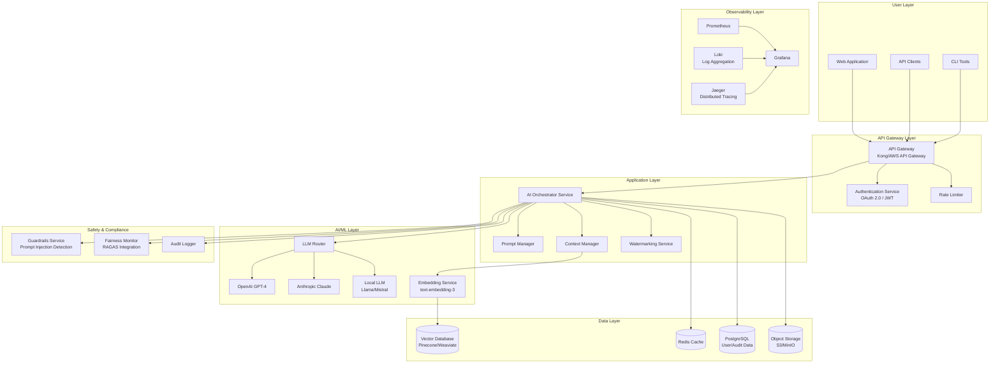

# System Topology

**Document Type:** Architecture & Infrastructure  
**Owner:** Chief Technology Officer  
**Reviewers:** Infrastructure Team, Security Team, Architecture Review Board  
**Review Cadence:** Quarterly  
**Last Updated:** 2025-12-11  
**Status:** 🟢 Active

---

## Purpose

This document provides a comprehensive view of KOSMOS's system architecture, component inventory, service dependencies, and infrastructure topology. It serves as the authoritative reference for understanding how all system components interconnect and interact.

---

## Architecture Overview

### High-Level Architecture



---

## Component Inventory

### 1. User Interface Layer

#### 1.1 Web Application
**Technology:** React + Next.js  
**Purpose:** Primary user interface for KOSMOS  
**Deployment:** Cloudflare Pages  
**URL:** https://app.kosmos.ai  
**Repository:** `kosmos-web`

**Key Features:**
- Conversational AI interface
- Document upload and processing
- User account management
- Usage analytics dashboard
- Model selection interface

**Dependencies:**
- API Gateway (for all backend calls)
- Authentication Service (OAuth 2.0)

---

#### 1.2 API Clients
**SDKs Available:**
- Python SDK: `pip install kosmos-sdk`
- JavaScript SDK: `npm install @kosmos/sdk`
- Go SDK: `go get github.com/kosmos/go-sdk`

**Purpose:** Programmatic access to KOSMOS  
**Authentication:** API Keys + OAuth 2.0

---

#### 1.3 CLI Tools
**Tool:** `kosmos-cli`  
**Installation:** `pip install kosmos-cli`  
**Purpose:** Command-line interface for developers

**Commands:**
- `kosmos chat` - Interactive chat
- `kosmos deploy` - Deploy prompt templates
- `kosmos logs` - View audit logs
- `kosmos metrics` - Retrieve performance metrics

---

### 2. API Gateway Layer

#### 2.1 API Gateway
**Technology:** Kong Gateway (Enterprise) OR AWS API Gateway  
**Purpose:** Single entry point for all API requests  
**Deployment:** Kubernetes cluster OR AWS managed service

**Responsibilities:**
- Request routing
- Protocol translation (REST → internal gRPC)
- API versioning (v1, v2)
- SSL/TLS termination
- Request/response transformation

**Configuration:**
```yaml
# Kong declarative config
_format_version: "3.0"

services:
  - name: kosmos-orchestrator
    url: http://orchestrator.kosmos.svc.cluster.local:8080
    routes:
      - name: orchestrator-route
        paths:
          - /v1/chat
          - /v1/completions
        methods:
          - POST
    plugins:
      - name: rate-limiting
        config:
          minute: 100
          hour: 1000
```

---

#### 2.2 Authentication Service
**Technology:** Keycloak OR Auth0  
**Purpose:** Centralized authentication and authorization  
**Protocol:** OAuth 2.0, OpenID Connect

**Supported Flows:**
- Authorization Code (for web apps)
- Client Credentials (for API clients)
- Refresh Token rotation

**Token Structure:**
```json
{
  "sub": "user-uuid",
  "email": "john.doe@nuvanta-holding.com",
  "roles": ["user", "api-access"],
  "tier": "premium",
  "rate_limit": 1000,
  "exp": 1735689600
}
```

---

#### 2.3 Rate Limiter
**Technology:** Redis-based (Kong plugin OR custom)  
**Purpose:** Enforce usage limits per user/tier

**Rate Limits by Tier:**

| Tier | Requests/Minute | Requests/Hour | Requests/Day |
|------|-----------------|---------------|--------------|
| Free | 10 | 100 | 1,000 |
| Pro | 100 | 1,000 | 50,000 |
| Enterprise | Custom | Custom | Custom |

**Implementation:** Token bucket algorithm with Redis

---

### 3. Application Layer

#### 3.1 AI Orchestrator Service
**Technology:** Python (FastAPI) + Celery for async tasks  
**Purpose:** Core business logic and workflow orchestration  
**Deployment:** Kubernetes deployment (3 replicas minimum)

**Responsibilities:**
- Request validation and preprocessing
- Workflow orchestration (multi-step AI tasks)
- Response post-processing
- Error handling and retries
- Metrics collection

**API Endpoints:**
- `POST /v1/chat/completions` - Chat completions
- `POST /v1/embeddings` - Generate embeddings
- `POST /v1/prompts` - Submit prompt templates
- `GET /v1/status` - Health check

**Resource Requirements:**
- CPU: 2-4 cores per instance
- Memory: 4-8 GB per instance
- Autoscaling: 3-20 instances based on load

---

#### 3.2 Prompt Manager
**Technology:** Python service + PostgreSQL  
**Purpose:** Manage, version, and validate prompt templates

**Features:**
- Prompt template versioning
- Variable substitution
- Prompt linting and validation
- A/B testing support
- Prompt registry

**Database Schema:**
```sql
CREATE TABLE prompts (
    id UUID PRIMARY KEY,
    name VARCHAR(255) NOT NULL,
    version INT NOT NULL,
    template TEXT NOT NULL,
    variables JSONB,
    created_at TIMESTAMP DEFAULT NOW(),
    created_by UUID,
    status VARCHAR(50), -- draft, active, deprecated
    UNIQUE(name, version)
);
```

**See:** [Prompt Standards](../03-engineering/prompt-standards.md)

---

#### 3.3 Context Manager
**Technology:** Python service + Vector Database  
**Purpose:** Manage conversational context and RAG (Retrieval-Augmented Generation)

**Responsibilities:**
- Conversation history management
- Semantic search over knowledge base
- Context window optimization
- Document chunking and indexing

**Context Storage:**
- Short-term: Redis (last 10 messages)
- Long-term: Vector DB (semantic search)
- Metadata: PostgreSQL (conversation metadata)

---

#### 3.4 Watermarking Service
**Technology:** Python service  
**Purpose:** Add cryptographic watermarks to AI-generated content

**Watermarking Methods:**
- Metadata injection (for structured outputs)
- Semantic watermarking (for text)
- Digital signatures (for attribution)

**See:** [Watermarking Standard](../03-engineering/watermarking-standard.md)

---

### 4. AI/ML Layer

#### 4.1 LLM Router
**Technology:** Python (LiteLLM OR custom router)  
**Purpose:** Intelligent routing to appropriate LLM based on request characteristics

**Routing Logic:**
```python
def route_llm_request(request):
    """Route to optimal LLM based on request characteristics"""
    
    # Cost optimization for simple requests
    if request.complexity == "low" and request.max_tokens < 100:
        return LOCAL_LLM
    
    # High-quality responses for complex tasks
    if request.complexity == "high":
        return GPT4
    
    # Balance of cost and quality
    if request.tier == "free":
        return LOCAL_LLM
    
    return CLAUDE  # Default
```

**Fallback Strategy:**
1. Primary LLM (based on routing)
2. Secondary LLM (if primary fails)
3. Cached response (if available)
4. Error response with retry guidance

---

#### 4.2 External LLM Providers

##### OpenAI GPT-4
**API:** OpenAI Platform API  
**Models Used:**
- `gpt-4-turbo` (primary)
- `gpt-4` (fallback)
- `gpt-3.5-turbo` (cost-optimized)

**Cost per 1K tokens:**
- Input: $0.01
- Output: $0.03

**Rate Limits:** 10,000 TPM (tokens per minute) - Enterprise tier

---

##### Anthropic Claude
**API:** Anthropic API  
**Models Used:**
- `claude-3-opus` (highest quality)
- `claude-3-sonnet` (balanced)
- `claude-3-haiku` (fastest)

**Cost per 1K tokens:**
- Opus: $0.015 / $0.075 (input/output)
- Sonnet: $0.003 / $0.015

**Rate Limits:** Custom enterprise agreement

---

#### 4.3 Local LLM (Self-Hosted)
**Technology:** vLLM OR TGI (Text Generation Inference)  
**Models Deployed:**
- Llama 3 8B (instruction-tuned)
- Mistral 7B (instruction-tuned)

**Infrastructure:**
- GPU: 4x NVIDIA A100 (40GB)
- Framework: vLLM for optimized inference
- Deployment: Kubernetes with GPU node pool

**Use Cases:**
- Free tier requests
- Data-sensitive workloads (on-prem requirement)
- Cost optimization for high-volume simple tasks

---

#### 4.4 Embedding Service
**Technology:** OpenAI Embeddings OR sentence-transformers  
**Models:**
- `text-embedding-3-large` (OpenAI) - primary
- `all-MiniLM-L6-v2` (local) - fallback

**Purpose:**
- Document embeddings for RAG
- Semantic search
- Conversation similarity

**Performance:**
- Latency: <50ms (p95)
- Throughput: 1000 embeddings/sec

---

### 5. Data Layer

#### 5.1 Vector Database
**Technology:** Pinecone (managed) OR Weaviate (self-hosted)  
**Purpose:** Store and retrieve high-dimensional embeddings

**Collections:**
- `knowledge_base` - Company knowledge documents
- `conversations` - Historical conversation embeddings
- `user_documents` - User-uploaded documents

**Configuration:**
```python
# Pinecone index configuration
index = pinecone.Index(
    name="kosmos-knowledge",
    dimension=1536,  # text-embedding-3 dimension
    metric="cosine",
    pods=4,
    replicas=2
)
```

**Performance:**
- Query latency: <100ms (p95)
- Concurrent queries: 1000 QPS
- Total vectors: 10M+

---

#### 5.2 Redis Cache
**Technology:** Redis Cluster (6 nodes)  
**Purpose:** High-speed caching and session storage

**Use Cases:**
- LLM response caching (TTL: 1 hour)
- User session data
- Rate limiting counters
- Conversation context (recent messages)

**Configuration:**
- Memory: 64 GB per node
- Persistence: RDB snapshots every 5 minutes
- Replication: 1 master + 2 replicas per shard

---

#### 5.3 PostgreSQL
**Technology:** PostgreSQL 15 (managed - AWS RDS OR self-hosted)  
**Purpose:** Relational data storage

**Databases:**
- `kosmos_users` - User accounts, profiles
- `kosmos_audit` - Audit logs, compliance records
- `kosmos_billing` - Usage tracking, invoices
- `kosmos_prompts` - Prompt templates

**High Availability:**
- Primary-replica setup (1 primary + 2 read replicas)
- Automatic failover (30 seconds RTO)
- Daily backups with 30-day retention
- Point-in-time recovery (PITR)

---

#### 5.4 Object Storage (S3)
**Technology:** AWS S3 OR MinIO (self-hosted)  
**Purpose:** Store large files and model artifacts

**Buckets:**
- `kosmos-user-uploads` - User-uploaded documents
- `kosmos-model-artifacts` - Model weights, checkpoints
- `kosmos-logs` - Long-term log storage
- `kosmos-backups` - Database backups

**Lifecycle Policies:**
- User uploads: 90-day retention → Glacier
- Logs: 1-year retention → delete
- Backups: 30-day retention → delete

---

### 6. Observability Layer

#### 6.1 Prometheus
**Technology:** Prometheus + Thanos (long-term storage)  
**Purpose:** Metrics collection and alerting

**Metrics Collected:**
- Request rates and latencies
- Error rates by service
- LLM token usage and costs
- Database query performance
- Infrastructure resource usage

**Retention:**
- Local: 15 days
- Thanos (S3): 1 year

---

#### 6.2 Grafana
**Technology:** Grafana Cloud OR self-hosted  
**Purpose:** Visualization and dashboards

**Key Dashboards:**
- System Overview (golden signals)
- LLM Performance (latency, cost, quality)
- User Activity (usage patterns)
- Fairness Metrics (from Ethics Scorecard)
- FinOps Dashboard (cost tracking)

**Alerting:** Integrated with PagerDuty

---

#### 6.3 Loki
**Technology:** Grafana Loki  
**Purpose:** Log aggregation

**Log Sources:**
- Application logs (JSON structured)
- Access logs (API Gateway)
- Audit logs (compliance)
- Error logs (exceptions, stack traces)

**Retention:** 30 days (queryable), 1 year (archived to S3)

---

#### 6.4 Jaeger
**Technology:** Jaeger (OpenTelemetry compatible)  
**Purpose:** Distributed tracing

**Trace Spans:**
- API Gateway → Orchestrator → LLM Router → External LLM
- Full request lifecycle visibility
- Performance bottleneck identification

---

### 7. Safety & Compliance Layer

#### 7.1 Guardrails Service
**Technology:** Python (NeMo Guardrails OR custom)  
**Purpose:** Detect and prevent unsafe AI behavior

**Checks:**
- Prompt injection detection (99.7% accuracy)
- Content policy violation detection
- PII detection in inputs/outputs
- Jailbreak attempt detection

**Action on Detection:**
- Block request
- Log incident
- Alert security team
- See [Prompt Injection Runbook](../04-operations/incident-response/prompt-injection.md)

---

#### 7.2 Fairness Monitor
**Technology:** RAGAS + custom monitoring  
**Purpose:** Continuous fairness evaluation

**Metrics Tracked:**
- Demographic parity
- Equal opportunity
- Calibration across groups

**Integration:**
- Real-time scoring on sample of requests
- Daily batch evaluation
- See [Ethics Scorecard](../01-governance/ethics-scorecard.md)

---

#### 7.3 Audit Logger
**Technology:** Custom service + PostgreSQL  
**Purpose:** Immutable audit trail for compliance

**Events Logged:**
- All API requests (anonymized)
- Model predictions
- User actions (login, data access, etc.)
- System configuration changes
- Access control changes

**Retention:** 3 years (compliance requirement)

---

## Network Architecture

### Deployment Model: Hybrid Cloud

**Components:**

1. **Public Cloud (AWS):**
   - API Gateway
   - Web Application (Cloudflare Pages)
   - Managed databases (RDS, ElastiCache)
   - Object storage (S3)

2. **Private Cloud / On-Premise:**
   - Local LLM inference
   - Sensitive data processing
   - Compliance-required data storage

3. **Edge Computing:**
   - CDN (Cloudflare)
   - Edge functions for lightweight processing

---

### Network Segmentation

```
┌─────────────────────────────────────────────────┐
│  DMZ (Public-Facing)                           │
│  - API Gateway                                  │
│  - Web Application                              │
│  - WAF (Web Application Firewall)              │
└────────────────┬────────────────────────────────┘
                 │
┌────────────────▼────────────────────────────────┐
│  Application Tier (Private Subnet)              │
│  - Orchestrator Service                         │
│  - Prompt Manager                                │
│  - Context Manager                               │
│  - Guardrails Service                            │
└────────────────┬────────────────────────────────┘
                 │
┌────────────────▼────────────────────────────────┐
│  Data Tier (Private Subnet)                     │
│  - PostgreSQL                                    │
│  - Redis                                         │
│  - Vector Database                               │
└─────────────────────────────────────────────────┘
```

**Security Groups:**
- DMZ → Application Tier: HTTPS (443)
- Application Tier → Data Tier: Database ports only
- All tiers → Internet: Outbound for external APIs
- All tiers → Monitoring: Metrics export

---

## Service Dependencies

### Critical Path Dependencies

**User Request Flow:**
1. User → API Gateway (dependency: DNS, Load Balancer)
2. API Gateway → Authentication Service (dependency: Keycloak/Auth0)
3. API Gateway → Orchestrator (dependency: Kubernetes)
4. Orchestrator → LLM Router (dependency: Python runtime)
5. LLM Router → External LLM (dependency: OpenAI/Anthropic API)
6. Response flows back

**Failure Modes:**
- External LLM unavailable → Fallback to secondary LLM
- Cache miss → Direct database query (slower)
- Vector DB unavailable → Disable RAG, use LLM only
- Guardrails service down → Allow requests with warning

---

## Infrastructure Specifications

### Compute Resources

| Service | CPU | Memory | Storage | Replicas |
|---------|-----|--------|---------|----------|
| API Gateway | 2 | 4 GB | 10 GB | 3 |
| Orchestrator | 4 | 8 GB | 20 GB | 3-20 (autoscale) |
| LLM Router | 2 | 4 GB | 10 GB | 3 |
| Local LLM | 16 (+ 4x A100) | 128 GB | 500 GB | 2 |
| PostgreSQL | 8 | 32 GB | 500 GB | 1 primary + 2 replicas |
| Redis | 4 | 64 GB | 128 GB | 6 (cluster) |
| Vector DB | 8 | 32 GB | 1 TB | 4 |

**Total Infrastructure:**
- CPU cores: ~150
- Memory: ~600 GB
- Storage: ~3 TB
- GPUs: 8x NVIDIA A100

---

## Disaster Recovery

### Backup Strategy

**Databases:**
- PostgreSQL: Continuous backup (PITR), 30-day retention
- Redis: RDB snapshots every 5 minutes
- Vector DB: Daily snapshots to S3

**Recovery Objectives:**
- **RTO (Recovery Time Objective):** 1 hour
- **RPO (Recovery Point Objective):** 5 minutes

**Failover Procedures:**
1. Automated health checks every 30 seconds
2. Auto-failover to replica on primary failure
3. DNS update to point to new primary
4. Alert operations team

**See:** [Business Continuity Plan](../05-human-factors/business-continuity.md)

---

## Scaling Strategy

### Horizontal Scaling

**Auto-scaling Triggers:**
- CPU utilization > 70% for 5 minutes
- Request queue depth > 100
- Response time > 2 seconds (p95)

**Scaling Limits:**
- Orchestrator: 3-20 instances
- LLM Router: 3-10 instances
- Local LLM: 2-6 instances (limited by GPU availability)

### Vertical Scaling

**Database Scaling:**
- PostgreSQL: Can scale to r6g.12xlarge (48 vCPU, 384 GB RAM)
- Redis: Can add nodes to cluster dynamically

---

## Security Architecture

### Defense in Depth

1. **Network Layer:**
   - WAF (Web Application Firewall)
   - DDoS protection (Cloudflare)
   - VPC segmentation

2. **Application Layer:**
   - Input validation
   - Output sanitization
   - Rate limiting
   - Authentication/authorization

3. **Data Layer:**
   - Encryption at rest (AES-256)
   - Encryption in transit (TLS 1.3)
   - Database access controls
   - Audit logging

4. **Monitoring Layer:**
   - Intrusion detection (IDS)
   - Anomaly detection
   - Security information and event management (SIEM)

---

## Performance Targets

### Service Level Objectives (SLOs)

| Metric | Target | Current |
|--------|--------|---------|
| API Availability | 99.9% | 99.95% |
| Request Latency (p95) | <2s | 1.8s |
| Request Latency (p99) | <5s | 4.2s |
| Error Rate | <0.1% | 0.05% |
| LLM Response Time | <10s | 8.5s |

**See:** [SLA/SLO Documentation](../04-operations/sla-slo.md)

---

## Technology Stack Summary

| Layer | Technologies |
|-------|-------------|
| **Frontend** | React, Next.js, TypeScript |
| **API Gateway** | Kong OR AWS API Gateway |
| **Backend** | Python (FastAPI), Celery |
| **LLMs** | OpenAI GPT-4, Anthropic Claude, Llama 3, Mistral |
| **Databases** | PostgreSQL, Redis, Pinecone/Weaviate |
| **Storage** | AWS S3 OR MinIO |
| **Observability** | Prometheus, Grafana, Loki, Jaeger |
| **Security** | OAuth 2.0, TLS 1.3, WAF |
| **Infrastructure** | Kubernetes, Docker, Terraform |
| **CI/CD** | GitHub Actions, ArgoCD |

---

## References

### Internal Documents
- [C4 Diagrams](c4-diagrams/README.md)
- [ADR Index](adr/index.md)
- [Data Lineage](data-lineage.md)
- [SLA/SLO](../04-operations/sla-slo.md)

### External Documentation
- [Kubernetes Documentation](https://kubernetes.io/docs/)
- [FastAPI Documentation](https://fastapi.tiangolo.com/)
- [Prometheus Documentation](https://prometheus.io/docs/)

---

**Next Review:** March 2026 (Quarterly)  
**Document Owner:** architecture@nuvanta-holding.com  
**Infrastructure Contact:** infrastructure@nuvanta-holding.com
