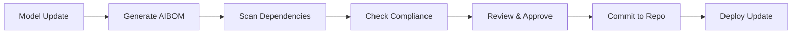

# AIBOM - AI Bill of Materials

**Transparency and Component Tracking for AI Systems**

> "Know your dependencies, track your lineage, ensure your compliance."

---

## 📋 Overview

The AI Bill of Materials (AIBOM) is a comprehensive inventory of all components, dependencies, datasets, and configurations used in an AI system. Similar to a Software Bill of Materials (SBOM), the AIBOM provides transparency and traceability for AI systems.

### Purpose

AIBOM serves to:
- **Ensure transparency** in AI system components
- **Track dependencies** for security and licensing
- **Enable compliance** with regulations (EU AI Act, NIST AI RMF)
- **Facilitate audits** and risk assessments
- **Support incident response** and troubleshooting
- **Manage supply chain** risks in AI

---

## 🎯 AIBOM Components

### 1. Model Information
```yaml
model:
  id: "MC-001"
  name: "Document Summarizer"
  version: "2.1.0"
  type: "text-generation"
  architecture: "transformer"
  base_model: "gpt-4-turbo"
  fine_tuned: true
  parameters: "175B"
  license: "proprietary"
```

### 2. Training Data
```yaml
training_data:
  datasets:
    - name: "Internal Documents Dataset"
      version: "v3.2"
      size: "50M documents"
      source: "internal"
      license: "proprietary"
      collection_date: "2025-01-15"
      pii_filtered: true
      
    - name: "Public Web Corpus"
      version: "2024-Q4"
      size: "100M documents"
      source: "common_crawl"
      license: "CC-BY-4.0"
      collection_date: "2024-10-01"
      pii_filtered: true
```

### 3. Dependencies
```yaml
dependencies:
  frameworks:
    - name: "transformers"
      version: "4.35.0"
      license: "Apache-2.0"
      
    - name: "torch"
      version: "2.1.0"
      license: "BSD-3-Clause"
      
  libraries:
    - name: "numpy"
      version: "1.24.0"
      license: "BSD-3-Clause"
      
    - name: "tokenizers"
      version: "0.15.0"
      license: "Apache-2.0"
```

### 4. Infrastructure
```yaml
infrastructure:
  training:
    provider: "AWS"
    region: "us-east-1"
    compute: "8x A100 GPUs"
    duration: "72 hours"
    
  inference:
    provider: "AWS"
    region: "us-east-1"
    compute: "g5.xlarge"
    autoscaling: true
```

### 5. Prompts & Configurations
```yaml
prompts:
  - id: "document_summary_v2.1"
    version: "2.1.0"
    registry_url: "prompts/production/document_summary_v2.1.yaml"
    
configuration:
  temperature: 0.3
  max_tokens: 500
  top_p: 0.95
  frequency_penalty: 0.0
```

---

## 📝 AIBOM Format

### Complete AIBOM Example

```yaml
# AIBOM for Document Summarizer v2.1.0
aibom_version: "1.0"
created: "2025-12-11T10:00:00Z"
generator: "kosmos-aibom-tool v1.2"

# Model Information
model:
  id: "MC-001"
  name: "Document Summarizer"
  version: "2.1.0"
  type: "text-generation"
  architecture: "transformer"
  base_model:
    name: "gpt-4-turbo"
    provider: "OpenAI"
    version: "gpt-4-1106-preview"
    license: "proprietary"
  fine_tuning:
    enabled: true
    method: "LoRA"
    epochs: 3
    learning_rate: 0.0001
  parameters: "175B"
  license: "proprietary"
  owner: "Nuvanta Holding"
  contact: "ml-team@nuvanta-holding.com"

# Training Data
training_data:
  datasets:
    - name: "Internal Documents Dataset"
      id: "DS-001"
      version: "v3.2"
      size: "50M documents"
      size_bytes: 500_000_000_000
      source: "internal"
      license: "proprietary"
      collection_date: "2025-01-15"
      collection_method: "automated_scraping"
      languages: ["en", "es", "fr"]
      pii_filtered: true
      pii_removal_method: "presidio"
      bias_analysis: true
      bias_report_url: "reports/bias_analysis_DS-001_v3.2.pdf"
      
    - name: "Public Web Corpus"
      id: "DS-002"
      version: "2024-Q4"
      size: "100M documents"
      size_bytes: 1_000_000_000_000
      source: "common_crawl"
      license: "CC-BY-4.0"
      collection_date: "2024-10-01"
      languages: ["en"]
      pii_filtered: true
      pii_removal_method: "custom_regex"
  
  preprocessing:
    deduplication: true
    deduplication_method: "minhash"
    filtering: ["length", "language", "quality"]
    augmentation: false

# Software Dependencies
dependencies:
  frameworks:
    - name: "transformers"
      version: "4.35.0"
      source: "pypi"
      license: "Apache-2.0"
      cve_scan_date: "2025-12-10"
      vulnerabilities: []
      
    - name: "torch"
      version: "2.1.0"
      source: "pypi"
      license: "BSD-3-Clause"
      cve_scan_date: "2025-12-10"
      vulnerabilities: []
      
  libraries:
    - name: "numpy"
      version: "1.24.0"
      license: "BSD-3-Clause"
      
    - name: "tokenizers"
      version: "0.15.0"
      license: "Apache-2.0"
      
    - name: "presidio-analyzer"
      version: "2.2.33"
      license: "MIT"
      purpose: "PII detection"
      
  apis:
    - name: "OpenAI API"
      version: "v1"
      endpoint: "api.openai.com"
      purpose: "base model access"

# Infrastructure
infrastructure:
  training:
    provider: "AWS"
    region: "us-east-1"
    compute: "8x A100 80GB GPUs"
    instance_type: "p4d.24xlarge"
    duration: "72 hours"
    cost: "$5,760"
    carbon_footprint: "1.2 tons CO2e"
    
  inference:
    provider: "AWS"
    region: "us-east-1"
    compute: "g5.xlarge"
    autoscaling:
      enabled: true
      min_instances: 2
      max_instances: 10
    load_balancer: "ALB"
    cdn: "CloudFront"

# Prompts & Configuration
prompts:
  - id: "document_summary_v2.1"
    version: "2.1.0"
    registry_url: "prompts/production/document_summary_v2.1.yaml"
    checksum: "sha256:abc123..."
    
system_configuration:
  temperature: 0.3
  max_tokens: 500
  top_p: 0.95
  frequency_penalty: 0.0
  presence_penalty: 0.0
  stop_sequences: ["END_SUMMARY"]

# Security
security:
  vulnerability_scan:
    last_scan: "2025-12-10"
    tool: "snyk"
    critical: 0
    high: 0
    medium: 2
    low: 5
    
  access_control:
    authentication: "OAuth2"
    authorization: "RBAC"
    encryption_at_rest: true
    encryption_in_transit: true
    
  adversarial_testing:
    last_test: "2025-12-05"
    prompt_injection: "passed"
    jailbreak_attempts: "passed"

# Compliance
compliance:
  regulations:
    - name: "EU AI Act"
      status: "compliant"
      risk_level: "limited"
      last_audit: "2025-11-15"
      
    - name: "GDPR"
      status: "compliant"
      dpia_completed: true
      dpia_date: "2025-10-01"
      
    - name: "NIST AI RMF"
      status: "compliant"
      framework_version: "1.0"
      
  certifications:
    - "ISO 42001:2023"
    - "SOC 2 Type II"

# Monitoring
monitoring:
  performance_tracking: true
  drift_detection: true
  fairness_monitoring: true
  cost_tracking: true
  
  dashboards:
    - "Grafana: Model Performance"
    - "DataDog: Infrastructure Metrics"
    - "Custom: Fairness Dashboard"

# Documentation
documentation:
  model_card: "docs/03-engineering/model-cards/MC-001-document-summarizer.md"
  technical_docs: "docs/models/document-summarizer-v2.1/"
  api_docs: "https://api.nuvanta.com/docs/summarizer"
  
# Lineage
lineage:
  parent_models: []
  derived_models: []
  training_pipeline_id: "pipeline-20250115-001"
  training_git_commit: "a1b2c3d4"
  deployment_date: "2025-12-01T14:30:00Z"
  deployed_by: "ml-team@nuvanta-holding.com"

# Change Log
changelog:
  - version: "2.1.0"
    date: "2025-12-01"
    changes: "Improved accuracy on technical documents"
    
  - version: "2.0.0"
    date: "2025-10-15"
    changes: "Major architecture update, fine-tuning on internal data"
    
  - version: "1.0.0"
    date: "2025-06-01"
    changes: "Initial release"
```

---

## 🔄 AIBOM Generation

### Automated Generation

```python
# Generate AIBOM from deployment
from aibom_generator import AIBOMGenerator

generator = AIBOMGenerator()

# Scan model deployment
aibom = generator.generate_from_deployment(
    model_id="MC-001",
    version="2.1.0",
    include_dependencies=True,
    include_training_data=True,
    scan_vulnerabilities=True
)

# Export to YAML
aibom.export("aibom/MC-001-v2.1.0.yaml")

# Export to JSON
aibom.export("aibom/MC-001-v2.1.0.json")

# Export to SPDX format (for compatibility)
aibom.export_spdx("aibom/MC-001-v2.1.0.spdx")
```

### Manual Creation

```bash
# Copy template
cp templates/aibom_template.yaml aibom/MC-XXX-vX.Y.Z.yaml

# Fill in all sections
vim aibom/MC-XXX-vX.Y.Z.yaml

# Validate AIBOM
aibom-validate aibom/MC-XXX-vX.Y.Z.yaml

# Register in AIBOM registry
aibom-register aibom/MC-XXX-vX.Y.Z.yaml
```

---

## 📊 AIBOM Management

### Storage & Version Control

```
aibom/
├── production/
│   ├── MC-001-v2.1.0.yaml
│   ├── MC-002-v1.5.2.yaml
│   └── MC-003-v3.0.1.yaml
├── development/
│   ├── MC-004-v0.9-beta.yaml
│   └── MC-005-v2.0-rc1.yaml
└── deprecated/
    ├── MC-001-v1.x.yaml
    └── MC-002-v1.0.yaml
```

### Update Workflow



---

## 🔒 Security & Compliance

### Vulnerability Scanning

```python
# Scan AIBOM for vulnerabilities
from aibom_scanner import AIBOMScanner

scanner = AIBOMScanner()
results = scanner.scan_aibom("aibom/MC-001-v2.1.0.yaml")

# Check for critical CVEs
if results.critical_vulnerabilities:
    raise SecurityException("Critical vulnerabilities found!")

# Generate security report
scanner.generate_report("reports/security_MC-001_v2.1.0.pdf")
```

### Compliance Checking

```python
# Validate compliance
from aibom_compliance import ComplianceChecker

checker = ComplianceChecker()

# Check EU AI Act compliance
eu_compliance = checker.check_eu_ai_act("aibom/MC-001-v2.1.0.yaml")

# Check NIST AI RMF compliance
nist_compliance = checker.check_nist_ai_rmf("aibom/MC-001-v2.1.0.yaml")

# Generate compliance report
checker.generate_report("reports/compliance_MC-001_v2.1.0.pdf")
```

---

## 📋 Integration with CI/CD

### Automated AIBOM Update

```yaml
# .github/workflows/update-aibom.yml
name: Update AIBOM

on:
  push:
    branches: [ main ]
    paths:
      - 'models/**'
      - 'training/**'

jobs:
  update-aibom:
    runs-on: ubuntu-latest
    steps:
      - uses: actions/checkout@v4
      
      - name: Generate AIBOM
        run: |
          python scripts/sync_aibom.py --model-id MC-001
      
      - name: Scan vulnerabilities
        run: |
          snyk test aibom/MC-001-latest.yaml
      
      - name: Check compliance
        run: |
          python scripts/check_compliance.py aibom/MC-001-latest.yaml
      
      - name: Commit AIBOM
        run: |
          git add aibom/
          git commit -m "chore: update AIBOM for MC-001"
          git push
```

---

## 🔗 Related Documentation

- **[Model Cards](model-cards/README.md)** - Model documentation
- **[Prompt Standards](prompt-standards.md)** - Prompt management
- **[Data Lineage](../02-architecture/data-lineage.md)** - Data flow tracking
- **[Risk Registry](../01-governance/risk-registry.md)** - Risk management

---

## 📞 Support

| Issue Type | Contact |
|------------|---------|
| **AIBOM Questions** | ml-team@nuvanta-holding.com |
| **Security Concerns** | security@nuvanta-holding.com |
| **Compliance** | legal@nuvanta-holding.com |
| **Tool Issues** | devops@nuvanta-holding.com |

---

## 📅 Review Schedule

- **AIBOM Updates** - With each model deployment
- **Vulnerability Scans** - Weekly
- **Compliance Checks** - Quarterly
- **AIBOM Template** - Annual review

**Next Review:** 2026-03-11

---

**Last Updated:** 2025-12-11  
**Document Owner:** ML Lead  
**Status:** Active

---

[← Back to Volume III](index.md) | [Canary Playbooks →](canary-playbooks.md)
