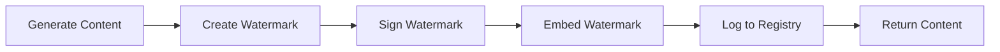
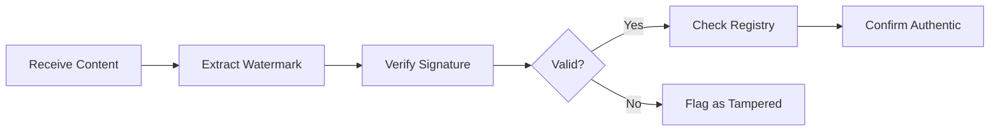

# Watermarking Standard

**Content Authenticity and Provenance Tracking for AI-Generated Content**

> "Know what's real, track what's generated, prove what's authentic."

---

## 📋 Overview

The Watermarking Standard defines how KOSMOS tracks, marks, and verifies AI-generated content to ensure authenticity, prevent misuse, and maintain accountability. Watermarking provides a chain of custody for AI outputs.

### Purpose

Watermarking serves to:
- **Prove authenticity** - Verify content origin and integrity
- **Enable attribution** - Track which model generated content
- **Prevent misuse** - Detect and trace unauthorized use
- **Meet compliance** - Satisfy regulatory requirements (EU AI Act)
- **Build trust** - Demonstrate transparency to users

---

## 🎯 Watermarking Types

### 1. Metadata Watermarking (Required)

Embed structured metadata with every AI-generated output:

```yaml
# Standard watermark metadata
watermark:
  version: "1.0"
  generated: true
  timestamp: "2025-12-11T23:00:00Z"
  model:
    id: "MC-001"
    name: "Document Summarizer"
    version: "2.1.0"
  generator:
    system: "KOSMOS"
    organization: "Nuvanta Holding"
  content:
    type: "text"
    format: "markdown"
    language: "en"
  checksum: "sha256:abc123def456..."
  signature: "digital_signature_here"
```

### 2. Statistical Watermarking (Optional)

For text generation, embed statistical patterns:

```python
# Biased token selection
def apply_statistical_watermark(tokens, watermark_key):
    """Apply statistical watermark during generation"""
    for position, token_probs in enumerate(tokens):
        # Apply deterministic bias based on watermark key
        bias = compute_bias(position, watermark_key)
        token_probs = apply_bias(token_probs, bias)
    return tokens
```

### 3. Visual Watermarking (For Images)

Embed imperceptible visual patterns in AI-generated images:

```python
# Image watermarking
from watermark import ImageWatermarker

watermarker = ImageWatermarker(key="secret_key")
watermarked_image = watermarker.embed(
    image=generated_image,
    metadata=watermark_metadata
)
```

---

## 📝 Implementation Standards

### Text Content Watermarking

**Metadata Injection:**
```python
from watermark import TextWatermark

# Generate content
content = model.generate(prompt)

# Add watermark
watermark = TextWatermark(
    content=content,
    model_id="MC-001",
    model_version="2.1.0",
    timestamp=datetime.now(),
    organization="Nuvanta Holding"
)

# Attach metadata
watermarked_content = watermark.attach_metadata()

# Output format
output = {
    "content": content,
    "metadata": watermark.to_dict(),
    "signature": watermark.sign()
}
```

**Metadata Format:**
```json
{
  "content": "This is the AI-generated text content...",
  "watermark": {
    "version": "1.0",
    "generated": true,
    "timestamp": "2025-12-11T23:00:00Z",
    "model": {
      "id": "MC-001",
      "name": "Document Summarizer",
      "version": "2.1.0",
      "provider": "KOSMOS"
    },
    "generator": {
      "system": "KOSMOS",
      "organization": "Nuvanta Holding",
      "contact": "ai@nuvanta-holding.com"
    },
    "content_info": {
      "type": "text",
      "format": "markdown",
      "language": "en",
      "length": 450,
      "encoding": "UTF-8"
    },
    "integrity": {
      "checksum": "sha256:abc123def456...",
      "signature": "RSA_signature_here",
      "algorithm": "SHA256withRSA"
    },
    "compliance": {
      "eu_ai_act": true,
      "transparency_notice": true
    }
  }
}
```

### Image Content Watermarking

```python
from watermark import ImageWatermarker

# Generate image
image = model.generate_image(prompt)

# Create watermarker
watermarker = ImageWatermarker(
    method="dct",  # Discrete Cosine Transform
    strength=0.1,  # Imperceptible to human eye
    key="organizational_key"
)

# Embed watermark
watermarked_image = watermarker.embed(
    image=image,
    metadata={
        "model_id": "MC-004",
        "timestamp": "2025-12-11T23:00:00Z",
        "organization": "Nuvanta Holding"
    }
)

# Save with embedded metadata
watermarked_image.save(
    "output.png",
    include_exif=True,
    include_xmp=True
)
```

### Code Generation Watermarking

```python
from watermark import CodeWatermark

# Generate code
code = model.generate_code(prompt)

# Add watermark as comment
watermark = CodeWatermark(
    code=code,
    model_id="MC-003",
    model_version="3.0.1"
)

# Inject header comment
watermarked_code = watermark.inject_header()

# Output
"""
# AI-Generated Code
# Model: Code Reviewer v3.0.1 (MC-003)
# Generated: 2025-12-11T23:00:00Z
# Organization: Nuvanta Holding
# CAUTION: Review before production use

def example_function():
    # ... generated code ...
"""
```

---

## 🔒 Security & Verification

### Digital Signatures

All watermarks must be digitally signed:

```python
from cryptography.hazmat.primitives import hashes
from cryptography.hazmat.primitives.asymmetric import rsa, padding

# Sign watermark
def sign_watermark(watermark_data, private_key):
    """Sign watermark with private key"""
    message = json.dumps(watermark_data, sort_keys=True).encode()
    
    signature = private_key.sign(
        message,
        padding.PSS(
            mgf=padding.MGF1(hashes.SHA256()),
            salt_length=padding.PSS.MAX_LENGTH
        ),
        hashes.SHA256()
    )
    
    return base64.b64encode(signature).decode()

# Verify signature
def verify_watermark(watermark_data, signature, public_key):
    """Verify watermark signature"""
    message = json.dumps(watermark_data, sort_keys=True).encode()
    signature_bytes = base64.b64decode(signature)
    
    try:
        public_key.verify(
            signature_bytes,
            message,
            padding.PSS(
                mgf=padding.MGF1(hashes.SHA256()),
                salt_length=padding.PSS.MAX_LENGTH
            ),
            hashes.SHA256()
        )
        return True
    except:
        return False
```

### Watermark Detection

```python
from watermark import WatermarkDetector

# Detect watermark in content
detector = WatermarkDetector()

# Check for metadata watermark
metadata = detector.extract_metadata(content)
if metadata:
    print(f"AI-generated by {metadata['model']['name']}")
    print(f"Generated at {metadata['timestamp']}")
    
    # Verify signature
    if detector.verify_signature(metadata):
        print("✅ Watermark verified")
    else:
        print("❌ Watermark tampered or invalid")

# Check for statistical watermark (text)
if detector.detect_statistical_watermark(content):
    confidence = detector.get_confidence()
    print(f"Statistical watermark detected (confidence: {confidence})")
```

---

## 📊 Compliance & Disclosure

### EU AI Act Compliance

Per EU AI Act Article 52, users must be informed when interacting with AI:

```html
<!-- User notification example -->
<div class="ai-disclosure">
  <span class="icon">🤖</span>
  <p>This content was generated by AI (Document Summarizer v2.1.0)</p>
  <a href="/watermark-info">Learn more</a>
</div>
```

### Transparency Notice

Every AI-generated output must include:

```markdown
---
**AI-Generated Content Notice**

This content was generated by an AI system:
- Model: Document Summarizer v2.1.0
- Organization: Nuvanta Holding
- Generated: 2025-12-11
- Verification: [Verify authenticity](https://api.nuvanta-holding.com/verify)

Users should verify critical information independently.
---
```

### Watermark Registry

All watermarks are logged to a central registry:

```python
# Log watermark
watermark_registry.log({
    "watermark_id": "wm_abc123",
    "content_id": "content_xyz789",
    "model_id": "MC-001",
    "model_version": "2.1.0",
    "timestamp": "2025-12-11T23:00:00Z",
    "user_id": "user_12345",
    "session_id": "sess_67890",
    "content_type": "text",
    "content_hash": "sha256:...",
    "signature": "digital_signature"
})

# Query watermark
info = watermark_registry.get("wm_abc123")
```

---

## 🔄 Lifecycle Management

### Watermark Creation



### Watermark Verification



---

## 📋 Best Practices

### For Content Creators

✅ **Do:**
- Always include watermark metadata
- Use strong cryptographic signatures
- Log all watermarks to registry
- Provide transparency notices
- Update watermarks with model versions

❌ **Don't:**
- Strip watermarks from generated content
- Reuse watermark signatures
- Expose private signing keys
- Skip watermarking for "internal" content
- Modify watermarked content without updating metadata

### For Content Consumers

✅ **Do:**
- Verify watermark signatures
- Check watermark registry
- Report suspected tampering
- Respect usage restrictions
- Maintain watermark integrity when sharing

❌ **Don't:**
- Remove or alter watermarks
- Pass AI content as human-created
- Ignore authenticity warnings
- Bypass verification checks

---

## 🛠️ Tools & APIs

### Watermarking SDK

```python
# Install
pip install kosmos-watermark

# Usage
from kosmos_watermark import Watermarker

# Initialize
watermarker = Watermarker(
    organization="Nuvanta Holding",
    private_key=load_private_key(),
    registry_url="https://registry.nuvanta.com"
)

# Watermark content
result = watermarker.apply(
    content=generated_content,
    model_id="MC-001",
    model_version="2.1.0"
)

# Verify content
verification = watermarker.verify(content)
if verification.valid:
    print(f"Verified: {verification.model_name}")
else:
    print(f"Invalid: {verification.reason}")
```

### REST API

```bash
# Apply watermark
curl -X POST https://api.nuvanta.com/v1/watermark \
  -H "Authorization: Bearer $API_KEY" \
  -H "Content-Type: application/json" \
  -d '{
    "content": "AI-generated text...",
    "model_id": "MC-001",
    "model_version": "2.1.0"
  }'

# Verify watermark
curl -X POST https://api.nuvanta.com/v1/watermark/verify \
  -H "Authorization: Bearer $API_KEY" \
  -H "Content-Type: application/json" \
  -d '{
    "content": "Watermarked content...",
    "metadata": {...}
  }'
```

---

## 📊 Monitoring & Reporting

### Watermark Metrics

| Metric | Target | Current | Status |
|--------|--------|---------|--------|
| Watermarking Coverage | 100% | 98% | 🟡 Improving |
| Signature Verification Rate | 100% | 99.5% | 🟢 Good |
| Detection Accuracy | >95% | 97% | 🟢 Good |
| Tampering Detection | 100% | 100% | 🟢 Good |

### Audit Reports

```python
# Generate watermark audit report
report = watermark_registry.generate_audit_report(
    start_date="2025-12-01",
    end_date="2025-12-11",
    include_violations=True
)

# Report contents
"""
Watermark Audit Report
======================
Period: 2025-12-01 to 2025-12-11

Total watermarks created: 1,234,567
Total verifications: 567,890
Verification success rate: 99.5%
Tampering detected: 12
Signature failures: 45

Top Models:
1. MC-001 (Document Summarizer): 450,000
2. MC-002 (Sentiment Analyzer): 380,000
3. MC-003 (Code Reviewer): 404,567
"""
```

---

## 🔗 Related Documentation

- **[Prompt Standards](prompt-standards.md)** - Input tracking
- **[Model Cards](model-cards/README.md)** - Model documentation
- **[AIBOM](aibom.md)** - Component tracking
- **[Legal Framework](../01-governance/legal-framework.md)** - Compliance requirements

---

## 📞 Support

| Issue Type | Contact |
|------------|---------|
| **Watermarking Questions** | ml-team@nuvanta-holding.com |
| **Signature Issues** | security@nuvanta-holding.com |
| **Compliance** | legal@nuvanta-holding.com |
| **API Support** | api-support@nuvanta-holding.com |

---

## 📅 Review Schedule

- **Standard Updates** - Semi-annual review
- **Cryptography Review** - Annual security audit
- **Compliance Check** - Quarterly regulatory review
- **Tool Updates** - Continuous improvements

**Next Review:** 2026-06-11

---

**Last Updated:** 2025-12-11  
**Document Owner:** ML Lead & Security Team  
**Status:** Active

---

[← Back to Volume III](index.md) | [Volume IV: Operations →](../04-operations/index.md)
