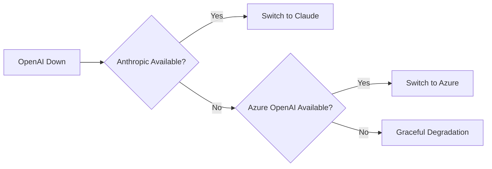

# Third-Party API Outage

**Runbook for LLM Provider and External Service Failures**

---

## 🚨 Severity Classification

| Severity | Impact | Response Time |
|----------|--------|---------------|
| P0 (Critical) | Primary LLM provider completely down | 5 minutes |
| P1 (High) | Partial outage or severe degradation | 15 minutes |
| P2 (Medium) | Rate limiting or elevated errors | 1 hour |
| P3 (Low) | Minor latency increase | 24 hours |

---

## 📊 External Dependencies

### LLM Providers

| Provider | Status Page | Primary Use |
|----------|-------------|-------------|
| OpenAI | [status.openai.com](https://status.openai.com) | GPT-4, Embeddings |
| Anthropic | [status.anthropic.com](https://status.anthropic.com) | Claude (fallback) |
| Azure OpenAI | [azure.status.microsoft.com](https://azure.status.microsoft.com) | Enterprise backup |

### Other Critical Services

| Service | Purpose | Fallback |
|---------|---------|----------|
| Weaviate | Vector DB | Read replicas |
| Redis | Cache | Local cache |
| PostgreSQL | Main DB | Read replica |

---

## 🔧 Response Procedures

### Phase 1: Detection & Verification (0-5 minutes)

1. **Check provider status pages**
   - OpenAI: [status.openai.com](https://status.openai.com)
   - Anthropic: [status.anthropic.com](https://status.anthropic.com)

2. **Verify from our systems**
   ```bash
   # Check error rates
   curl -s https://api.kosmos.nuvanta-holding.com/metrics/errors-by-provider
   
   # Test API directly
   curl -X POST https://api.openai.com/v1/chat/completions \
     -H "Authorization: Bearer $OPENAI_API_KEY" \
     -d '{"model":"gpt-4","messages":[{"role":"user","content":"test"}]}'
   ```

3. **Assess scope**
   - Which models affected?
   - Partial or complete outage?
   - Expected duration (from provider)?

### Phase 2: Activate Failover

#### LLM Provider Failover



**Automatic Failover (if configured):**
```bash
# Check failover status
kubectl get configmap llm-routing -o yaml

# Verify traffic routing
curl -s https://api.kosmos.nuvanta-holding.com/routing/status
```

**Manual Failover:**
```bash
# Switch to Anthropic
kubectl patch configmap llm-routing -p '{"data":{"primary":"anthropic"}}'

# Apply change
kubectl rollout restart deployment/model-router
```

#### Service-Specific Failovers

**Vector Database (Weaviate):**
```bash
# Switch to read replica
kubectl patch service weaviate -p '{"spec":{"selector":{"role":"replica"}}}'
```

**Cache (Redis):**
```bash
# Enable local cache fallback
kubectl patch configmap cache-config -p '{"data":{"local_fallback":"true"}}'
```

### Phase 3: User Communication

1. **Update status page**
   ```bash
   # Post incident to status page
   curl -X POST https://api.statuspage.io/v1/pages/{page_id}/incidents \
     -d '{"incident":{"name":"LLM Provider Degradation","status":"investigating"}}'
   ```

2. **Notify internal teams**
   ```bash
   /incident start "External API Outage: OpenAI"
   ```

3. **Customer notification** (if extended outage)
   - Email template: "Service Degradation Notice"
   - In-app banner: "Some features may be slower than usual"

### Phase 4: Monitor & Recovery

1. **Monitor provider status**
   - Watch status page for updates
   - Test API periodically
   
   ```bash
   # Continuous health check
   watch -n 60 "curl -s -o /dev/null -w '%{http_code}' https://api.openai.com/v1/models"
   ```

2. **Prepare for recovery**
   - Don't switch back immediately when provider recovers
   - Verify stability (15+ minutes of green status)

3. **Restore primary provider**
   ```bash
   # Gradual traffic shift (10% increments)
   kubectl patch configmap llm-routing -p '{"data":{"openai_weight":"10"}}'
   
   # Monitor for 5 minutes, then increase
   kubectl patch configmap llm-routing -p '{"data":{"openai_weight":"50"}}'
   
   # Full restoration
   kubectl patch configmap llm-routing -p '{"data":{"primary":"openai","openai_weight":"100"}}'
   ```

---

## 🛡️ Graceful Degradation

When all providers are unavailable:

### Option 1: Cached Responses

```python
def get_response(prompt):
    # Try cache first
    cached = cache.get(hash(prompt))
    if cached:
        return cached, {"source": "cache", "fresh": False}
    
    # Try all providers
    for provider in [openai, anthropic, azure]:
        try:
            return provider.complete(prompt)
        except ProviderError:
            continue
    
    # All providers failed
    return None, {"error": "service_unavailable"}
```

### Option 2: Simplified Features

- Disable complex AI features temporarily
- Enable rule-based fallbacks where possible
- Queue requests for later processing

### Option 3: Honest Error Messages

```yaml
error_response:
  status: 503
  message: "AI service temporarily unavailable. Please try again in a few minutes."
  retry_after: 300
```

---

## 📋 Provider-Specific Notes

### OpenAI

- Rate limits: 10,000 TPM (tokens per minute) on standard tier
- Retry strategy: Exponential backoff, max 3 retries
- Headers to check: `x-ratelimit-remaining-tokens`

### Anthropic

- Rate limits: Based on tier
- Different API format than OpenAI
- Prompt translation may be needed

### Azure OpenAI

- Same models as OpenAI
- Regional endpoints
- Enterprise SLA available

---

## 📞 Escalation Path

1. Platform On-Call
2. ML Engineering Lead
3. VP Engineering
4. CTO (extended P0 outage)

### External Contacts

| Provider | Support | Escalation |
|----------|---------|------------|
| OpenAI | support@openai.com | Enterprise support portal |
| Anthropic | support@anthropic.com | Account manager |
| Azure | Azure Portal support | Microsoft TAM |

---

## 📋 Post-Incident

### Required Documentation

- Provider affected
- Duration of outage
- User impact
- Failover effectiveness
- Cost of outage (if applicable)

### Follow-up Actions

- [ ] Review failover automation
- [ ] Update provider weights if needed
- [ ] Consider additional providers
- [ ] Improve caching strategy
- [ ] Update runbook with lessons learned

---

**Last Updated:** 2025-12-12  
**Document Owner:** Platform Engineering Lead

[← Back to Incident Response](README.md)
