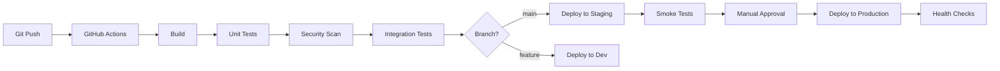

# CI/CD Pipeline

**Last Updated:** 2025-12-13  
**Status:** Active

## Overview

Continuous Integration and Continuous Deployment pipeline for KOSMOS, automating build, test, security scanning, and deployment processes.

## Pipeline Architecture



## CI Workflow

### On Pull Request
1. **Code Quality Checks**
   - Linting (pylint, eslint)
   - Formatting (black, prettier)
   - Type checking (mypy, TypeScript)

2. **Unit Tests**
   - Run all unit tests
   - Generate coverage report (>80% required)

3. **Security Scanning**
   - Dependency vulnerabilities (Snyk, Dependabot)
   - Secret scanning (TruffleHog)
   - SAST (Semgrep)

4. **Build Images**
   - Build Docker images
   - Tag with PR number

5. **Integration Tests**
   - Deploy to ephemeral environment
   - Run integration test suite
   - Cleanup environment

### On Merge to Main
1. **Full Test Suite**
   - All tests from PR + E2E tests

2. **Build Production Images**
   - Build and tag with version
   - Push to container registry
   - Sign images (Cosign)

3. **Deploy to Staging**
   - Automatic deployment
   - Run smoke tests
   - Performance benchmarks

4. **Await Approval**
   - Manual approval required for production
   - Automated approval for non-breaking changes (future)

5. **Deploy to Production**
   - Canary deployment (10% → 50% → 100%)
   - Health checks at each stage
   - Automatic rollback on failure

## CD Workflow

### GitOps with ArgoCD

```yaml
# Application manifest
apiVersion: argoproj.io/v1alpha1
kind: Application
metadata:
  name: kosmos-production
  namespace: argocd
spec:
  project: default
  source:
    repoURL: https://github.com/Nuvanta-Holding/kosmos-infrastructure
    targetRevision: main
    path: k8s/production
  destination:
    server: https://kubernetes.default.svc
    namespace: kosmos
  syncPolicy:
    automated:
      prune: true
      selfHeal: true
    syncOptions:
    - CreateNamespace=true
```

### Deployment Strategies

**Canary (Preferred):**
- 10% traffic for 5 minutes
- Monitor error rates, latency
- Promote to 50% if healthy
- Full rollout or rollback

**Blue-Green (DR scenarios):**
- Deploy full "green" environment
- Run validation tests
- Switch traffic atomically
- Keep "blue" for quick rollback

**Rolling Update (Default):**
- Update pods one by one
- Wait for health checks
- Continue if healthy

## Pipeline Stages

### Stage 1: Build (< 5 min)
```yaml
build:
  runs-on: ubuntu-latest
  steps:
    - uses: actions/checkout@v4
    
    - name: Set up Docker Buildx
      uses: docker/setup-buildx-action@v3
    
    - name: Build images
      uses: docker/build-push-action@v5
      with:
        context: .
        push: false
        tags: kosmos/agent:${{ github.sha }}
        cache-from: type=gha
        cache-to: type=gha,mode=max
```

### Stage 2: Test (< 15 min)
```yaml
test:
  runs-on: ubuntu-latest
  needs: build
  steps:
    - name: Run unit tests
      run: pytest tests/unit --cov=src --cov-report=xml
    
    - name: Upload coverage
      uses: codecov/codecov-action@v3
```

### Stage 3: Security (< 10 min)
```yaml
security:
  runs-on: ubuntu-latest
  needs: build
  steps:
    - name: Run Trivy scan
      uses: aquasecurity/trivy-action@master
      with:
        scan-type: 'fs'
        severity: 'CRITICAL,HIGH'
    
    - name: Run Snyk scan
      uses: snyk/actions/docker@master
```

### Stage 4: Deploy Staging (< 5 min)
```yaml
deploy-staging:
  runs-on: ubuntu-latest
  needs: [test, security]
  if: github.ref == 'refs/heads/main'
  steps:
    - name: Deploy via ArgoCD
      run: |
        argocd app sync kosmos-staging
        argocd app wait kosmos-staging --health
```

### Stage 5: Deploy Production (< 10 min)
```yaml
deploy-production:
  runs-on: ubuntu-latest
  needs: deploy-staging
  environment: production
  steps:
    - name: Deploy canary
      run: |
        kubectl apply -f k8s/production/canary.yaml
        
    - name: Monitor canary
      run: ./scripts/monitor-canary.sh
    
    - name: Promote or rollback
      run: |
        if [ $CANARY_HEALTHY == "true" ]; then
          kubectl apply -f k8s/production/
        else
          kubectl delete -f k8s/production/canary.yaml
          exit 1
        fi
```

## Deployment Gates

### Quality Gates
- [ ] All tests passing
- [ ] Code coverage ≥ 80%
- [ ] No critical/high vulnerabilities
- [ ] Performance benchmarks met
- [ ] Documentation updated

### Approval Gates
- **Staging:** Automatic
- **Production:** Manual approval required
  - Development Lead
  - Product Manager (for major releases)

## Monitoring and Notifications

### Slack Notifications
```yaml
- name: Notify deployment
  uses: slackapi/slack-github-action@v1
  with:
    payload: |
      {
        "text": "🚀 Deploying kosmos v${{ github.ref_name }} to production",
        "channel": "#deployments"
      }
```

### Deployment Metrics
- Deployment frequency
- Lead time for changes
- Mean time to recovery (MTTR)
- Change failure rate

## Rollback Procedures

### Automatic Rollback Triggers
- Health check failures > 5 minutes
- Error rate > 5%
- P95 latency > 2x baseline

### Manual Rollback
```bash
# Kubernetes
kubectl rollout undo deployment/agent-name -n kosmos

# ArgoCD
argocd app rollback kosmos-production <previous-revision>

# Helm
helm rollback kosmos 0 -n kosmos
```

## Pipeline Configuration Files

- `.github/workflows/deploy.yml` - Main deployment workflow
- `.github/workflows/validate.yml` - PR validation
- `argocd/apps/` - ArgoCD application definitions
- `k8s/` - Kubernetes manifests

## Related Documentation

- [Deployment Procedures](../../security/deployment.md)
- [Agent Deployment](../runbooks/agent-deployment.md)
- [Disaster Recovery](../../security/disaster-recovery.md)
