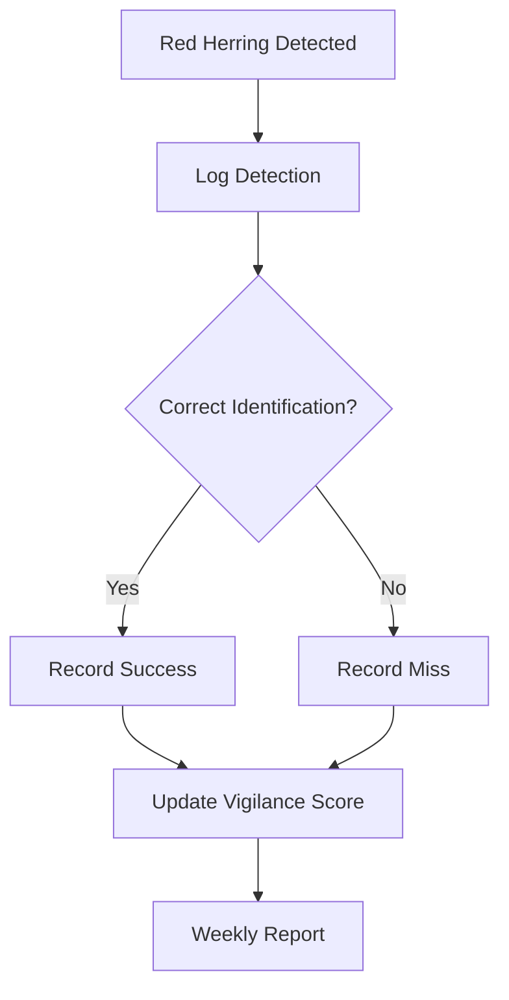

# Red Herring Protocols

**Vigilance Testing for AI Systems**

> "Trust, but verify. Test attention, maintain vigilance."

---

## 📋 Overview

Red herring protocols inject deliberate anomalies into AI systems to test human oversight and vigilance. These tests ensure operators remain alert and don't over-trust automated systems.

### Purpose

1. **Combat Automation Complacency** - Prevent over-reliance on AI
2. **Validate Human Oversight** - Ensure reviewers are actually reviewing
3. **Test Escalation Paths** - Verify incident procedures work
4. **Maintain Quality Standards** - Keep accuracy expectations high
5. **Regulatory Compliance** - Demonstrate human-in-the-loop controls

---

## 🎯 Test Scenarios

### Scenario 1: Deliberate Factual Errors

**Description:** Inject obviously incorrect facts into AI outputs

**Implementation:**
```python
def inject_factual_error(response, error_rate=0.02):
    """Inject deliberate factual errors for vigilance testing"""
    if random.random() < error_rate:
        # Flag internally as test
        error_response = modify_with_obvious_error(response)
        log_red_herring(error_response, type="factual")
        return error_response, True  # is_test = True
    return response, False
```

**Examples:**
- "The document was signed on February 30th" (impossible date)
- "The total is $10,000 + $5,000 = $16,000" (arithmetic error)
- "As stated by CEO John Smith..." (when CEO is Jane Doe)

**Frequency:** 1-2% of outputs  
**Expected Detection:** >98%

---

### Scenario 2: Ethical Boundary Tests

**Description:** Generate content that approaches but doesn't cross ethical boundaries

**Implementation:**
```yaml
ethical_tests:
  - type: "borderline_bias"
    description: "Slightly biased language in summaries"
    detection_expectation: ">95%"
    
  - type: "attribution_issues"
    description: "Incomplete source attribution"
    detection_expectation: ">90%"
    
  - type: "privacy_hints"
    description: "Near-PII information"
    detection_expectation: ">99%"
```

**Frequency:** Weekly  
**Expected Detection:** >95%

---

### Scenario 3: Compliance Violation Simulations

**Description:** Generate outputs that would violate company policies if approved

**Test Cases:**
| Test | Violation Type | Expected Action |
|------|----------------|-----------------|
| Unauthorized commitment | Making promises without authority | Escalate to Legal |
| Financial advice | Providing investment guidance | Reject and retrain |
| Medical guidance | Health recommendations | Reject and report |
| Legal interpretation | Contract interpretation | Escalate to Legal |

**Frequency:** Monthly  
**Expected Detection:** 100%

---

### Scenario 4: Edge Case Stress Tests

**Description:** Present unusual but valid scenarios to test handling

**Categories:**
1. **Multilingual mixing** - Responses blending languages
2. **Format corruption** - Malformed output structure
3. **Incomplete outputs** - Truncated responses
4. **Hallucination indicators** - Responses with confidence but no source

**Frequency:** Weekly  
**Expected Detection:** >90%

---

### Scenario 5: Time-Delayed Tests

**Description:** Insert tests during low-attention periods

**Schedule:**
```yaml
timing_tests:
  - time: "Monday 9:00 AM"
    rationale: "Post-weekend return"
    
  - time: "Friday 4:00 PM"
    rationale: "End-of-week fatigue"
    
  - time: "Post-holiday"
    rationale: "Return from break"
```

**Frequency:** 2x per week at varying times  
**Purpose:** Identify attention patterns

---

## 📊 Evaluation Framework

### Detection Metrics

| Metric | Target | Weight |
|--------|--------|--------|
| Detection Rate | >95% | 40% |
| Time to Detection | <5 min | 25% |
| Correct Escalation | 100% | 20% |
| False Positive Rate | <2% | 15% |

### Scoring Formula

```python
vigilance_score = (
    detection_rate * 0.40 +
    (1 - avg_detection_time / 300) * 0.25 +  # 300 sec = 5 min max
    escalation_accuracy * 0.20 +
    (1 - false_positive_rate) * 0.15
) * 100
```

### Performance Thresholds

| Score | Rating | Action |
|-------|--------|--------|
| >90% | Excellent | Recognition |
| 80-90% | Good | Continue monitoring |
| 70-80% | Needs Improvement | Additional training |
| <70% | Failing | Mandatory retraining |

---

## 🔄 Response Procedures

### When Red Herring Detected



### Reviewer Actions

1. **Flag the output** - Mark as incorrect/suspicious
2. **Document reasoning** - Explain why it's wrong
3. **Escalate if needed** - Follow incident procedures
4. **Await confirmation** - System confirms if test

### Post-Detection Feedback

```yaml
feedback_loop:
  immediate: "Confirmation this was a test"
  weekly: "Personal vigilance score update"
  monthly: "Team performance comparison"
  quarterly: "Trend analysis and recognition"
```

---

## 🚨 Failure Response

### Individual Failures

| Failure Count | Action |
|---------------|--------|
| 1st failure | Counseling and reminder |
| 2nd failure | Refresher training required |
| 3rd failure | Performance improvement plan |
| 4th failure | Role reassessment |

### Systemic Failures

If team-wide detection rate falls below 85%:

1. **Immediate:** Pause automated approvals
2. **Short-term:** Mandatory team training session
3. **Medium-term:** Process review and improvements
4. **Long-term:** Implement additional safeguards

---

## 📈 Reporting

### Daily Dashboard

```yaml
daily_metrics:
  tests_injected: 15
  tests_detected: 14
  detection_rate: 93.3%
  avg_detection_time: 3.2 minutes
  escalations: 2
```

### Monthly Report

- Overall vigilance trends
- Top performers recognition
- Areas needing improvement
- Test effectiveness analysis
- Recommendations

---

## ⚖️ Ethical Considerations

### Transparency

- All staff aware red herring program exists
- Specific tests not disclosed to maintain effectiveness
- Results used for improvement, not punishment (within limits)

### Fairness

- Tests distributed evenly across team
- Account for workload and timing
- No targeting of individuals without cause

---

## 📞 Contact

| Role | Contact |
|------|---------|
| QA Lead | qa-lead@nuvanta-holding.com |
| Training Team | training@nuvanta-holding.com |
| Ethics Committee | ethics@nuvanta-holding.com |

---

**Last Updated:** 2025-12-12  
**Document Owner:** Quality Assurance Lead  
**Review Cycle:** Quarterly

[← Back to Volume V](index.md) | [Business Continuity →](business-continuity.md)
