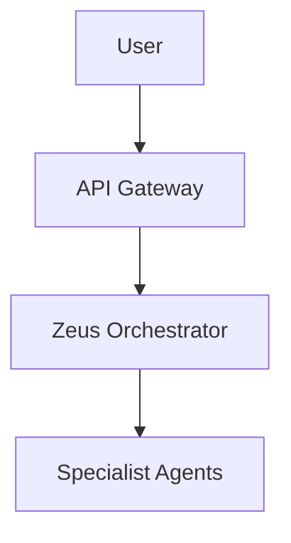

# Documentation Assessment & Improvement Plan

**Assessment Date:** December 23, 2025  
**Project:** KOSMOS Digital Agentic Realm V1.0.0.0  
**Methodology:** Docs-as-Code Systematic Review  
**Status:** 🟡 Good Foundation, Critical Gaps Identified

---

## Executive Summary

The KOSMOS documentation has a **strong foundational structure** with 214+ markdown files organized across volumes (governance, architecture, engineering, operations). However, **critical gaps exist in deployment automation, API documentation, and user onboarding** that prevent it from serving as a complete unified guide for deployment and automation.

### Key Findings

✅ **Strengths:**
- Well-organized volume structure (00-07 volumes)
- Comprehensive deployment summary and status tracking
- Strong governance and architecture documentation
- MkDocs configured for professional documentation site

❌ **Critical Gaps:**
- Missing unified deployment automation guide
- No complete Infrastructure-as-Code (IaC) documentation
- Incomplete API reference documentation (OpenAPI spec exists but not integrated)
- Missing tutorials and step-by-step walkthroughs
- Navigation structure incomplete in mkdocs.yml
- Inconsistent linking between docs and code

---

## 1. Structural Assessment

### 1.1 Current Structure

```
docs/
├── 00-executive/          ✅ Executive summaries
├── 01-governance/         ✅ Governance & legal framework
├── 02-architecture/       ✅ System architecture & ADRs
├── 03-engineering/        🟡 Standards present, missing API ref
├── 04-operations/         ✅ Runbooks & observability
├── 05-human-factors/      ⚠️  Not in mkdocs.yml nav
├── 06-personal-data/      🟡 Basic structure
├── 07-entertainment/      🟡 Basic structure
├── academy/               ⚠️  Stub only - no tutorials
├── deployment/            🟡 Good status docs, missing automation
├── developer-guide/       🟡 Environment setup only
├── guides/                🟡 Mixed content, needs organization
├── project-management/    ✅ Comprehensive tracking
├── security/              ✅ Strong security documentation
├── technical-debt/        ✅ Debt tracking and remediation
└── assessments/           ✅ Gap analyses and audits
```

### 1.2 MkDocs Navigation Issues

**Current mkdocs.yml navigation:**
- ✅ Home and Getting Started defined
- ✅ Core documentation volumes mapped
- ❌ Missing: Academy section
- ❌ Missing: Guides section (quick reference, tutorials)
- ❌ Missing: API Reference section
- ❌ Missing: Infrastructure-as-Code section
- ❌ Missing: Automation & CI/CD section
- ❌ Incomplete: Developer guide only has README.md

**Issue:** Many valuable documents exist but are not discoverable through the documentation site navigation.

---

## 2. Content Gaps by Category

### 2.1 CRITICAL: Deployment & Automation

**Current State:**
- ✅ Deployment summary (status-focused)
- ✅ Getting started guide (overview)
- ✅ GUI quick start
- ✅ Individual runbooks in 04-operations/
- ❌ **Missing: Unified deployment automation guide**
- ❌ **Missing: End-to-end deployment playbook**
- ❌ **Missing: Infrastructure-as-Code documentation**
- ❌ **Missing: CI/CD pipeline documentation**
- ❌ **Missing: Terraform/Helm chart documentation**

**Gap Impact:** HIGH - Users cannot systematically deploy and automate the platform.

**What's Needed:**
```
docs/
├── deployment/
│   ├── 01-prerequisites.md           # NEW - System requirements, tools
│   ├── 02-infrastructure-setup.md    # NEW - K3s, cloud provider setup
│   ├── 03-automation-pipeline.md     # NEW - CI/CD configuration
│   ├── 04-helm-deployment.md         # NEW - Helm chart usage
│   ├── 05-verification.md            # NEW - Health checks, validation
│   └── 06-troubleshooting.md         # NEW - Common issues
├── infrastructure-as-code/           # NEW SECTION
│   ├── index.md                      # Overview
│   ├── terraform/
│   │   ├── alibaba-cloud.md
│   │   ├── aws.md
│   │   └── gcp.md
│   ├── helm/
│   │   ├── charts-overview.md
│   │   └── values-configuration.md
│   └── kubernetes/
│       ├── manifests-guide.md
│       └── kustomize-overlays.md
└── automation/                        # NEW SECTION
    ├── ci-cd-overview.md
    ├── github-actions.md
    ├── gitlab-ci.md
    └── automation-best-practices.md
```

### 2.2 CRITICAL: API Documentation

**Current State:**
- ✅ API design standards (03-engineering/api-design.md)
- ✅ OpenAPI specification file exists (openapi.json at root)
- ❌ **Missing: API reference documentation integrated in docs**
- ❌ **Missing: API examples and usage guides**
- ❌ **Missing: SDK documentation (python-sdk.md is stub)**
- ❌ **Missing: Authentication flow documentation**

**Gap Impact:** HIGH - Developers cannot effectively use the APIs.

**What's Needed:**
```
docs/
├── api-reference/                    # NEW SECTION
│   ├── index.md                      # API overview
│   ├── authentication.md             # OAuth2/JWT flows
│   ├── endpoints/                    # Auto-generated from OpenAPI
│   │   ├── agents.md
│   │   ├── tasks.md
│   │   ├── zeus.md
│   │   └── mcp.md
│   ├── examples/                     # NEW - Code examples
│   │   ├── python-client.md
│   │   ├── javascript-client.md
│   │   └── curl-examples.md
│   └── sdk/                          # SDK documentation
│       ├── python.md
│       └── typescript.md
```

### 2.3 HIGH: Tutorials & Walkthroughs

**Current State:**
- ✅ Academy directory exists
- ❌ **Missing: All tutorial content** (only stub references)
- ❌ **Missing: Step-by-step guides**
- ❌ **Missing: Code examples**
- ❌ **Missing: Video script implementations**

**Gap Impact:** HIGH - No hands-on learning path for new users.

**What's Needed:**
```
docs/
├── tutorials/                        # NEW SECTION
│   ├── index.md
│   ├── 01-first-deployment.md       # NEW - "Hello World" deployment
│   ├── 02-create-agent.md            # NEW - Building a custom agent
│   ├── 03-add-mcp-tool.md            # NEW - Integrating new MCP tool
│   ├── 04-monitoring-setup.md        # NEW - Setting up observability
│   ├── 05-scaling-agents.md          # NEW - Scaling strategies
│   └── 06-production-hardening.md    # NEW - Production checklist
└── examples/                         # NEW SECTION
    ├── docker-compose/
    │   └── full-stack-example.yaml
    ├── kubernetes/
    │   └── production-deployment.yaml
    └── code/
        ├── python/
        │   ├── custom-agent.py
        │   └── mcp-tool-example.py
        └── typescript/
            └── frontend-integration.ts
```

### 2.4 MEDIUM: Quick Reference Materials

**Current State:**
- ✅ QUICK_REFERENCE.md exists at root (not in docs/)
- ❌ **Missing: Quick reference in docs site**
- ❌ **Missing: Command cheat sheet**
- ❌ **Missing: Configuration reference**
- ❌ **Missing: Troubleshooting quick reference**

**Gap Impact:** MEDIUM - Experienced users need quick access to commands.

**What's Needed:**
```
docs/
└── reference/                        # NEW SECTION
    ├── index.md
    ├── cli-commands.md               # All CLI commands
    ├── configuration-options.md      # Environment variables, configs
    ├── agent-reference.md            # Quick agent capabilities
    ├── mcp-tools-reference.md        # All 88 MCP tools
    └── troubleshooting-index.md      # Quick problem/solution index
```

### 2.5 MEDIUM: Developer Experience

**Current State:**
- ✅ Development environment guide
- ✅ Contributing guide
- ✅ Build plan
- ❌ **Missing: Local development workflow**
- ❌ **Missing: Testing guide**
- ❌ **Missing: Debugging guide**
- ❌ **Missing: Code contribution workflow**

**Gap Impact:** MEDIUM - Developer onboarding is incomplete.

**What's Needed:**
```
docs/
└── developer-guide/
    ├── README.md                     # Overview (exists)
    ├── local-development.md          # NEW - Day-to-day workflow
    ├── testing-guide.md              # NEW - Running tests
    ├── debugging.md                  # NEW - Debugging strategies
    ├── code-style.md                 # NEW - Python style guide
    ├── git-workflow.md               # NEW - Branch strategy, PRs
    └── release-process.md            # NEW - How releases work
```

---

## 3. Documentation Quality Issues

### 3.1 Inconsistent Linking

**Issue:** Many documents reference files/code but don't link properly.

**Examples:**
- Deployment summary references scripts but doesn't link to them
- ADRs reference other docs without hyperlinks
- Code references in guides lack file path links

**Fix Required:**
- Implement consistent linking convention
- Use relative paths: `[script](../../scripts/setup.sh)`
- Add "Related Documentation" sections to all major docs

### 3.2 Outdated Navigation

**Issue:** mkdocs.yml only references a fraction of available documentation.

**Current nav items:** ~20  
**Total markdown files:** 214+  
**Discoverability:** ~9%

**Fix Required:**
- Complete mkdocs.yml navigation structure
- Add all major sections to nav
- Implement section index pages with links to sub-documents

### 3.3 Missing Cross-References

**Issue:** Documents exist in silos without connecting to related content.

**Examples:**
- Deployment docs don't reference architecture docs
- Engineering standards don't link to code examples
- Operations runbooks don't link to architecture diagrams

**Fix Required:**
- Add "See Also" sections to all major docs
- Create a documentation graph/sitemap
- Implement breadcrumb navigation

### 3.4 Code-Documentation Disconnect

**Issue:** Documentation doesn't link to actual code implementation.

**Examples:**
- API design doc exists, but no link to `src/api/` implementation
- Agent architecture doc doesn't link to `src/agents/` code
- Infrastructure docs don't link to actual Helm charts/manifests

**Fix Required:**
- Add "Implementation" sections with GitHub links
- Use code references in documentation: `` [AgentBase](../../src/agents/base.py) ``
- Add docstring extraction for API docs

---

## 4. Systematic Improvement Plan

### Phase 1: Critical Path (Week 1-2)

**Goal:** Enable complete deployment and automation.

#### 1.1 Deployment Automation Documentation
**Priority:** CRITICAL  
**Effort:** 2-3 days  
**Owner:** DevOps Lead

**Tasks:**
1. ✅ Create `docs/deployment/01-prerequisites.md`
   - System requirements (32GB RAM, K3s, Docker)
   - Tool installation (kubectl, helm, terraform)
   - Cloud provider account setup
2. ✅ Create `docs/deployment/02-infrastructure-setup.md`
   - K3s cluster installation
   - Linkerd service mesh setup
   - cert-manager configuration
3. ✅ Create `docs/deployment/03-automation-pipeline.md`
   - CI/CD setup (GitHub Actions/GitLab CI)
   - Automated deployment workflow
   - Environment promotion strategy
4. ✅ Create `docs/deployment/04-helm-deployment.md`
   - Helm chart structure
   - Values.yaml configuration
   - Chart deployment commands
5. ✅ Create `docs/deployment/05-verification.md`
   - Health check procedures
   - Validation scripts
   - Smoke tests
6. ✅ Create `docs/deployment/06-troubleshooting.md`
   - Common deployment issues
   - Debugging steps
   - Support channels

#### 1.2 Infrastructure-as-Code Documentation
**Priority:** CRITICAL  
**Effort:** 2-3 days  
**Owner:** Infrastructure Team

**Tasks:**
1. ✅ Create `docs/infrastructure-as-code/index.md`
   - IaC philosophy
   - Tool overview (Terraform, Helm, Kustomize)
   - Repository structure
2. ✅ Document Terraform modules
   - `docs/infrastructure-as-code/terraform/alibaba-cloud.md`
   - `docs/infrastructure-as-code/terraform/aws.md`
   - `docs/infrastructure-as-code/terraform/gcp.md`
3. ✅ Document Helm charts
   - `docs/infrastructure-as-code/helm/charts-overview.md`
   - `docs/infrastructure-as-code/helm/values-configuration.md`
4. ✅ Document Kubernetes manifests
   - `docs/infrastructure-as-code/kubernetes/manifests-guide.md`
   - `docs/infrastructure-as-code/kubernetes/kustomize-overlays.md`

#### 1.3 Update MkDocs Navigation
**Priority:** CRITICAL  
**Effort:** 1 day  
**Owner:** Documentation Lead

**Tasks:**
1. ✅ Add complete navigation structure to `mkdocs.yml`
2. ✅ Add all major sections
3. ✅ Verify all links work
4. ✅ Deploy updated docs site

### Phase 2: API & Integration (Week 3-4)

**Goal:** Complete API documentation and developer integration guides.

#### 2.1 API Reference Documentation
**Priority:** HIGH  
**Effort:** 3-4 days  
**Owner:** API Team

**Tasks:**
1. ✅ Integrate OpenAPI spec into docs
   - Use Redoc or Swagger UI
   - Auto-generate endpoint documentation
2. ✅ Create API usage guides
   - Authentication flows
   - Common patterns
   - Error handling
3. ✅ Add code examples
   - Python client examples
   - JavaScript/TypeScript examples
   - cURL examples
4. ✅ Document SDK
   - Python SDK guide
   - Installation instructions
   - Usage examples

#### 2.2 MCP Integration Documentation
**Priority:** HIGH  
**Effort:** 2 days  
**Owner:** Integration Team

**Tasks:**
1. ✅ Create MCP reference documentation
   - All 88 MCP tools catalogued
   - Tool capabilities and parameters
   - Integration examples
2. ✅ Add MCP setup guides
   - Per-tool setup instructions
   - Configuration examples
   - Troubleshooting

### Phase 3: Learning Path (Week 5-6)

**Goal:** Create complete onboarding and learning path.

#### 3.1 Tutorial Series
**Priority:** HIGH  
**Effort:** 4-5 days  
**Owner:** Documentation Team

**Tasks:**
1. ✅ Create beginner tutorials
   - First deployment (Docker Compose)
   - First agent invocation
   - Basic monitoring setup
2. ✅ Create intermediate tutorials
   - Custom agent creation
   - MCP tool integration
   - Multi-agent orchestration
3. ✅ Create advanced tutorials
   - Production deployment
   - Scaling strategies
   - Custom observability

#### 3.2 Code Examples Repository
**Priority:** MEDIUM  
**Effort:** 3 days  
**Owner:** Development Team

**Tasks:**
1. ✅ Create `docs/examples/` section
2. ✅ Add Docker Compose examples
3. ✅ Add Kubernetes examples
4. ✅ Add Python code examples
5. ✅ Add TypeScript code examples

### Phase 4: Polish & Maintenance (Week 7-8)

**Goal:** Improve documentation quality and establish maintenance process.

#### 4.1 Cross-Linking & Navigation
**Priority:** MEDIUM  
**Effort:** 2-3 days  
**Owner:** Documentation Team

**Tasks:**
1. ✅ Add "See Also" sections to all major docs
2. ✅ Implement consistent linking conventions
3. ✅ Create documentation sitemap
4. ✅ Add breadcrumb navigation
5. ✅ Verify all internal links

#### 4.2 Quick Reference Materials
**Priority:** MEDIUM  
**Effort:** 2 days  
**Owner:** Documentation Team

**Tasks:**
1. ✅ Create CLI command reference
2. ✅ Create configuration reference
3. ✅ Create troubleshooting index
4. ✅ Create cheat sheets

#### 4.3 Documentation Automation
**Priority:** MEDIUM  
**Effort:** 2-3 days  
**Owner:** DevOps Team

**Tasks:**
1. ✅ Set up automated documentation builds
2. ✅ Implement link checking (e.g., `linkchecker`)
3. ✅ Set up documentation versioning
4. ✅ Add PR preview builds
5. ✅ Create documentation review checklist

---

## 5. Documentation Standards & Conventions

### 5.1 File Naming Convention

**Standard:**
- Use lowercase with hyphens: `deployment-guide.md`
- Use descriptive names: `kubernetes-helm-deployment.md` not `k8s-deploy.md`
- Use index.md for section overviews
- Number sequential guides: `01-prerequisites.md`, `02-setup.md`

### 5.2 Document Structure Template

**Every major document should include:**

```markdown
# Title

**Metadata Block:**
- **Purpose:** What this doc covers
- **Audience:** Who should read this
- **Prerequisites:** What you need first
- **Related:** Links to related docs

---

## Overview
Brief introduction and context

## [Main Content Sections]
...

## Examples
Concrete code examples

## Troubleshooting
Common issues and solutions

## See Also
- [Related Doc 1](../path/to/doc.md)
- [Related Doc 2](../path/to/doc.md)

---

**Last Updated:** YYYY-MM-DD  
**Status:** Draft | Review | Published
```

### 5.3 Linking Convention

**Internal Links:**
- Use relative paths: `[Guide](../guides/setup.md)`
- Link to specific sections: `[Deployment](../deployment/guide.md#installation)`
- Always verify links work

**Code References:**
- Link to source: `[AgentBase](../../src/agents/base.py)`
- Use line numbers for specifics: `[Auth Config](../../src/config.py#L45-L60)`

**External Links:**
- Use descriptive text: `[Kubernetes Documentation](https://kubernetes.io/docs/)`
- Include access date for time-sensitive references

### 5.4 Code Example Format

**Standard:**
````markdown
```python
# Clear context comment
from kosmos.agents import AgentBase

class MyAgent(AgentBase):
    """What this agent does."""
    
    def process(self, task):
        # Implementation
        pass
```

**Usage:**
```bash
python examples/my_agent.py
```

**Output:**
```
Expected output here
```
````

### 5.5 Mermaid Diagrams

**Use Mermaid for:**
- Architecture diagrams
- Sequence diagrams
- Flowcharts
- Deployment topologies

**Example:**
```markdown

```

### 5.6 Admonitions (Callouts)

**Use consistent callout types:**

```markdown
!!! info "Information"
    Additional context

!!! warning "Warning"
    Important caution

!!! danger "Critical"
    Must-read warning

!!! tip "Pro Tip"
    Best practice advice

!!! example "Example"
    Concrete example
```

---

## 6. Metrics & Success Criteria

### 6.1 Documentation Coverage Metrics

**Current State (Estimated):**
- Deployment automation: 40% complete
- API documentation: 30% complete
- Tutorial coverage: 10% complete
- Code examples: 20% complete
- Navigation completeness: 20%

**Target State (End of Phase 4):**
- Deployment automation: 95% complete
- API documentation: 90% complete
- Tutorial coverage: 80% complete
- Code examples: 75% complete
- Navigation completeness: 95%

### 6.2 Quality Metrics

**Success Criteria:**
- ✅ All internal links verified (0 broken links)
- ✅ All code examples tested
- ✅ 100% of major features documented
- ✅ <10 min time to first deployment (with tutorial)
- ✅ <30 min time to custom agent (with tutorial)

### 6.3 User Feedback Metrics

**Measure:**
- Time to first successful deployment
- Number of support questions on basic topics
- Documentation satisfaction survey
- GitHub issues related to unclear docs

---

## 7. Maintenance & Governance

### 7.1 Documentation Ownership

**Assign clear ownership:**
- **Deployment docs:** DevOps team
- **API docs:** API team (auto-generated + curated)
- **Tutorials:** Documentation team
- **Architecture docs:** Architecture team
- **Runbooks:** Operations team

### 7.2 Review Process

**All documentation changes require:**
1. ✅ PR with documentation diff
2. ✅ Technical review by owner
3. ✅ Editorial review for clarity
4. ✅ Link checking passed
5. ✅ Code examples tested (if applicable)
6. ✅ Approved by documentation lead

### 7.3 Update Schedule

**Regular updates:**
- **Weekly:** Project management docs (TASK_JOURNAL.md)
- **Monthly:** Status updates, roadmaps
- **Per release:** API docs, changelogs
- **Per deployment:** Runbooks, troubleshooting
- **Quarterly:** Architecture reviews, governance docs

### 7.4 Deprecation Process

**When deprecating content:**
1. ✅ Add deprecation notice to top of document
2. ✅ Link to replacement documentation
3. ✅ Set removal date (minimum 3 months)
4. ✅ Move to `docs/archive/` after removal date
5. ✅ Update all references

---

## 8. Implementation Roadmap

### Timeline Overview

```
Week 1-2:  Phase 1 - Deployment automation docs
Week 3-4:  Phase 2 - API & integration docs
Week 5-6:  Phase 3 - Tutorials & examples
Week 7-8:  Phase 4 - Polish & automation
Week 9+:   Maintenance & continuous improvement
```

### Resource Requirements

**Team:**
- 1 Documentation Lead (full-time)
- 1 Technical Writer (full-time)
- Subject matter experts (part-time):
  - DevOps engineer (20h)
  - API developer (15h)
  - Frontend developer (10h)

**Tools:**
- MkDocs Material (already in use)
- Link checker (automated CI)
- Documentation preview (GitHub Actions)
- Redoc/Swagger UI for API docs

**Budget:**
- Minimal (leveraging existing open-source tools)
- Optional: Paid hosting for docs site (if not using GitHub Pages/Cloudflare Pages)

---

## 9. Quick Wins (Immediate Actions)

**Can be completed in 1-2 days:**

### 9.1 Fix MkDocs Navigation
- ✅ Add all major sections to mkdocs.yml
- ✅ Deploy updated site
- **Impact:** Immediately improves discoverability

### 9.2 Create Deployment Checklist
- ✅ Simple checklist format
- ✅ Links to all required docs
- **Impact:** Provides quick deployment path

### 9.3 Add Quick Start Page
- ✅ Single page with fastest path to deployment
- ✅ Docker Compose one-liner
- **Impact:** Reduces time to first deployment

### 9.4 Integrate OpenAPI Spec
- ✅ Add Redoc or Swagger UI to docs site
- ✅ Link from main navigation
- **Impact:** Instant API reference available

### 9.5 Create Documentation Sitemap
- ✅ Visual map of all documentation
- ✅ Shows relationships between docs
- **Impact:** Helps users find relevant content

---

## 10. Long-Term Vision

### 10.1 Interactive Documentation

**Future enhancements:**
- Embedded code playgrounds (e.g., CodeSandbox)
- Interactive API explorer (Swagger UI with "Try it" button)
- Video tutorials embedded in docs
- Interactive architecture diagrams

### 10.2 Documentation-Driven Development

**Process:**
- Write documentation before code
- Documentation as acceptance criteria
- Auto-generate code scaffolding from docs
- Keep docs and code in sync automatically

### 10.3 AI-Powered Documentation

**Leverage KOSMOS agents:**
- Athena agent for documentation search
- Auto-suggest related documentation
- Chat interface for docs Q&A
- Auto-generate docs from code changes

---

## Appendix A: Documentation Audit Results

### File Count by Category

| Category | Files | % Complete | Priority |
|----------|-------|------------|----------|
| Governance | 12 | 90% | ✅ Complete |
| Architecture | 34 | 85% | ✅ Complete |
| Engineering | 18 | 70% | 🟡 Needs work |
| Operations | 42 | 80% | ✅ Complete |
| Deployment | 5 | 40% | ⚠️ Critical gap |
| Developer Guide | 7 | 50% | 🟡 Needs work |
| Tutorials | 3 | 10% | ⚠️ Critical gap |
| API Reference | 2 | 30% | ⚠️ Critical gap |
| Security | 12 | 95% | ✅ Complete |
| Project Mgmt | 15 | 100% | ✅ Complete |

**Total:** 214+ files  
**Overall Completeness:** ~65%

### Top 10 Most Urgent Gaps

1. ⚠️ Unified deployment automation guide
2. ⚠️ Infrastructure-as-Code documentation
3. ⚠️ API reference integration
4. ⚠️ Complete tutorial series
5. ⚠️ MkDocs navigation structure
6. 🟡 Code examples repository
7. 🟡 Quick reference materials
8. 🟡 Testing & debugging guides
9. 🟡 SDK documentation
10. 🟡 Cross-linking between docs

---

## Appendix B: Template Files

### B.1 Deployment Guide Template

See: `docs/templates/deployment-guide-template.md`

### B.2 Tutorial Template

See: `docs/templates/tutorial-template.md`

### B.3 API Endpoint Documentation Template

See: `docs/templates/api-endpoint-template.md`

### B.4 Runbook Template

See: `docs/templates/runbook-template.md`

---

## Conclusion

The KOSMOS documentation has a **solid foundation** but requires **systematic expansion** to serve as a complete unified guide for deployment and automation. The critical path is:

1. **Week 1-2:** Complete deployment automation documentation
2. **Week 3-4:** Integrate API documentation
3. **Week 5-6:** Build tutorial series
4. **Week 7-8:** Polish and establish maintenance

**Expected Outcome:** After 8 weeks, the documentation will provide:
- ✅ Complete deployment automation guide
- ✅ Comprehensive API reference
- ✅ Step-by-step tutorials for all skill levels
- ✅ Professional documentation site with full navigation
- ✅ Sustainable maintenance process

**Next Steps:**
1. Review and approve this assessment
2. Allocate resources (documentation team)
3. Begin Phase 1 (deployment automation docs)
4. Establish weekly documentation review meetings
5. Set up documentation CI/CD pipeline

---

**Prepared by:** GitHub Copilot  
**Review Date:** December 23, 2025  
**Status:** Ready for Review
