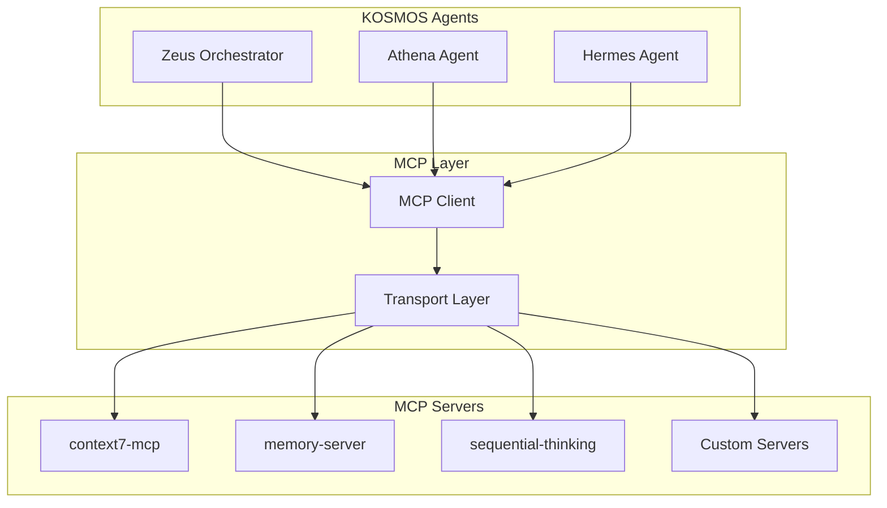
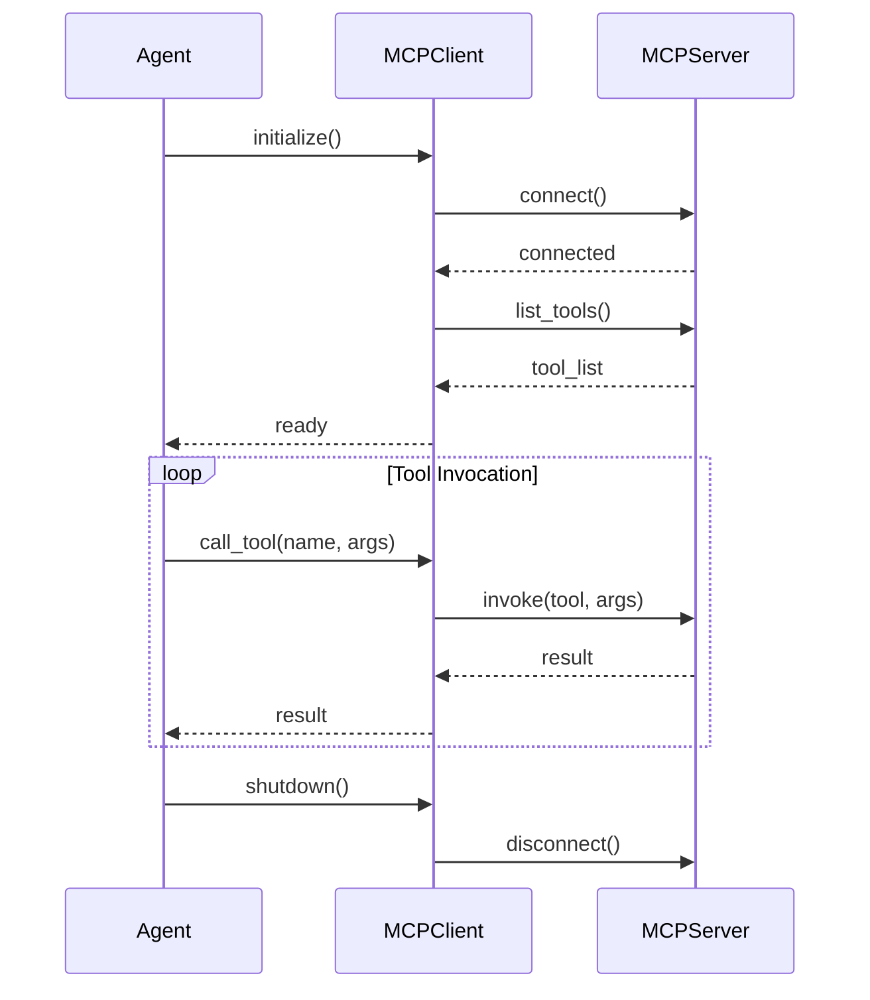

# MCP Integration Guide

**Model Context Protocol (MCP) in KOSMOS**

---

## Overview

KOSMOS uses the **Model Context Protocol (MCP)** as the standard for tool integration, enabling agents to interact with external services, APIs, and data sources through a unified interface. MCP provides a consistent way to expose tools, resources, and prompts to AI agents.

### Why MCP?

1. **Standardization** - Common protocol across all tool integrations
2. **Discoverability** - Agents can discover available tools at runtime
3. **Type Safety** - Strongly typed tool interfaces
4. **Composability** - Mix and match tools from different servers
5. **Ecosystem** - Growing library of pre-built MCP servers

See [ADR-010 MCP Adoption](../../02-architecture/adr/ADR-010-mcp-adoption.md) for the decision rationale.

---

## MCP Architecture

### Protocol Overview



### Core Concepts

**MCP Server** - A process that exposes tools, resources, and prompts via the MCP protocol.

**MCP Client** - The consumer (KOSMOS agent) that connects to MCP servers and invokes tools.

**Tool** - A function exposed by an MCP server that agents can call.

**Resource** - Data or content that can be read by agents.

**Prompt** - Pre-defined prompt templates for specific use cases.

---

## MCP Server Inventory

### Production Servers

| Server | Purpose | Agents Using | Status |
|--------|---------|--------------|--------|
| [context7](context7-setup.md) | External documentation lookup | Athena | Active |
| [memory-server](memory-server-setup.md) | Conversation memory | Athena, Zeus | Active |
| [sequential-thinking](sequential-thinking-setup.md) | Multi-step reasoning | Zeus | Active |
| filesystem | File operations | Hephaestus | Active |
| github | Repository operations | Hephaestus | Active |

### Planned Servers

| Server | Purpose | Target Agent | Timeline |
|--------|---------|--------------|----------|
| slack-mcp | Slack integration | Hermes | Q1 2026 |
| calendar-mcp | Calendar integration | Chronos | Q1 2026 |
| prometheus-mcp | Metrics queries | Apollo, Prometheus | Q1 2026 |

---

## Agent-MCP Wiring

### Configuration Matrix

| Agent | MCP Servers | Connection Mode |
|-------|-------------|-----------------|
| Zeus | sequential-thinking | On-demand |
| Athena | context7, memory-server | Persistent |
| Hermes | slack-mcp*, email-mcp* | On-demand |
| Chronos | calendar-mcp* | On-demand |
| Hephaestus | filesystem, github | Persistent |
| Apollo | prometheus-mcp*, grafana-mcp* | On-demand |
| Prometheus | alertmanager-mcp* | On-demand |
| Dionysus | image-gen-mcp*, audio-mcp* | On-demand |
| Ares | security-scanner-mcp* | On-demand |
| Demeter | database-mcp*, storage-mcp* | Persistent |
| Iris | ui-components-mcp* | On-demand |

*Planned - not yet implemented

### Connection Lifecycle



---

## Configuration

### Environment Variables

```bash
# MCP Server Connections
MCP_CONTEXT7_ENABLED=true
MCP_CONTEXT7_ENDPOINT=http://localhost:3001

MCP_MEMORY_ENABLED=true
MCP_MEMORY_ENDPOINT=http://localhost:3002

MCP_SEQUENTIAL_THINKING_ENABLED=true
MCP_SEQUENTIAL_THINKING_ENDPOINT=http://localhost:3003

# Connection Settings
MCP_CONNECTION_TIMEOUT_MS=5000
MCP_REQUEST_TIMEOUT_MS=30000
MCP_MAX_RETRIES=3
```

### Agent Configuration

```python
# config/agents.py

AGENT_MCP_CONFIG = {
    "zeus": {
        "servers": ["sequential-thinking"],
        "connection_mode": "on_demand",
        "timeout_ms": 30000,
    },
    "athena": {
        "servers": ["context7", "memory-server"],
        "connection_mode": "persistent",
        "timeout_ms": 60000,
    },
    # ... other agents
}
```

---

## Usage Patterns

### Basic Tool Invocation

```python
from kosmos.mcp import MCPClient

async def use_mcp_tool():
    client = MCPClient("context7")
    await client.connect()
    
    try:
        # List available tools
        tools = await client.list_tools()
        
        # Invoke a tool
        result = await client.call_tool(
            name="search_docs",
            arguments={"query": "authentication setup"}
        )
        
        return result
    finally:
        await client.disconnect()
```

### With Context Manager

```python
async def use_mcp_tool_context():
    async with MCPClient("context7") as client:
        result = await client.call_tool(
            name="search_docs",
            arguments={"query": "authentication setup"}
        )
        return result
```

### Agent Integration

```python
from kosmos.agents.base import BaseAgent
from kosmos.mcp import MCPClient

class AthenaAgent(BaseAgent):
    def __init__(self, config: AgentConfig):
        super().__init__(config)
        self.mcp_clients: dict[str, MCPClient] = {}
    
    async def initialize(self):
        await super().initialize()
        # Initialize MCP connections
        for server in self.config.mcp_servers:
            client = MCPClient(server)
            await client.connect()
            self.mcp_clients[server] = client
    
    async def retrieve_context(self, query: str) -> list[Document]:
        client = self.mcp_clients["context7"]
        result = await client.call_tool(
            name="search_docs",
            arguments={"query": query, "limit": 5}
        )
        return self._parse_documents(result)
```

---

## Error Handling

### Common Errors

| Error | Cause | Resolution |
|-------|-------|------------|
| `ConnectionError` | Server unreachable | Check server status, retry |
| `TimeoutError` | Request took too long | Increase timeout, retry |
| `ToolNotFoundError` | Tool doesn't exist | Verify tool name |
| `InvalidArgumentsError` | Wrong arguments | Check tool schema |
| `ServerError` | Server-side failure | Check server logs |

### Retry Strategy

```python
from tenacity import retry, stop_after_attempt, wait_exponential

@retry(
    stop=stop_after_attempt(3),
    wait=wait_exponential(multiplier=0.5, max=10)
)
async def call_mcp_tool_with_retry(
    client: MCPClient,
    tool: str,
    args: dict
):
    return await client.call_tool(tool, args)
```

### Circuit Breaker

```python
from circuitbreaker import circuit

@circuit(failure_threshold=5, recovery_timeout=30)
async def call_mcp_tool_with_circuit_breaker(
    client: MCPClient,
    tool: str,
    args: dict
):
    return await client.call_tool(tool, args)
```

---

## Observability

### Metrics

| Metric | Type | Description |
|--------|------|-------------|
| `mcp_connections_active` | Gauge | Active connections |
| `mcp_tool_calls_total` | Counter | Tool invocations |
| `mcp_tool_call_duration_seconds` | Histogram | Call latency |
| `mcp_errors_total` | Counter | Errors by type |

### Tracing

MCP calls include OpenTelemetry spans:

```
trace: kosmos.mcp
├── mcp.connect (server=context7)
├── mcp.list_tools (server=context7)
├── mcp.call_tool (server=context7, tool=search_docs)
└── mcp.disconnect (server=context7)
```

### Logging

```python
import structlog

logger = structlog.get_logger("kosmos.mcp")

# Connection events
logger.info("mcp.connected", server="context7", latency_ms=150)
logger.error("mcp.connection_failed", server="context7", error="timeout")

# Tool events
logger.info("mcp.tool_called", server="context7", tool="search_docs", latency_ms=230)
logger.error("mcp.tool_error", server="context7", tool="search_docs", error="invalid_args")
```

---

## Server-Specific Guides

- [Context7 MCP Setup](context7-setup.md)
- [Memory Server Setup](memory-server-setup.md)
- [Sequential Thinking Setup](sequential-thinking-setup.md)

---

## Developing Custom MCP Servers

See [Custom MCP Server Development](custom-mcp-servers.md) for guidelines on creating KOSMOS-specific MCP servers.

---

## Troubleshooting

### Connection Issues

```bash
# Check if server is running
curl http://localhost:3001/health

# Test MCP connection
python -m kosmos.mcp.test --server context7

# Check logs
journalctl -u mcp-context7 -f
```

### Tool Discovery Issues

```python
# List all tools from a server
async with MCPClient("context7") as client:
    tools = await client.list_tools()
    for tool in tools:
        print(f"{tool.name}: {tool.description}")
        print(f"  Schema: {tool.input_schema}")
```

### Performance Issues

1. Check server resource usage
2. Review timeout configurations
3. Enable connection pooling
4. Consider caching frequent tool results

---

## Related Documentation

- [ADR-010 MCP Adoption](../../02-architecture/adr/ADR-010-mcp-adoption.md)
- [Agent Architecture](../../02-architecture/agents/README.md)
- [Inter-Agent Communication](../../02-architecture/agents/inter-agent-communication.md)

---

**Last Updated:** 2025-12-12  
**Document Owner:** Engineering Team
