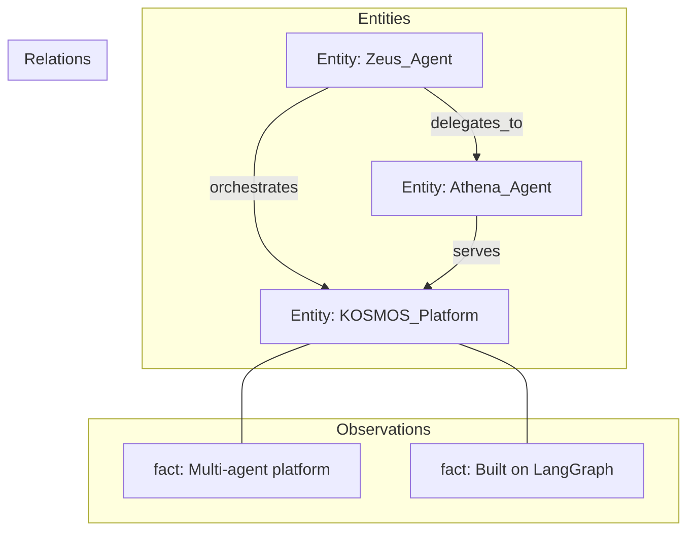

# Memory Server MCP Setup

**Knowledge Graph Memory for KOSMOS Agents**

---

## Overview

The MCP Memory Server provides a persistent knowledge graph for storing entities, relationships, and observations across conversations. Used primarily by Athena and Zeus for maintaining context and organizational knowledge.

### Server Details

| Property | Value |
|----------|-------|
| Server Name | `memory-server` |
| Package | `@modelcontextprotocol/server-memory` |
| Version | 0.6.3 |
| Primary Agents | Athena, Zeus |
| Status | Active |

---

## Configuration

### MCP Settings

```json
{
  "mcpServers": {
    "memory-server": {
      "command": "npx",
      "args": ["-y", "@modelcontextprotocol/server-memory"],
      "env": {
        "MEMORY_FILE_PATH": "/data/memory.jsonl"
      }
    }
  }
}
```

### Environment Variables

| Variable | Description | Default |
|----------|-------------|---------|
| `MCP_MEMORY_ENABLED` | Enable/disable server | `true` |
| `MEMORY_FILE_PATH` | Knowledge graph storage path | `./memory.jsonl` |

---

## Available Tools

### Entity Management

#### create_entities

Create multiple entities in the knowledge graph.

```python
await client.call_tool(
    "create_entities",
    {
        "entities": [
            {
                "name": "KOSMOS_Platform",
                "entityType": "system",
                "observations": [
                    "Multi-agent AI orchestration platform",
                    "Built on LangGraph"
                ]
            }
        ]
    }
)
```

#### delete_entities

Delete entities and their associated relations.

```python
await client.call_tool(
    "delete_entities",
    {"entityNames": ["Old_Entity"]}
)
```

### Relation Management

#### create_relations

Create directed relations between entities (active voice).

```python
await client.call_tool(
    "create_relations",
    {
        "relations": [
            {
                "from": "Zeus_Agent",
                "to": "Athena_Agent",
                "relationType": "delegates_to"
            }
        ]
    }
)
```

#### delete_relations

Remove relations from the graph.

```python
await client.call_tool(
    "delete_relations",
    {
        "relations": [
            {"from": "A", "to": "B", "relationType": "type"}
        ]
    }
)
```

### Observation Management

#### add_observations

Add facts to existing entities.

```python
await client.call_tool(
    "add_observations",
    {
        "observations": [
            {
                "entityName": "KOSMOS_Platform",
                "contents": ["Deployed to production January 2026"]
            }
        ]
    }
)
```

#### delete_observations

Remove specific observations.

```python
await client.call_tool(
    "delete_observations",
    {
        "deletions": [
            {
                "entityName": "Entity",
                "observations": ["outdated fact"]
            }
        ]
    }
)
```

### Query Operations

#### read_graph

Read the entire knowledge graph.

```python
graph = await client.call_tool("read_graph", {})
# Returns: {"entities": [...], "relations": [...]}
```

#### search_nodes

Search for nodes by query.

```python
results = await client.call_tool(
    "search_nodes",
    {"query": "documentation"}
)
```

#### open_nodes

Retrieve specific nodes by name.

```python
nodes = await client.call_tool(
    "open_nodes",
    {"names": ["KOSMOS_Platform", "Zeus_Agent"]}
)
```

---

## Knowledge Graph Structure



---

## Data Persistence

The memory server stores data in JSONL format:

```
memory.jsonl
├── Entity records
├── Relation records
└── Observation records
```

**Persistence behavior:**

- Data survives server restarts
- Automatic file locking for concurrent access
- Backup recommended before major operations

---

## Integration Examples

### Athena Knowledge Storage

```python
class AthenaAgent(BaseAgent):
    async def store_knowledge(
        self,
        entity: str,
        entity_type: str,
        facts: list[str]
    ) -> None:
        """Store knowledge in memory server."""
        client = self.mcp_clients["memory-server"]
        
        await client.call_tool(
            "create_entities",
            {
                "entities": [{
                    "name": entity,
                    "entityType": entity_type,
                    "observations": facts
                }]
            }
        )
    
    async def query_knowledge(self, query: str) -> list[Entity]:
        """Search knowledge graph."""
        client = self.mcp_clients["memory-server"]
        results = await client.call_tool(
            "search_nodes",
            {"query": query}
        )
        return self._parse_entities(results)
```

---

## Troubleshooting

### Storage Issues

```bash
# Check file permissions
ls -la /data/memory.jsonl

# Verify file content
head -20 /data/memory.jsonl

# Check disk space
df -h /data
```

### Connection Issues

```python
# Test connection
async with MCPClient("memory-server") as client:
    tools = await client.list_tools()
    assert len(tools) == 10
```

### Data Recovery

```bash
# Backup memory file
cp /data/memory.jsonl /data/memory.jsonl.backup

# Restore from backup
cp /data/memory.jsonl.backup /data/memory.jsonl
```

---

## Best Practices

1. **Entity Naming** - Use consistent, descriptive names
2. **Relation Types** - Use active voice (A "creates" B, not B "created_by" A)
3. **Observations** - Keep facts atomic and specific
4. **Regular Backups** - Backup memory file before major operations
5. **Search Optimization** - Include relevant keywords in entity names and observations

---

**Last Updated:** 2025-12-12  
**Document Owner:** Engineering Team
