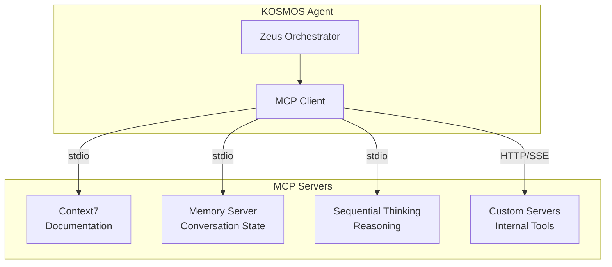

# ADR-010: Model Context Protocol (MCP) Adoption

**Status:** Accepted  
**Date:** 2025-10-01  
**Deciders:** Chief Architect, Engineering Lead, Platform Team  
**Technical Area:** Tool Integration

---

## Context

KOSMOS agents require standardized mechanisms to integrate with external tools, services, and data sources. The platform needs a consistent approach for:

- Tool registration and discovery
- Resource access and management
- Prompt templates and customization
- Bidirectional communication with external services

We evaluated several approaches for tool integration:

1. **Model Context Protocol (MCP)** - Anthropic's open standard
2. **OpenAI Function Calling** - Direct function definitions
3. **LangChain Tools** - LangChain ecosystem integration
4. **Custom RPC** - Proprietary protocol
5. **GraphQL Federation** - Schema-based integration

---

## Decision

We will adopt **Model Context Protocol (MCP)** as the standard for tool integration in KOSMOS.

---

## Rationale

### MCP Advantages

| Factor | MCP | Function Calling | LangChain Tools | Custom RPC |
|--------|-----|------------------|-----------------|------------|
| Standardization | Open standard | Vendor-specific | Framework-tied | Proprietary |
| Tool Discovery | Built-in | Manual | Manual | Manual |
| Resource Management | Native | None | Limited | Manual |
| Bidirectional | Yes | Request-only | Request-only | Configurable |
| Ecosystem | Growing | Large | Large | None |
| Vendor Lock-in | None | OpenAI | LangChain | Full |

### Key Selection Factors

**1. Open Standard**
MCP is an open protocol specification, preventing vendor lock-in while enabling broad ecosystem compatibility.

**2. Comprehensive Abstraction**
MCP provides abstractions for tools, resources, and prompts within a single protocol:

```typescript
// MCP Server Capabilities
interface ServerCapabilities {
  tools?: { listChanged?: boolean };
  resources?: { subscribe?: boolean; listChanged?: boolean };
  prompts?: { listChanged?: boolean };
}
```

**3. Transport Flexibility**
Supports multiple transport mechanisms:
- Standard I/O (local servers)
- HTTP/SSE (remote servers)
- WebSocket (real-time applications)

**4. Resource Subscription**
Enables real-time updates from external data sources:

```typescript
// Resource subscription example
server.subscribeResource("weather://current");
```

**5. Integration with LangGraph**
MCP servers integrate cleanly with LangGraph tool nodes:

```python
# LangGraph tool from MCP server
@tool
async def mcp_tool(input: str) -> str:
    async with mcp_client.session() as session:
        result = await session.call_tool("tool_name", {"input": input})
        return result.content
```

---

## Consequences

### Positive

- **Ecosystem leverage** - Growing library of MCP servers
- **Standardized integration** - Consistent tool integration patterns
- **Future compatibility** - Industry adoption increasing
- **Resource management** - Built-in patterns for data access
- **Agent portability** - Agents can use any MCP-compatible server

### Negative

- **Learning curve** - Team must learn MCP protocol
- **Limited maturity** - Protocol still evolving
- **Performance overhead** - Additional abstraction layer
- **Debugging complexity** - Multi-layer communication


### Risks

| Risk | Likelihood | Impact | Mitigation |
|------|------------|--------|------------|
| Protocol changes | Medium | Medium | Version pinning, abstraction layer |
| Server unavailability | Low | High | Fallback tools, circuit breakers |
| Performance issues | Medium | Medium | Connection pooling, caching |
| Debugging difficulty | Medium | Low | Enhanced logging, tracing |

---

## Implementation

### MCP Server Architecture



### Agent-MCP Wiring

| Agent | MCP Servers | Purpose |
|-------|-------------|---------|
| Zeus | sequential-thinking | Complex task planning |
| Athena | context7, memory | Knowledge retrieval |
| Hermes | custom-messaging | Email/Slack integration |
| Chronos | custom-calendar | Calendar operations |
| Hephaestus | context7 | Code documentation |
| Apollo | custom-metrics | Metrics queries |

### Configuration Pattern

```yaml
# kosmos-mcp-config.yaml
mcp_servers:
  - name: context7
    transport: stdio
    command: npx
    args: ["-y", "@anthropic/context7-mcp"]
    env:
      CONTEXT7_API_KEY: ${CONTEXT7_API_KEY}
    
  - name: memory
    transport: stdio
    command: npx
    args: ["-y", "@anthropic/memory-mcp"]
    config:
      persistence: postgres
    
  - name: sequential-thinking
    transport: stdio
    command: npx
    args: ["-y", "@anthropic/sequential-thinking-mcp"]
    config:
      max_iterations: 10
```

---

## Alternatives Considered

### OpenAI Function Calling

**Rejected because:**
- Vendor lock-in to OpenAI API format
- No resource management capabilities
- Request-only pattern (no server push)

### LangChain Tools

**Rejected because:**
- Tightly coupled to LangChain framework
- Limited tool discovery mechanism
- No standardized resource abstraction

### Custom RPC

**Rejected because:**
- High development and maintenance cost
- No ecosystem benefits
- Proprietary protocol maintenance burden

---

## Compliance Considerations

- MCP servers must implement authentication for sensitive operations
- All tool calls logged for audit purposes
- Resource access follows least privilege principle
- PII handling tools require enhanced monitoring

---

## References

- [MCP Specification](https://modelcontextprotocol.io/)
- [ADR-009: LangGraph Selection](ADR-009-langgraph-selection)
- [MCP Integration Guide](../../developer-guide/mcp-integration/README)

---

## Review Schedule

| Date | Reviewer | Status |
|------|----------|--------|
| 2025-10-01 | Architecture Review Board | Approved |
| 2026-01-01 | Quarterly Review | Scheduled |

**Last Updated:** 2025-12-13  
**Document Owner:** Chief Architect
