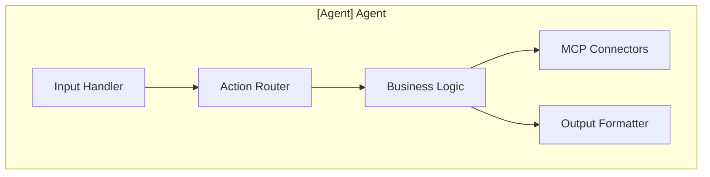
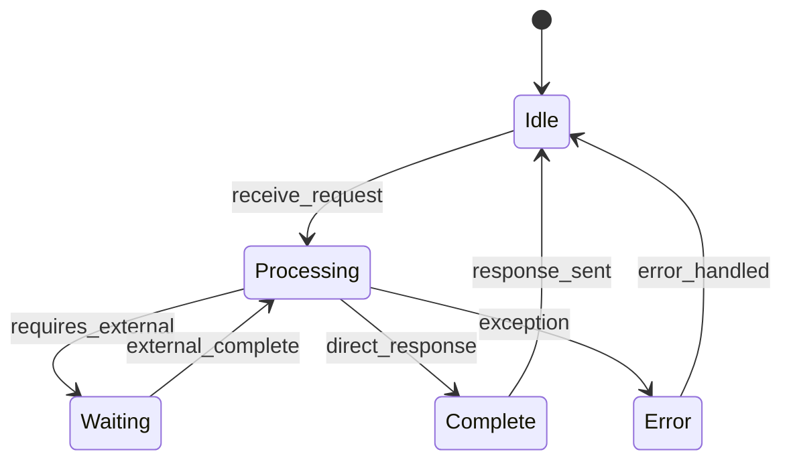

# Agent Documentation Template

**Use this template for documenting each KOSMOS specialist agent.**

---

## [Agent Name] Agent

**Domain:** [Primary responsibility area]  
**Greek Deity:** [Name] - God/Goddess of [domain]  
**Status:** [Development | Active | Deprecated]  
**Version:** [Semantic version]

---

## Overview

[2-3 sentences describing the agent's purpose and primary responsibilities]

### Key Capabilities

- [Capability 1]
- [Capability 2]
- [Capability 3]
- [Capability 4]

### When to Use This Agent

| Use Case | Example |
|----------|---------|
| [Use case 1] | [Concrete example] |
| [Use case 2] | [Concrete example] |
| [Use case 3] | [Concrete example] |

---

## Interface Specification

### Input Contract

```python
class [Agent]Input(BaseModel):
    """Input schema for [Agent] agent."""
    action: Literal["action1", "action2", "action3"]
    payload: dict
    context: Optional[ConversationContext] = None
    
    class Config:
        extra = "forbid"
```

### Output Contract

```python
class [Agent]Output(BaseModel):
    """Output schema for [Agent] agent."""
    status: Literal["success", "error", "pending"]
    result: Any
    metadata: OutputMetadata
```

### Supported Actions

| Action | Description | Required Params | Returns |
|--------|-------------|-----------------|---------|
| `action1` | [Description] | `param1`, `param2` | [Return type] |
| `action2` | [Description] | `param1` | [Return type] |
| `action3` | [Description] | None | [Return type] |

---

## Architecture

### Component Diagram



### State Machine



---

## Dependencies

### Internal Dependencies

| Dependency | Purpose | Required |
|------------|---------|----------|
| Zeus Orchestrator | Task delegation | Yes |
| [Other Agent] | [Purpose] | No |
| [Service] | [Purpose] | Yes |

### External Dependencies

| Service | Purpose | Fallback |
|---------|---------|----------|
| [External Service] | [Purpose] | [Fallback behavior] |

### MCP Server Connections

| MCP Server | Tools Used | Configuration |
|------------|------------|---------------|
| [server-name] | tool1, tool2 | [config reference] |

---

## Configuration

### Environment Variables

| Variable | Description | Default | Required |
|----------|-------------|---------|----------|
| `[AGENT]_LOG_LEVEL` | Logging verbosity | `INFO` | No |
| `[AGENT]_TIMEOUT_MS` | Request timeout | `30000` | No |
| `[AGENT]_MAX_RETRIES` | Retry attempts | `3` | No |

### Feature Flags

| Flag | Description | Default |
|------|-------------|---------|
| `[AGENT]_FEATURE_X_ENABLED` | Enable feature X | `false` |

---

## Observability

### Key Metrics

| Metric | Type | Description |
|--------|------|-------------|
| `[agent]_requests_total` | Counter | Total requests received |
| `[agent]_request_duration_seconds` | Histogram | Request latency |
| `[agent]_errors_total` | Counter | Total errors |
| `[agent]_active_requests` | Gauge | Currently processing |

### Log Events

| Event | Level | When |
|-------|-------|------|
| `[agent].request.received` | INFO | Request starts |
| `[agent].request.completed` | INFO | Request completes |
| `[agent].error` | ERROR | Error occurs |
| `[agent].mcp.timeout` | WARN | MCP timeout |

### Traces

Spans created by this agent:

- `[agent].process_request` - Root span for request
- `[agent].action.[action_name]` - Per-action span
- `[agent].mcp.[server].[tool]` - MCP tool invocation

---

## Error Handling

### Error Codes

| Code | Description | Recovery |
|------|-------------|----------|
| `[AGENT]_001` | [Error description] | [Recovery action] |
| `[AGENT]_002` | [Error description] | [Recovery action] |
| `[AGENT]_003` | [Error description] | [Recovery action] |

### Retry Policy

```python
retry_config = RetryConfig(
    max_attempts=3,
    backoff_type="exponential",
    initial_delay_ms=100,
    max_delay_ms=5000,
    retryable_errors=["TIMEOUT", "RATE_LIMITED"]
)
```

### Circuit Breaker

```python
circuit_breaker = CircuitBreaker(
    failure_threshold=5,
    recovery_timeout_s=30,
    half_open_requests=3
)
```

---

## Security Considerations

### Required Permissions

| Permission | Scope | Purpose |
|------------|-------|---------|
| [permission] | [scope] | [purpose] |

### Data Handling

- PII handling: [Yes/No - details]
- Data retention: [Policy reference]
- Encryption: [At rest / In transit details]

### Audit Events

| Event | When | Data Captured |
|-------|------|---------------|
| [event] | [trigger] | [fields] |

---

## Performance

### SLOs

| Metric | Target | Current |
|--------|--------|---------|
| Availability | 99.9% | [Current] |
| P50 Latency | &lt;Xms | [Current] |
| P99 Latency | &lt;Xms | [Current] |
| Error Rate | &lt;X% | [Current] |

### Scaling Characteristics

- Horizontal scaling: [Supported/Not supported]
- Max instances: [Number]
- Memory per instance: [Amount]
- CPU per instance: [Amount]

---

## Testing

### Unit Tests

```bash
pytest tests/agents/[agent]/ -v
```

### Integration Tests

```bash
pytest tests/integration/[agent]/ -v --integration
```

### Test Coverage

Target: >gt;80% line coverage

---

## Operational Runbooks

<!-- Replace with agent-specific runbooks when using this template, or use generic ones below -->
- [Agent Deployment Runbook](../../04-operations/runbooks/agent-deployment)
- [Agent Scaling Runbook](../../04-operations/runbooks/agent-scaling)
- [Agent Recovery Runbook](../../04-operations/runbooks/agent-recovery)

---

## Changelog

| Version | Date | Changes |
|---------|------|---------|
| 1.0.0 | YYYY-MM-DD | Initial release |

---

**Last Updated:** YYYY-MM-DD  
**Document Owner:** [Team/Role]  
**Next Review:** YYYY-MM-DD
