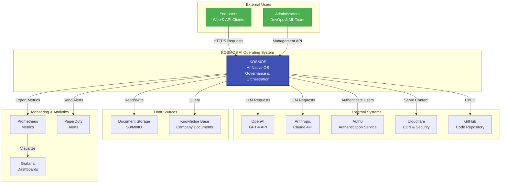
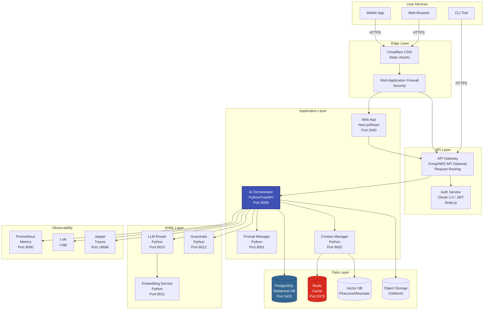
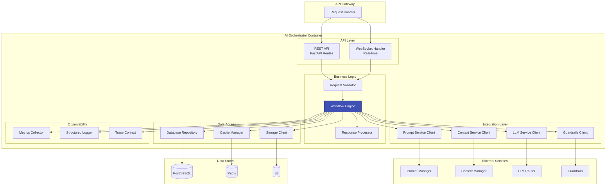
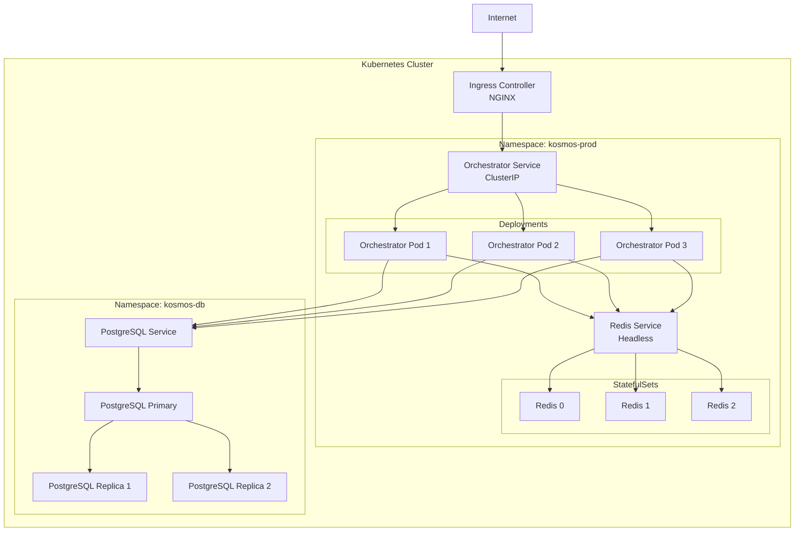

# C4 Architecture Diagrams

**Document Type:** Architecture & Visual Documentation  
**Owner:** Chief Architect  
**Reviewers:** Architecture Review Board, Engineering Leadership  
**Review Cadence:** Quarterly  
**Last Updated:** 2025-12-11  
**Status:** 🟢 Active

---

## Purpose

This document provides C4 (Context, Containers, Components, Code) model diagrams for KOSMOS architecture. The C4 model offers a hierarchical approach to software architecture diagrams, making complex systems understandable at different levels of abstraction.

**C4 Model Levels:**
1. **System Context** - High-level view of system in its environment
2. **Container** - Major technical building blocks (services, databases)
3. **Component** - Components within a container
4. **Code** - Class/interface level (generated from code)

---

## C4 Level 1: System Context Diagram

### KOSMOS in its Environment

**Purpose:** Show KOSMOS and how it fits into the world around it



**Key Interactions:**

| Actor/System | Relationship | Description |
|--------------|--------------|-------------|
| End Users | Uses | Access AI capabilities via web/API |
| Administrators | Manages | Configure and monitor system |
| OpenAI | Provides | GPT-4 language model inference |
| Anthropic | Provides | Claude language model inference |
| Auth0 | Authenticates | User identity verification |
| Cloudflare | Protects | DDoS protection, CDN, SSL |
| GitHub | Hosts | Source code and CI/CD |
| Prometheus | Collects | System metrics and telemetry |
| Grafana | Displays | Metrics visualization |
| PagerDuty | Alerts | Incident notification |

---

## C4 Level 2: Container Diagram

### KOSMOS Containers (Deployable Units)

**Purpose:** Show major technical building blocks and their interactions



**Container Inventory:**

| Container | Technology | Purpose | Scaling |
|-----------|------------|---------|---------|
| **Web App** | Next.js/React | User interface | Horizontal (CDN) |
| **API Gateway** | Kong/AWS | Request routing, rate limiting | Horizontal (3-10 instances) |
| **Auth Service** | Keycloak/Auth0 | Authentication & authorization | Horizontal (2-5 instances) |
| **AI Orchestrator** | Python/FastAPI | Core business logic | Horizontal (3-20 instances) |
| **Prompt Manager** | Python | Prompt versioning & validation | Horizontal (2-5 instances) |
| **Context Manager** | Python | RAG & context management | Horizontal (2-10 instances) |
| **LLM Router** | Python | Intelligent LLM routing | Horizontal (3-10 instances) |
| **Embedding Service** | Python | Text embeddings | Horizontal (2-5 instances) |
| **Guardrails** | Python | Safety & compliance checks | Horizontal (2-5 instances) |
| **PostgreSQL** | PostgreSQL 15 | Relational data | Vertical (+ read replicas) |
| **Redis** | Redis Cluster | Caching & sessions | Horizontal (cluster mode) |
| **Vector DB** | Pinecone/Weaviate | Semantic search | Managed/Horizontal |
| **Object Storage** | S3/MinIO | Documents & artifacts | Managed |
| **Prometheus** | Prometheus | Metrics collection | Horizontal (+ Thanos) |
| **Loki** | Grafana Loki | Log aggregation | Horizontal |
| **Jaeger** | Jaeger | Distributed tracing | Horizontal |

---

## C4 Level 3: Component Diagram

### AI Orchestrator Components

**Purpose:** Show internal components of the AI Orchestrator container



**Component Responsibilities:**

| Component | Responsibility | Technology |
|-----------|----------------|------------|
| **REST API** | HTTP endpoint handling | FastAPI |
| **WebSocket Handler** | Real-time bidirectional communication | FastAPI WebSocket |
| **Request Validator** | Input validation & sanitization | Pydantic |
| **Workflow Engine** | Orchestrate multi-step AI workflows | Custom (asyncio) |
| **Response Processor** | Format and post-process outputs | Custom |
| **Prompt Service Client** | Interact with Prompt Manager | HTTP Client |
| **Context Service Client** | Interact with Context Manager | HTTP Client |
| **LLM Service Client** | Interact with LLM Router | HTTP Client |
| **Guardrails Client** | Safety checks integration | HTTP Client |
| **Database Repository** | Data persistence layer | SQLAlchemy |
| **Cache Manager** | Redis operations | redis-py |
| **Storage Client** | S3/MinIO operations | boto3 |
| **Metrics Collector** | Prometheus metrics | prometheus_client |
| **Structured Logger** | JSON logging | structlog |
| **Trace Context** | OpenTelemetry tracing | opentelemetry |

---

## C4 Level 4: Code Diagram

### Request Validator Component (Example)

**Purpose:** Class-level structure (typically generated from code)

```python
# request_validator.py

class RequestValidator:
    """Validates incoming API requests"""
    
    def __init__(self, schema_registry: SchemaRegistry):
        self.schema_registry = schema_registry
        self.pii_detector = PIIDetector()
    
    def validate(self, request: Request) -> ValidationResult:
        """Main validation method"""
        pass
    
    def validate_schema(self, request: Request) -> bool:
        """Validate against JSON schema"""
        pass
    
    def validate_rate_limit(self, user_id: str) -> bool:
        """Check rate limiting"""
        pass
    
    def detect_pii(self, content: str) -> List[PIIMatch]:
        """Detect PII in content"""
        pass
    
    def sanitize_input(self, content: str) -> str:
        """Remove potentially harmful input"""
        pass


class SchemaRegistry:
    """Manages JSON schemas for validation"""
    
    def get_schema(self, endpoint: str) -> Dict:
        pass
    
    def validate_against_schema(self, data: Dict, schema: Dict) -> bool:
        pass


class PIIDetector:
    """Detects personally identifiable information"""
    
    def __init__(self):
        self.patterns = self._load_pii_patterns()
    
    def detect(self, text: str) -> List[PIIMatch]:
        pass
    
    def _load_pii_patterns(self) -> Dict[str, Pattern]:
        pass


@dataclass
class ValidationResult:
    """Result of validation"""
    is_valid: bool
    errors: List[str]
    warnings: List[str]
    pii_detected: List[PIIMatch]


@dataclass
class PIIMatch:
    """Detected PII"""
    type: str  # email, phone, ssn, etc.
    value: str
    position: int
    confidence: float
```

**Class Diagram:**

```
┌─────────────────────────┐
│   RequestValidator      │
├─────────────────────────┤
│ - schema_registry       │
│ - pii_detector          │
├─────────────────────────┤
│ + validate()            │
│ + validate_schema()     │
│ + validate_rate_limit() │
│ + detect_pii()          │
│ + sanitize_input()      │
└───────────┬─────────────┘
            │ uses
            ↓
    ┌───────────────┐
    │ SchemaRegistry│
    └───────────────┘
            │ uses
            ↓
    ┌───────────────┐
    │  PIIDetector  │
    └───────────────┘
```

---

## Diagram Generation

### Automated C4 Generation

**Script:** `scripts/generate_c4.py`

```python
#!/usr/bin/env python3
"""
Generate C4 diagrams from architecture configuration
"""

from dataclasses import dataclass
from typing import List
import yaml

@dataclass
class Container:
    name: str
    technology: str
    description: str
    connections: List[str]

def generate_c4_container_diagram(config_path: str) -> str:
    """Generate C4 container diagram from YAML config"""
    
    with open(config_path) as f:
        config = yaml.safe_load(f)
    
    mermaid = ["graph TB"]
    
    # Generate containers
    for container in config['containers']:
        node_def = f"    {container['id']}[{container['name']}<br/>{container['technology']}]"
        mermaid.append(node_def)
    
    # Generate connections
    for conn in config['connections']:
        mermaid.append(f"    {conn['from']} -->|{conn['label']}| {conn['to']}")
    
    return "\n".join(mermaid)


if __name__ == "__main__":
    diagram = generate_c4_container_diagram("architecture-config.yaml")
    print(diagram)
```

**Configuration:** `architecture-config.yaml`

```yaml
containers:
  - id: ORCHESTRATOR
    name: AI Orchestrator
    technology: Python/FastAPI
    description: Core business logic
  
  - id: POSTGRES
    name: PostgreSQL
    technology: PostgreSQL 15
    description: Relational database
  
  - id: REDIS
    name: Redis
    technology: Redis Cluster
    description: Caching layer

connections:
  - from: ORCHESTRATOR
    to: POSTGRES
    label: Read/Write
  
  - from: ORCHESTRATOR
    to: REDIS
    label: Cache operations
```

**Usage:**
```bash
# Generate diagrams
python scripts/generate_c4.py

# Output to file
python scripts/generate_c4.py > docs/02-architecture/c4-diagrams/generated-container.md
```

---

## Diagram Conventions

### Visual Guidelines

**Color Scheme:**

| Element Type | Color | Usage |
|--------------|-------|-------|
| Core System | Blue (#4051b5) | KOSMOS components |
| Database | Dark Blue (#336791) | PostgreSQL |
| Cache | Red (#d82c20) | Redis |
| External System | Green (#4caf50) | Third-party services |
| User | Light Green (#66bb6a) | End users |
| Warning | Orange (#ff9800) | Deprecated/experimental |

**Shape Conventions:**

```
┌─────────┐
│ Service │  Rectangle = Container/Service
└─────────┘

[(Database)]  Cylinder = Database

[/External\]  Trapezoid = External System

((User))      Circle = User/Actor
```

---

## Deployment View

### Kubernetes Deployment Architecture



---

## Documentation Standards

### When to Update C4 Diagrams

**Update Triggers:**
- New container/service added
- Container relationships change
- Major architectural decision (ADR)
- Deployment topology changes
- Technology stack changes

**Update Process:**
1. Update architecture configuration YAML
2. Run generation script
3. Review generated diagrams
4. Update this README with context
5. Create ADR if significant change
6. Review with Architecture Review Board

---

## Tools & Resources

### Diagramming Tools

**Recommended:**
- **Mermaid** - Text-based diagrams in Markdown (current)
- **PlantUML** - More features, requires Java
- **Draw.io** - Visual editor with C4 library
- **Structurizr** - Purpose-built for C4 (DSL-based)

**Current Choice:** Mermaid (see [ADR-001](../adr/ADR-001-documentation-framework))

---

### C4 Model Resources

**Official:**
- **C4 Model Website:** https://c4model.com/
- **C4 Model Guidebook:** https://leanpub.com/visualising-software-architecture

**Community:**
- **C4-PlantUML:** https://github.com/plantuml-stdlib/C4-PlantUML
- **Structurizr DSL:** https://github.com/structurizr/dsl

---

## References

### Internal Documents
- [System Topology](../topology) - Detailed component inventory
- [Data Lineage](../data-lineage) - Data flow diagrams
- [ADR-001: Documentation Framework](../adr/ADR-001-documentation-framework)

### External Standards
- **C4 Model:** https://c4model.com/
- **ISO/IEC/IEEE 42010** - Architecture description standard
- **Arc42 Template:** Architecture documentation template

---

**Next Review:** March 2026 (Quarterly)  
**Document Owner:** architecture@nuvanta-holding.com  
**Diagram Questions:** c4-diagrams@nuvanta-holding.com

---

## Appendix: Quick Reference

### C4 Level Summary

| Level | Audience | Detail | Update Frequency |
|-------|----------|--------|------------------|
| 1. Context | Everyone | System in environment | Annually |
| 2. Container | Engineers, Ops | Deployable units | Quarterly |
| 3. Component | Developers | Internal structure | Monthly |
| 4. Code | Developers | Class diagrams | As needed (generated) |

### Common Patterns

**Microservices Pattern:**
```
API Gateway → Service A → Database A
            → Service B → Database B
```

**Layered Architecture:**
```
Presentation → Business Logic → Data Access → Database
```

**Event-Driven:**
```
Producer → Message Queue → Consumer → Action
```
