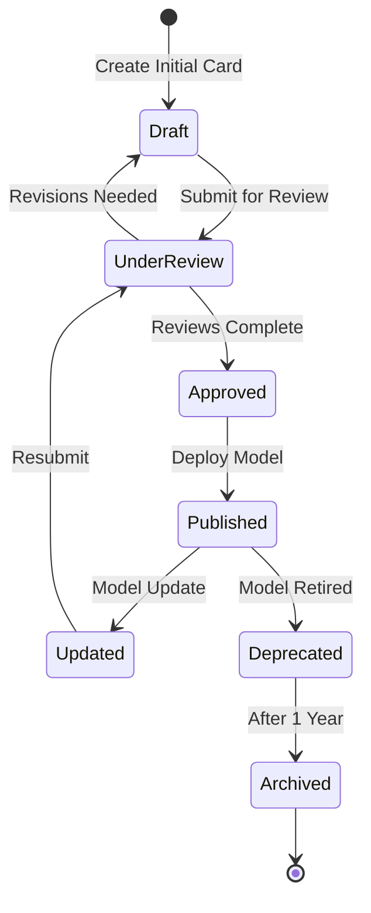

# Model Cards

**Standardized Documentation for AI Models**

> "If you can't document it, you shouldn't deploy it."

---

## 📋 Overview

Model Cards provide standardized documentation for AI models deployed in KOSMOS. They ensure transparency, accountability, and informed decision-making about model usage, limitations, and ethical considerations.

### Purpose

Model Cards serve to:
- **Document performance** across different scenarios and demographics
- **Disclose limitations** and known failure modes
- **Enable informed decisions** about model appropriateness
- **Meet compliance requirements** (NIST AI RMF, EU AI Act, ISO 42001)
- **Facilitate model governance** and lifecycle management

---

## 📚 Model Card Library

### Production Models

| Model ID | Model Name | Version | Status | Last Updated |
|----------|------------|---------|--------|--------------|
| MC-001 | Document Summarizer | v2.1.0 | ✅ Active | 2025-12-11 |
| MC-002 | Sentiment Analyzer | v1.5.2 | ✅ Active | 2025-11-15 |
| MC-003 | Code Reviewer | v3.0.1 | ✅ Active | 2025-12-01 |
| MC-006 | GPT-4o | v1.0.0 | ✅ Active | 2025-12-22 |
| MC-007 | Claude-3.5 Sonnet | v1.0.0 | ✅ Active | 2025-12-22 |

### Development Models

| Model ID | Model Name | Version | Status | Last Updated |
|----------|------------|---------|--------|--------------|
| MC-004 | Image Classifier | v0.9-beta | 🟡 Testing | 2025-12-10 |
| MC-005 | Translation Engine | v2.0-rc1 | 🟡 Testing | 2025-12-08 |

### Deprecated Models

| Model ID | Model Name | Version | Reason | Deprecated Date |
|----------|------------|---------|--------|-----------------|
| MC-000 | Legacy Classifier | v1.2.0 | Replaced by MC-003 | 2025-10-01 |

---

## 📝 Model Card Structure

Each Model Card follows this structure:

### 1. **Model Details**
- Model name and version
- Model type and architecture
- Model developer and owner
- Training date and update frequency
- License and access restrictions

### 2. **Intended Use**
- Primary use cases
- Out-of-scope applications
- Target users
- Deployment environment

### 3. **Training Data**
- Dataset description
- Data sources and collection methods
- Data preprocessing steps
- Dataset size and composition
- Known biases in training data

### 4. **Performance Metrics**
- Evaluation metrics
- Performance across demographics
- Benchmark results
- Confidence intervals

### 5. **Ethical Considerations**
- Potential biases
- Fairness analysis
- Privacy considerations
- Environmental impact

### 6. **Limitations & Risks**
- Known failure modes
- Edge cases
- Misuse potential
- Technical limitations

### 7. **Recommendations**
- Best practices for use
- Monitoring requirements
- Update schedule
- Contact information

---

## 🎯 Model Card Requirements

### Required for All Models

✅ **Must Have:**
- Unique model identifier
- Model version (semantic versioning)
- Intended use cases clearly defined
- Training data description
- Performance metrics with confidence intervals
- Known limitations documented
- Ethical review completed
- Owner and contact information

🟡 **Should Have:**
- Fairness metrics across demographics
- Environmental impact assessment
- Detailed failure mode analysis
- Comparison to baseline models
- Sample inputs and outputs

⚪ **Nice to Have:**
- Interactive demo
- Model explainability analysis
- Case studies
- Community feedback

---

## 🔄 Model Card Lifecycle



### Status Definitions

- **Draft** 🟡 - Being created, not yet complete
- **Under Review** 🟠 - Submitted for approval
- **Approved** 🟢 - Ready for deployment
- **Published** ✅ - Live in production
- **Updated** 🔄 - Changes made, needs re-review
- **Deprecated** 🔴 - No longer recommended
- **Archived** ⚫ - Historical record only

---

## 📋 Creating a New Model Card

### Step 1: Use the Template

```bash
# Copy the template
cp docs/03-engineering/model-cards/template.md \
   docs/03-engineering/model-cards/MC-XXX-model-name.md

# Replace XXX with next model ID (e.g., MC-006)
```

### Step 2: Fill Required Sections

1. **Model Details** - Basic information
2. **Intended Use** - Appropriate use cases
3. **Training Data** - Dataset information
4. **Performance** - Metrics and benchmarks
5. **Ethics** - Bias and fairness analysis
6. **Limitations** - Known issues
7. **Recommendations** - Best practices

### Step 3: Gather Evidence

Collect supporting documentation:
- Training logs and metrics
- Evaluation results
- Fairness analysis reports
- Security scan results
- Performance benchmarks

### Step 4: Review Process

1. **Technical Review** - ML Lead
2. **Ethics Review** - Ethics Committee
3. **Security Review** - Security Team
4. **Legal Review** - Legal/Compliance Team
5. **Final Approval** - CTO/Responsible Executive

### Step 5: Publish

```bash
# Update this index
# Add to model registry
# Link from relevant documentation
# Announce to team
```

---

## 🧪 Model Card Validation

### Automated Checks

```python
# Validate model card completeness
def validate_model_card(card_path: str) -> ValidationResult:
    card = load_model_card(card_path)
    
    # Required fields
    assert card.model_id, "Model ID missing"
    assert card.version, "Version missing"
    assert card.intended_use, "Intended use missing"
    assert card.training_data, "Training data description missing"
    assert card.performance_metrics, "Performance metrics missing"
    assert card.limitations, "Limitations missing"
    assert card.ethical_review_date, "Ethics review missing"
    
    # Performance metrics validation
    for metric in card.performance_metrics:
        assert metric.value is not None
        assert metric.confidence_interval is not None
        assert metric.test_set_size > 0
    
    # Fairness metrics (required for high-risk models)
    if card.risk_level == "high":
        assert card.fairness_metrics, "Fairness metrics required for high-risk models"
    
    return ValidationResult(passed=True)
```

### Review Checklist

**Technical Review:**
- [ ] Model architecture clearly described
- [ ] Training process documented
- [ ] Performance metrics are appropriate
- [ ] Evaluation methodology is sound
- [ ] Results are reproducible

**Ethics Review:**
- [ ] Bias analysis completed
- [ ] Fairness metrics calculated
- [ ] Privacy considerations addressed
- [ ] Potential harms identified
- [ ] Mitigation strategies defined

**Security Review:**
- [ ] Security scan completed
- [ ] Adversarial robustness tested
- [ ] Input validation documented
- [ ] Output filtering specified
- [ ] Access controls defined

**Compliance Review:**
- [ ] Regulatory requirements met
- [ ] Data governance compliant
- [ ] Documentation complete
- [ ] Audit trail established
- [ ] Approval signatures collected

---

## 📊 Model Card Metrics

### Coverage Metrics

| Metric | Target | Current | Status |
|--------|--------|---------|--------|
| Production Models with Cards | 100% | 100% | ✅ Complete |
| Cards with Fairness Metrics | 100% | 60% | 🟡 In Progress |
| Cards Updated This Quarter | 100% | 80% | 🟡 In Progress |
| Average Review Time | &lt;5 days | 7 days | 🟡 Needs Improvement |

### Quality Metrics

| Metric | Target | Current | Status |
|--------|--------|---------|--------|
| Card Completeness Score | ≥90% | 85% | 🟡 In Progress |
| Ethics Review Pass Rate | 100% | 95% | 🟢 Good |
| Documentation Clarity (1-5) | ≥4.0 | 4.2 | 🟢 Good |

---

## 🔗 Related Documentation

- **[Model Card Template](template)** - Start here for new models
- **[Prompt Standards](../prompt-standards)** - Related to prompt-based models
- **[AIBOM](../aibom)** - AI Bill of Materials
- **[Ethics Scorecard](../../01-governance/ethics-scorecard)**
- **[Risk Registry](../../01-governance/risk-registry)**

---

## 🛠️ Tools & Resources

### Model Card Tools

```python
# Generate model card from training metadata
from model_card_toolkit import ModelCardToolkit

mct = ModelCardToolkit()
model_card = mct.scaffold_assets()
model_card.model_details.name = "Document Summarizer"
model_card.model_details.version = "v2.1.0"
# ... fill in details
mct.update_model_card(model_card)
mct.export_format()  # Generate HTML/PDF
```

### Fairness Evaluation

```python
# Calculate fairness metrics
from aequitas.group import Group
from aequitas.plotting import Plot

# Load predictions and demographics
df = load_model_predictions()

# Calculate disparate impact
g = Group()
xtab, _ = g.get_crosstabs(df)
fairness = g.get_disparity_predefined_groups(xtab)

# Check if passes fairness threshold
assert fairness.all_disparity_ratios() > 0.8
```

### Performance Tracking

```python
# Track model performance over time
from model_monitor import PerformanceTracker

tracker = PerformanceTracker(model_id="MC-001")
tracker.log_prediction(input_data, prediction, ground_truth)
tracker.calculate_metrics(window="7d")
tracker.check_drift()
```

---

## 📞 Support

| Question Type | Contact |
|---------------|---------|
| **Creating Model Cards** | ml-team@nuvanta-holding.com |
| **Ethics Review** | ethics@nuvanta-holding.com |
| **Technical Questions** | techlead@nuvanta-holding.com |
| **Compliance** | legal@nuvanta-holding.com |

---

## 📅 Review Schedule

- **Model Cards** - Updated with each model version
- **Fairness Metrics** - Recalculated quarterly
- **Ethics Review** - Annual re-review for active models
- **Template** - Annual review and updates

**Next Template Review:** 2026-12-11

---

## 🚀 Quick Start

### For ML Engineers

1. Read the [template](template)
2. Gather training and evaluation data
3. Fill out all required sections
4. Submit for review
5. Iterate based on feedback

### For Reviewers

1. Check completeness against requirements
2. Validate metrics and claims
3. Assess ethical considerations
4. Provide constructive feedback
5. Approve or request changes

### For Consumers

1. Read the intended use section
2. Check if your use case is appropriate
3. Review limitations and risks
4. Follow recommendations
5. Report issues if found

---

**Last Updated:** 2025-12-22
**Document Owner:** ML Lead
**Total Model Cards:** 9 (5 production, 2 development, 2 deprecated)

---

[← Back to Volume III](../index) | [Model Card Template →](template)
