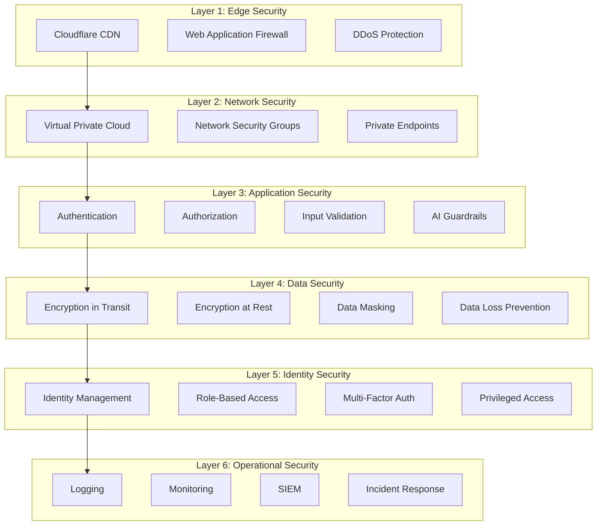
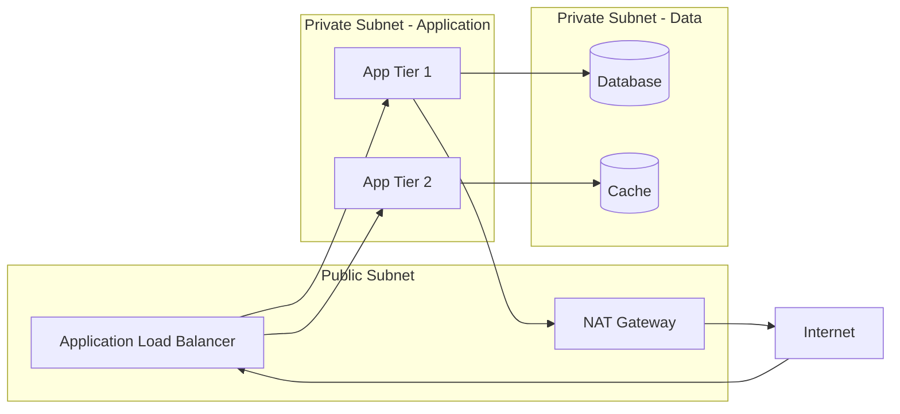
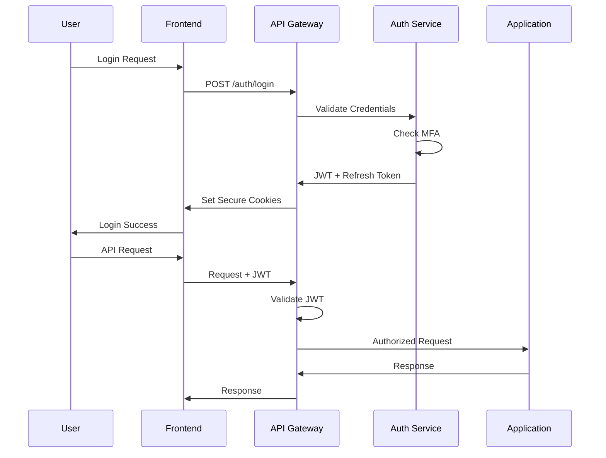
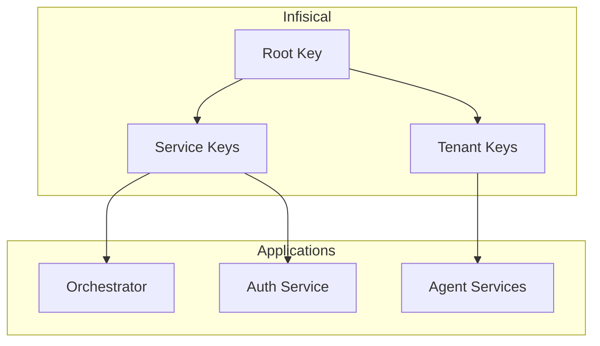
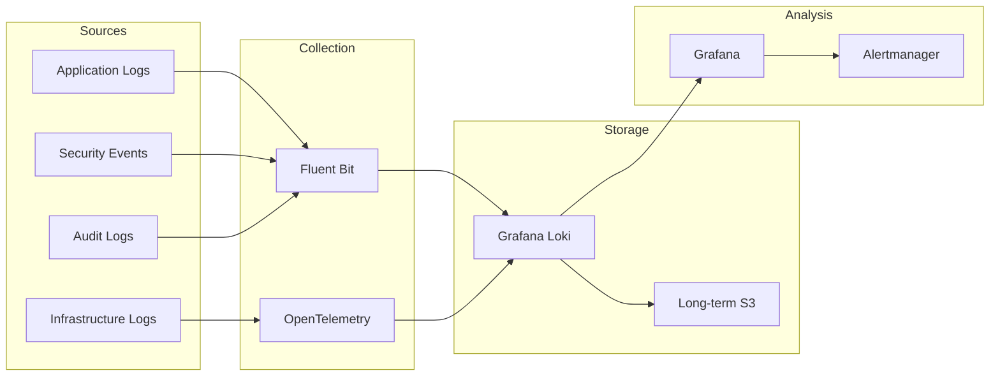

# Security Architecture

**Document Type:** Architecture Specification  
**Owner:** Security Lead  
**Reviewers:** CISO, Architecture Review Board  
**Review Cadence:** Quarterly  
**Last Updated:** 2025-12-13  
**Status:** 🟢 Active

---

## Purpose

This document describes the security architecture of the KOSMOS AI Operating System, including defense-in-depth strategies, security controls at each layer, and integration patterns for security services.

---

## Architecture Overview

### Defense in Depth Layers



---

## Edge Security

### Cloudflare Integration

| Feature | Purpose | Configuration |
|---------|---------|---------------|
| CDN | Content delivery, caching | Cache static assets |
| WAF | Application firewall | OWASP Core Rule Set |
| DDoS | Attack mitigation | Always-on protection |
| Bot Management | Automated traffic control | Challenge suspicious |
| Rate Limiting | Request throttling | 100 req/min per IP |

### WAF Rules

```yaml
# Custom WAF rules for AI platform
rules:
  - id: AI-001
    description: Block prompt injection patterns
    expression: >
      (http.request.body contains "ignore previous" or
       http.request.body contains "disregard instructions")
    action: block
    
  - id: AI-002
    description: Rate limit LLM endpoints
    expression: >
      http.request.uri.path contains "/api/v1/chat"
    action: rate_limit
    characteristics:
      - cf.unique_visitor_id
    threshold: 20
    period: 60
```

---

## Network Security

### VPC Architecture



### Network Security Groups

| Resource | Inbound | Outbound | Justification |
|----------|---------|----------|---------------|
| Load Balancer | 443/tcp from 0.0.0.0/0 | App tier only | Public HTTPS |
| Application | ALB only | Data tier, LLM providers | Least privilege |
| Database | App tier only | None | Isolated |
| Cache | App tier only | None | Isolated |


---

## Application Security

### Authentication Flow



### Authorization Model

| Layer | Mechanism | Enforcement |
|-------|-----------|-------------|
| API Gateway | JWT validation | Every request |
| Service | RBAC check | Controller layer |
| Data | Row-level security | Database queries |
| Agent | Capability restrictions | Agent config |

### Input Validation

```python
# Input validation for AI endpoints
from pydantic import BaseModel, Field, validator
import re

class ChatRequest(BaseModel):
    message: str = Field(..., max_length=10000)
    conversation_id: str = Field(..., regex=r"^[a-f0-9-]{36}$")
    
    @validator('message')
    def sanitize_message(cls, v):
        # Block obvious prompt injection patterns
        dangerous_patterns = [
            r"ignore\s+(all\s+)?previous",
            r"disregard\s+(your\s+)?instructions",
            r"you\s+are\s+now\s+",
            r"act\s+as\s+if"
        ]
        for pattern in dangerous_patterns:
            if re.search(pattern, v.lower()):
                raise ValueError("Invalid message content")
        return v
```

### AI Guardrails

| Guardrail | Purpose | Implementation |
|-----------|---------|----------------|
| Input filters | Block malicious prompts | Regex + ML classifier |
| Output filters | Prevent harmful content | Content classifier |
| PII detection | Protect personal data | NER model |
| Topic blocklist | Enforce content policy | Keyword + semantic |
| Rate limiting | Prevent abuse | Token bucket |

---

## Data Security

### Encryption Standards

| Data State | Algorithm | Key Management |
|------------|-----------|----------------|
| At Rest | AES-256-GCM | Infisical KMS |
| In Transit | TLS 1.3 | Let's Encrypt + ACM |
| In Use | Application-level | Per-tenant keys |
| Backups | AES-256-GCM | Separate backup keys |

### Key Management



### Data Classification

| Level | Examples | Controls |
|-------|----------|----------|
| Public | Documentation | None |
| Internal | Metrics, configs | Auth required |
| Confidential | User conversations | Encryption + access logs |
| Restricted | Credentials, PII | Encryption + MFA + audit |

---

## Identity & Access Management

### Role Hierarchy

```yaml
roles:
  admin:
    description: Full system access
    permissions: ["*"]
    requires_mfa: true
    
  operator:
    description: Operations team
    permissions:
      - "read:metrics"
      - "read:logs"
      - "manage:deployments"
      - "read:configurations"
    requires_mfa: true
    
  developer:
    description: Development team
    permissions:
      - "read:metrics"
      - "read:logs"
      - "read:configurations"
      - "manage:dev_resources"
    requires_mfa: false
    
  user:
    description: End user
    permissions:
      - "use:chat"
      - "read:own_history"
      - "manage:own_preferences"
    requires_mfa: false
```

### Service Account Security

| Control | Implementation |
|---------|----------------|
| Least privilege | Scoped to specific services |
| Key rotation | Automatic 90-day rotation |
| Audit logging | All actions logged |
| Network restriction | IP allowlisting |


---

## Operational Security

### Logging Architecture



### Security Monitoring

| Event Category | Detection Method | Alert Threshold |
|----------------|------------------|-----------------|
| Authentication failures | Pattern matching | >5 in 5 min |
| Privilege escalation | RBAC audit | Any occurrence |
| Prompt injection | ML classifier | Confidence >0.8 |
| Data exfiltration | Anomaly detection | >10x normal volume |
| API abuse | Rate analysis | >200% of baseline |

### Security Metrics

| Metric | Target | Current |
|--------|--------|---------|
| Mean Time to Detect | <15 min | 12 min |
| Mean Time to Respond | <1 hour | 45 min |
| Critical vuln patch time | <24 hours | 18 hours |
| Security training completion | 100% | 95% |

---

## Kubernetes Security

### Pod Security Standards

```yaml
apiVersion: v1
kind: Pod
metadata:
  name: kosmos-agent
spec:
  securityContext:
    runAsNonRoot: true
    runAsUser: 1000
    fsGroup: 1000
    seccompProfile:
      type: RuntimeDefault
  containers:
    - name: agent
      securityContext:
        allowPrivilegeEscalation: false
        readOnlyRootFilesystem: true
        capabilities:
          drop:
            - ALL
      resources:
        limits:
          memory: "512Mi"
          cpu: "500m"
```

### Network Policies

```yaml
apiVersion: networking.k8s.io/v1
kind: NetworkPolicy
metadata:
  name: kosmos-orchestrator
spec:
  podSelector:
    matchLabels:
      app: orchestrator
  policyTypes:
    - Ingress
    - Egress
  ingress:
    - from:
        - podSelector:
            matchLabels:
              app: api-gateway
      ports:
        - port: 8000
  egress:
    - to:
        - podSelector:
            matchLabels:
              app: postgresql
      ports:
        - port: 5432
    - to:
        - namespaceSelector: {}
          podSelector:
            matchLabels:
              app: nats
      ports:
        - port: 4222
```

---

## Security Compliance

### Control Framework Mapping

| Control Domain | SOC 2 | ISO 27001 | NIST CSF |
|----------------|-------|-----------|----------|
| Access Control | CC6.1-6.8 | A.9 | PR.AC |
| Network Security | CC6.6 | A.13 | PR.PT |
| Data Protection | CC6.7 | A.18 | PR.DS |
| Logging | CC7.2 | A.12.4 | DE.AE |
| Incident Response | CC7.4 | A.16 | RS.RP |

---

## References

- [Threat Model](threat-model.md)
- [ADR-004: Authentication Strategy](../02-architecture/adr/ADR-004-authentication-strategy.md)
- [Incident Response Runbooks](../04-operations/incident-response/README.md)

---

**Classification:** Internal Use Only  
**Next Review:** 2026-03-13  
**Document Owner:** Security Lead
