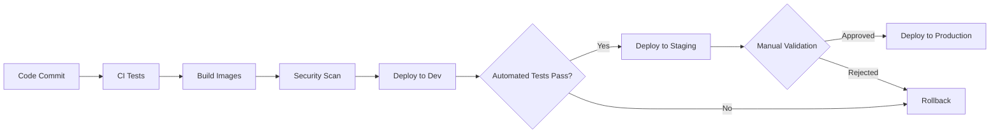

# Deployment Procedures

**Last Updated:** 2025-12-13  
**Status:** Active

## Overview

Standard deployment procedures for KOSMOS components across environments.

## Environments

### Development
- **Purpose:** Feature development and testing
- **Approval:** Self-service for developers
- **Deployment:** Automatic on PR merge to `develop`
- **Data:** Synthetic/anonymized data only

### Staging
- **Purpose:** Pre-production validation
- **Approval:** Lead developer review
- **Deployment:** Manual trigger after dev validation
- **Data:** Production-like synthetic data

### Production
- **Purpose:** Live customer-facing system
- **Approval:** Multi-party (Dev Lead + PM + Security)
- **Deployment:** Scheduled maintenance windows
- **Data:** Live customer data

## Deployment Pipeline



## Pre-Deployment Checklist

- [ ] All tests passing (unit, integration, E2E)
- [ ] Security scan completed (no critical/high CVEs)
- [ ] Database migrations tested
- [ ] Backup verified and recovery tested
- [ ] Monitoring and alerts configured
- [ ] Rollback plan documented
- [ ] Stakeholders notified
- [ ] Change request approved

## Deployment Methods

### GitOps (Preferred)

```bash
# Update manifests in Git
git checkout -b release/v2.1.0
# Update image tags in k8s/production/
git commit -m "Release v2.1.0"
git push origin release/v2.1.0

# ArgoCD automatically syncs
# Or manual sync:
argocd app sync kosmos-production
```

### Helm

```bash
# Update chart values
helm upgrade kosmos ./charts/kosmos \
  --namespace kosmos \
  --values values-production.yaml \
  --set image.tag=v2.1.0 \
  --wait \
  --timeout 10m

# Verify deployment
helm status kosmos -n kosmos
```

### kubectl (Emergency Only)

```bash
# Update deployment
kubectl set image deployment/agent-name \
  agent=kosmos/agent:v2.1.0 \
  -n kosmos

# Rollout status
kubectl rollout status deployment/agent-name -n kosmos
```

## Database Migrations

### Pre-Migration
```bash
# Backup database
./scripts/backup-database.sh --environment production

# Test migration on staging
flyway migrate -url=jdbc:postgresql://staging-db:5432/kosmos

# Validate migration
./scripts/validate-migration.sh
```

### Migration Execution
```bash
# Run migration
flyway migrate -url=jdbc:postgresql://prod-db:5432/kosmos

# Verify schema
psql -h prod-db -U kosmos -c "\d"
```

### Rollback Migration
```bash
# Undo last migration
flyway undo -url=jdbc:postgresql://prod-db:5432/kosmos
```

## Canary Deployment

```yaml
apiVersion: flagger.app/v1beta1
kind: Canary
metadata:
  name: agent-canary
  namespace: kosmos
spec:
  targetRef:
    apiVersion: apps/v1
    kind: Deployment
    name: agent-name
  service:
    port: 8080
  analysis:
    interval: 1m
    threshold: 5
    maxWeight: 50
    stepWeight: 10
    metrics:
    - name: request-success-rate
      thresholdRange:
        min: 99
    - name: request-duration
      thresholdRange:
        max: 500
```

## Blue-Green Deployment

```bash
# Deploy green environment
kubectl apply -f k8s/green/

# Verify green environment
./scripts/smoke-test.sh --environment green

# Switch traffic to green
kubectl patch service agent-service \
  -n kosmos \
  -p '{"spec":{"selector":{"version":"green"}}}'

# Monitor for issues
# If issues detected:
kubectl patch service agent-service \
  -n kosmos \
  -p '{"spec":{"selector":{"version":"blue"}}}'
```

## Rollback Procedures

### Automatic Rollback Triggers
- Health check failures > 5 minutes
- Error rate > 5%
- P95 latency > 2x baseline

### Manual Rollback
```bash
# Kubernetes rollout
kubectl rollout undo deployment/agent-name -n kosmos

# Helm rollback
helm rollback kosmos 0 -n kosmos

# ArgoCD rollback
argocd app rollback kosmos-production <previous-revision>
```

## Post-Deployment

### Verification
- [ ] Health checks passing
- [ ] Metrics within normal range
- [ ] No increase in error rates
- [ ] Key user journeys tested
- [ ] Performance benchmarks met

### Monitoring
```bash
# Check deployment status
kubectl get deployments -n kosmos

# View logs
kubectl logs -f deployment/agent-name -n kosmos

# Monitor metrics
open https://grafana.kosmos.internal/d/deployment-dashboard
```

### Documentation
- [ ] Release notes published
- [ ] CHANGELOG updated
- [ ] Runbooks updated if procedures changed
- [ ] Post-deployment report filed

## Maintenance Windows

### Scheduled
- **Frequency:** Bi-weekly
- **Day:** Saturday
- **Time:** 02:00-04:00 UTC
- **Notification:** 72 hours advance notice

### Emergency
- **Trigger:** Critical security patch or production incident
- **Approval:** On-call engineer + manager
- **Notification:** Immediate via status page

## Related Documentation

- [CI/CD Pipeline](../04-operations/infrastructure/cicd-pipeline.md)
- [Disaster Recovery](disaster-recovery.md)
- [Agent Deployment Runbook](../04-operations/runbooks/agent-deployment.md)
