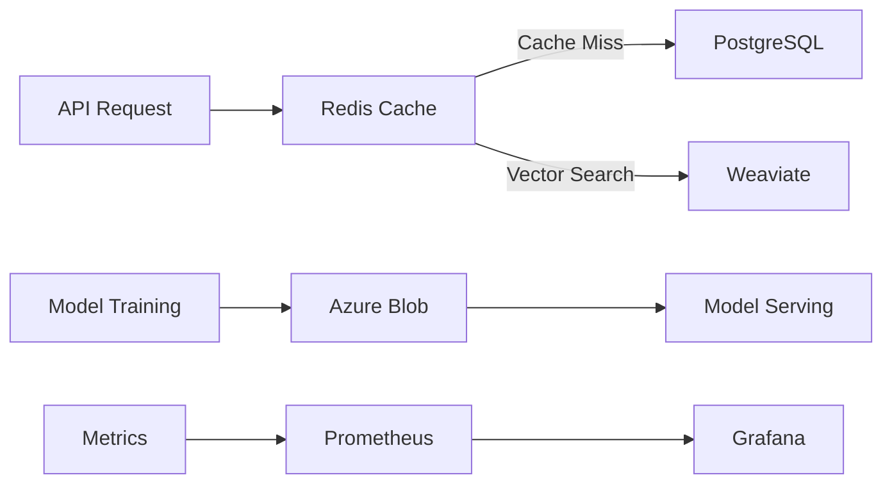

# ADR-005: Data Storage Selection

**Status:** Accepted  
**Date:** 2025-12-12  
**Deciders:** Chief Technology Officer, Data Architecture Team, ML Engineering  
**Technical Story:** [KOSMOS-DATA-001] Need for optimal data storage across AI workloads

---

## Context and Problem Statement

KOSMOS requires multiple data storage solutions to support:

- **Vector Storage** - Embeddings for semantic search and RAG
- **Structured Data** - User data, metadata, configurations
- **Unstructured Data** - Documents, images, model artifacts
- **Time-Series Data** - Metrics, logs, monitoring data
- **Cache Layer** - High-speed access for hot data

The key decision is: **Which storage technologies should KOSMOS adopt for each use case?**

---

## Decision Drivers

- **Performance** - Low latency for inference workloads
- **Scalability** - Handle growing data volumes
- **Cost Efficiency** - Optimize storage costs
- **Reliability** - High availability, durability
- **Compliance** - Data residency, encryption, GDPR
- **Operational Simplicity** - Managed services preferred

---

## Decision Outcome

### Storage Architecture

```yaml
storage_architecture:
  vector_database:
    technology: "Weaviate"
    deployment: "Kubernetes (self-managed)"
    use_cases:
      - Semantic search
      - RAG retrieval
      - Similarity matching
    
  relational_database:
    technology: "PostgreSQL"
    deployment: "Azure Database for PostgreSQL"
    use_cases:
      - User management
      - API key storage
      - Audit logs
      - Configuration
    
  object_storage:
    technology: "Azure Blob Storage"
    deployment: "Managed"
    use_cases:
      - Model artifacts
      - Training data
      - Document storage
      - Backups
    
  cache:
    technology: "Redis"
    deployment: "Azure Cache for Redis"
    use_cases:
      - Session cache
      - Rate limiting
      - Feature flags
      - Hot data
    
  time_series:
    technology: "Prometheus + InfluxDB"
    deployment: "Kubernetes"
    use_cases:
      - Metrics
      - Monitoring
      - Cost tracking
```

---

## Detailed Decisions

### 1. Vector Database: Weaviate

**Justification:**
- Open-source with commercial support
- Excellent performance for AI workloads
- GraphQL and REST APIs
- Built-in vectorization modules
- Kubernetes-native deployment

**Alternatives Considered:**
- Pinecone (rejected: vendor lock-in, cost)
- Milvus (rejected: operational complexity)
- pgvector (rejected: performance limitations at scale)

### 2. Relational Database: PostgreSQL

**Justification:**
- Industry-standard, well-supported
- Azure-managed reduces operational burden
- Excellent JSON support for semi-structured data
- Strong consistency guarantees
- Rich ecosystem (extensions, tools)

### 3. Object Storage: Azure Blob Storage

**Justification:**
- Native Azure integration
- Cost-effective for large files
- Tiered storage (hot/cool/archive)
- Built-in encryption
- Global redundancy options

### 4. Cache: Redis

**Justification:**
- Sub-millisecond latency
- Rich data structures
- Azure-managed option
- Pub/sub for real-time features
- Session management built-in

---

## Data Flow Architecture



---

## Security & Compliance

### Encryption

```yaml
encryption:
  at_rest:
    postgresql: "AES-256 (Azure-managed keys)"
    blob_storage: "AES-256 (customer-managed keys)"
    weaviate: "AES-256 (disk encryption)"
    redis: "TLS + Azure encryption"
    
  in_transit:
    all: "TLS 1.3"
```

### Data Residency

- Primary region: UAE (Dubai)
- Disaster recovery: Netherlands (Amsterdam)
- No data transfer outside approved regions

---

## Cost Estimates

| Service | Monthly Cost | Notes |
|---------|--------------|-------|
| PostgreSQL | $500 | General Purpose, 4 vCores |
| Weaviate | $2,000 | 3-node cluster |
| Blob Storage | $1,500 | 10TB hot, 50TB cool |
| Redis | $300 | Premium P1 |
| **Total** | **$4,300** | |

---

## Consequences

### Positive

- Optimized storage for each use case
- Managed services reduce operational burden
- Clear data flow and ownership
- Cost-effective tiered storage

### Negative

- Multiple technologies to maintain
- Data synchronization complexity
- Learning curve for team

### Risks & Mitigations

| Risk | Mitigation |
|------|------------|
| Vendor lock-in | Use standard APIs, data export procedures |
| Data inconsistency | Event-driven sync, eventual consistency design |
| Cost overruns | Monitoring, alerts, tiered storage policies |

---

## Related Decisions

- [ADR-004: Authentication Strategy](ADR-004-authentication-strategy)
- [ADR-006: LLM Provider Strategy](ADR-006-llm-provider-strategy)
- [ADR-007: Observability Stack](ADR-007-observability-stack)

---

**Last Updated:** 2025-12-12  
**Review Cycle:** Annually
