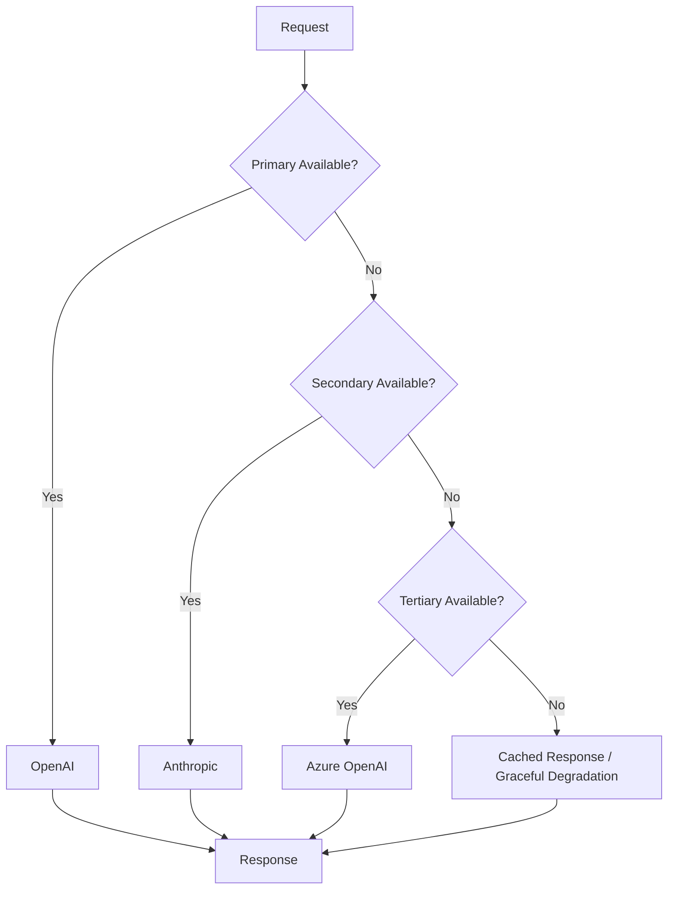

# ADR-006: LLM Provider Strategy

**Status:** Accepted  
**Date:** 2025-12-12  
**Deciders:** Chief Technology Officer, ML Engineering, Finance  
**Technical Story:** [KOSMOS-ML-001] Need for resilient, cost-effective LLM infrastructure

---

## Context and Problem Statement

KOSMOS relies on Large Language Models (LLMs) for core functionality. The organization must decide:

- **Provider Selection** - Which LLM providers to use
- **Multi-Provider Strategy** - Avoid single vendor dependency
- **Cost Optimization** - Balance quality vs. cost
- **Fallback Mechanisms** - Handle provider outages
- **Model Selection** - Which models for which tasks

The key decision is: **What LLM provider strategy should KOSMOS adopt?**

---

## Decision Drivers

- **Reliability** - 99.9%+ availability required
- **Performance** - Low latency, high throughput
- **Cost** - Optimize token costs at scale
- **Quality** - Best-in-class model performance
- **Compliance** - Data privacy, regional requirements
- **Vendor Independence** - Avoid lock-in

---

## Decision Outcome

### Multi-Provider Strategy

```yaml
llm_strategy:
  primary_provider: "OpenAI"
  secondary_provider: "Anthropic"
  tertiary_provider: "Azure OpenAI"
  
  model_selection:
    high_complexity:
      primary: "gpt-4-turbo"
      fallback: "claude-3-opus"
      use_cases: ["code review", "complex reasoning"]
      
    standard:
      primary: "gpt-4o-mini"
      fallback: "claude-3-haiku"
      use_cases: ["summarization", "classification"]
      
    high_volume:
      primary: "gpt-3.5-turbo"
      fallback: "claude-3-haiku"
      use_cases: ["simple tasks", "embeddings prep"]
      
    embeddings:
      primary: "text-embedding-3-large"
      fallback: "voyage-large-2"
      use_cases: ["semantic search", "RAG"]
```

---

## Provider Comparison

### OpenAI

| Aspect | Rating | Notes |
|--------|--------|-------|
| Model Quality | ⭐⭐⭐⭐⭐ | Industry-leading |
| Reliability | ⭐⭐⭐⭐ | Occasional outages |
| Cost | ⭐⭐⭐ | Premium pricing |
| API Design | ⭐⭐⭐⭐⭐ | Excellent DX |
| Compliance | ⭐⭐⭐⭐ | SOC 2, GDPR |

### Anthropic (Claude)

| Aspect | Rating | Notes |
|--------|--------|-------|
| Model Quality | ⭐⭐⭐⭐⭐ | Excellent reasoning |
| Reliability | ⭐⭐⭐⭐⭐ | Very stable |
| Cost | ⭐⭐⭐⭐ | Competitive |
| API Design | ⭐⭐⭐⭐ | Good, improving |
| Compliance | ⭐⭐⭐⭐ | SOC 2, safety focus |

### Azure OpenAI

| Aspect | Rating | Notes |
|--------|--------|-------|
| Model Quality | ⭐⭐⭐⭐⭐ | Same as OpenAI |
| Reliability | ⭐⭐⭐⭐⭐ | Enterprise SLA |
| Cost | ⭐⭐⭐ | Similar to OpenAI |
| API Design | ⭐⭐⭐⭐ | Azure integration |
| Compliance | ⭐⭐⭐⭐⭐ | Azure compliance |

---

## Failover Architecture



### Failover Configuration

```python
from kosmos.llm import LLMRouter

router = LLMRouter(
    providers=[
        {
            "name": "openai",
            "priority": 1,
            "timeout": 30,
            "retry_count": 2
        },
        {
            "name": "anthropic", 
            "priority": 2,
            "timeout": 30,
            "retry_count": 2
        },
        {
            "name": "azure_openai",
            "priority": 3,
            "timeout": 30,
            "retry_count": 2
        }
    ],
    fallback_strategy="graceful_degradation"
)
```

---

## Cost Optimization

### Token Cost Comparison (per 1M tokens)

| Model | Input | Output | Best For |
|-------|-------|--------|----------|
| GPT-4-Turbo | $10.00 | $30.00 | Complex tasks |
| GPT-4o-mini | $0.15 | $0.60 | Balanced |
| GPT-3.5-Turbo | $0.50 | $1.50 | High volume |
| Claude-3-Opus | $15.00 | $75.00 | Reasoning |
| Claude-3-Haiku | $0.25 | $1.25 | Fast/cheap |

### Optimization Strategies

1. **Model Routing** - Use cheaper models for simple tasks
2. **Prompt Caching** - Cache common prompts
3. **Token Optimization** - Minimize prompt length
4. **Batch Processing** - Aggregate requests
5. **Response Caching** - Cache identical queries

---

## Compliance Considerations

### Data Processing

```yaml
data_handling:
  openai:
    data_retention: "30 days (API)"
    training_opt_out: true
    region: "US"
    
  anthropic:
    data_retention: "30 days"
    training_opt_out: true
    region: "US"
    
  azure_openai:
    data_retention: "Configurable"
    training_opt_out: true
    region: "UAE/EU (customer choice)"
```

### Recommendation

For GDPR-sensitive workloads, prefer **Azure OpenAI** with EU region deployment.

---

## Consequences

### Positive

- No single point of failure
- Cost optimization through model routing
- Best-in-class quality for each use case
- Compliance flexibility

### Negative

- Multiple API integrations to maintain
- Prompt compatibility across providers
- Higher operational complexity

### Risks & Mitigations

| Risk | Mitigation |
|------|------------|
| Provider API changes | Abstraction layer, version pinning |
| Cost spikes | Budget alerts, rate limiting |
| Quality variance | Evaluation pipeline, A/B testing |

---

## Related Decisions

- [ADR-005: Data Storage Selection](ADR-005-data-storage-selection)
- [ADR-007: Observability Stack](ADR-007-observability-stack)

---

**Last Updated:** 2025-12-12  
**Review Cycle:** Quarterly (due to rapid LLM evolution)
