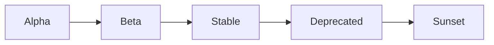

# ADR-008: API Versioning Strategy

**Status:** Accepted  
**Date:** 2025-12-12  
**Deciders:** Chief Technology Officer, Platform Team, API Team  
**Technical Story:** [KOSMOS-API-001] Need for stable, evolvable API contracts

---

## Context and Problem Statement

KOSMOS exposes AI capabilities through APIs consumed by:

- **Internal Services** - Microservices within KOSMOS
- **External Clients** - Third-party integrations
- **SDKs** - Official client libraries

The key decision is: **How should KOSMOS version and evolve its APIs?**

---

## Decision Drivers

- **Stability** - Clients need predictable behavior
- **Evolution** - APIs must evolve without breaking clients
- **Discoverability** - Easy to understand available versions
- **Migration** - Clear path for version upgrades
- **Documentation** - Versions must be well-documented

---

## Decision Outcome

### Versioning Strategy: URL Path Versioning

```yaml
versioning:
  strategy: "URL path versioning"
  format: "/api/v{major}"
  
  examples:
    - "https://api.kosmos.nuvanta-holding.com/api/v1/summarize"
    - "https://api.kosmos.nuvanta-holding.com/api/v2/summarize"
```

---

## Versioning Approaches Considered

### Option 1: URL Path Versioning ⭐ (Selected)

**Example:** `/api/v1/summarize`

**Pros:**
- ✅ Highly visible and explicit
- ✅ Easy to test and debug
- ✅ Clear routing
- ✅ Cacheable

**Cons:**
- ⚠️ URL changes between versions
- ⚠️ May require client updates

### Option 2: Header Versioning

**Example:** `Accept: application/vnd.kosmos.v1+json`

**Pros:**
- Clean URLs
- RESTful purists prefer it

**Cons:**
- ❌ Hidden, easy to miss
- ❌ Harder to test in browser
- ❌ Caching complications

### Option 3: Query Parameter Versioning

**Example:** `/api/summarize?version=1`

**Pros:**
- Easy to add
- Optional parameter

**Cons:**
- ❌ Can be forgotten
- ❌ Inconsistent usage

---

## Semantic Versioning for APIs

```yaml
version_semantics:
  major:
    trigger: "Breaking changes"
    examples:
      - Removing endpoints
      - Changing response structure
      - Removing required fields
    impact: "New URL path (/v1 → /v2)"
    
  minor:
    trigger: "Backward-compatible additions"
    examples:
      - New optional parameters
      - New endpoints
      - New response fields
    impact: "Same URL, documented change"
    
  patch:
    trigger: "Bug fixes, internal changes"
    examples:
      - Performance improvements
      - Bug fixes
      - Documentation updates
    impact: "Transparent to clients"
```

---

## Version Lifecycle



### Lifecycle Policies

| Stage | Duration | Support Level |
|-------|----------|---------------|
| Alpha | Variable | No guarantees |
| Beta | 3 months | Limited support |
| Stable | 2+ years | Full support |
| Deprecated | 12 months | Security fixes only |
| Sunset | - | No support, removed |

### Current API Versions

| Version | Status | Release Date | Sunset Date |
|---------|--------|--------------|-------------|
| v1 | Stable | 2025-06-01 | 2027-06-01+ |
| v2-beta | Beta | 2025-12-01 | N/A (beta) |

---

## Breaking Change Policy

### What Constitutes Breaking Change

- ❌ Removing an endpoint
- ❌ Removing a required response field
- ❌ Changing field data types
- ❌ Changing authentication requirements
- ❌ Changing error response format

### Non-Breaking Changes

- ✅ Adding new endpoints
- ✅ Adding optional request parameters
- ✅ Adding new response fields
- ✅ Adding new error codes
- ✅ Improving performance

---

## Deprecation Process

### Timeline

```yaml
deprecation_timeline:
  announcement: "Day 0"
  deprecation_header: "Day 0"
  documentation_update: "Day 0"
  sunset_warning: "Day 270"  # 9 months
  sunset: "Day 365"          # 12 months
```

### Deprecation Headers

```http
HTTP/1.1 200 OK
Deprecation: true
Sunset: Sat, 12 Dec 2026 00:00:00 GMT
Link: <https://api.kosmos.nuvanta-holding.com/api/v2>; rel="successor-version"
```

---

## Client Migration Support

### Migration Guide Structure

```markdown
# Migrating from v1 to v2

## Breaking Changes
1. Response field `summary` renamed to `result.summary`
2. Removed `legacyMode` parameter

## New Features
1. Streaming responses available
2. New `confidence_score` field

## Migration Steps
1. Update endpoint from `/v1` to `/v2`
2. Update response parsing for new structure
3. Remove deprecated parameters

## Code Examples
[Before/After examples]
```

---

## Implementation

### API Gateway Configuration

```yaml
# Kong API Gateway
routes:
  - name: summarize-v1
    paths:
      - /api/v1/summarize
    service: summarizer-v1
    
  - name: summarize-v2
    paths:
      - /api/v2/summarize
    service: summarizer-v2
```

### Version Detection Middleware

```python
from fastapi import FastAPI, Request

app = FastAPI()

@app.middleware("http")
async def add_version_headers(request: Request, call_next):
    response = await call_next(request)
    response.headers["X-API-Version"] = "1.0.0"
    response.headers["X-API-Deprecated"] = "false"
    return response
```

---

## Consequences

### Positive

- Clear, visible versioning
- Stable contracts for clients
- Graceful evolution path
- Well-documented lifecycle

### Negative

- Multiple versions to maintain
- Potential code duplication
- Migration effort for clients

---

## Related Decisions

- [ADR-004: Authentication Strategy](ADR-004-authentication-strategy)
- [ADR-007: Observability Stack](ADR-007-observability-stack)

---

**Last Updated:** 2025-12-12  
**Review Cycle:** Annually
