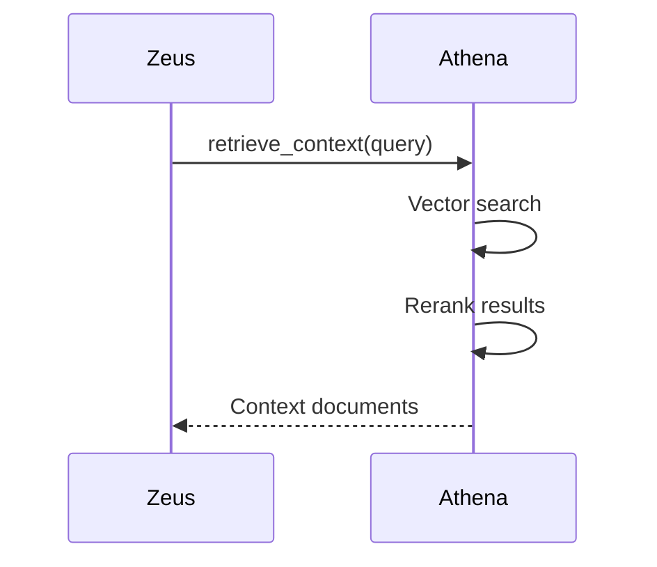
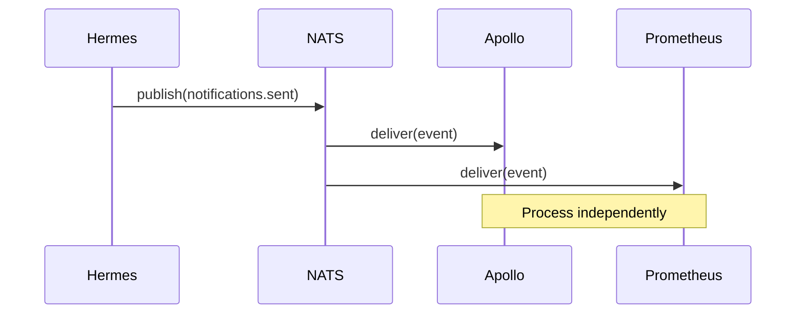
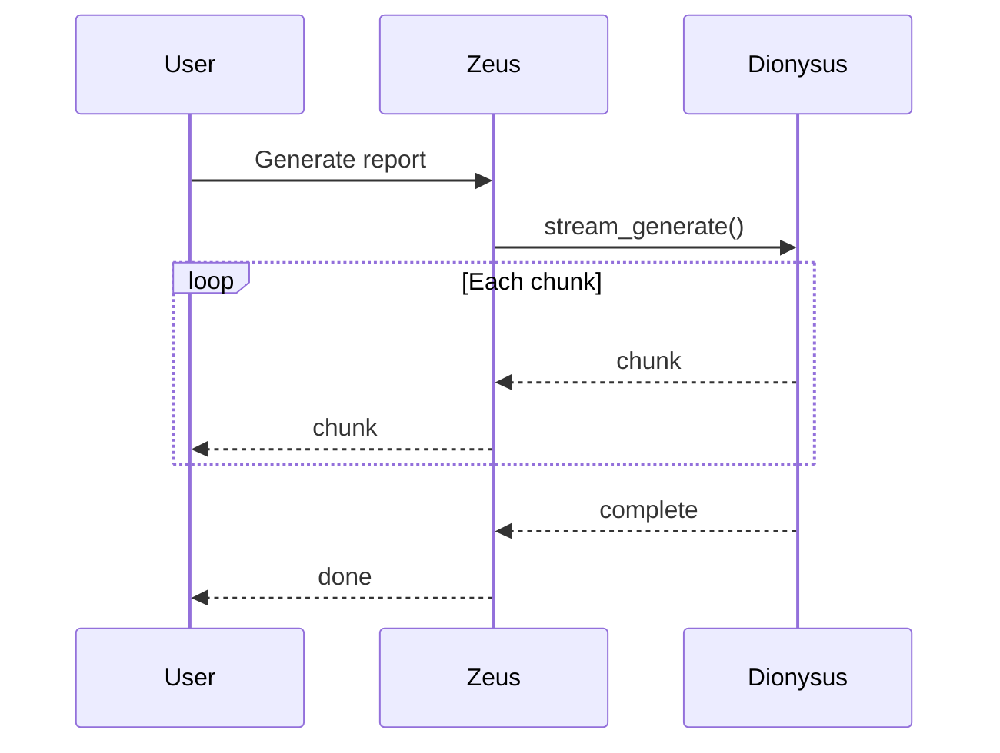
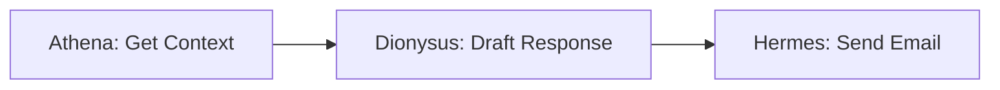
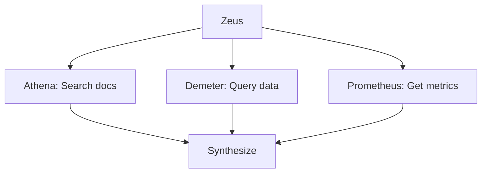

# Inter-Agent Communication Patterns

**Coordination Mechanisms for Multi-Agent Collaboration**

---

## Overview

This document describes how KOSMOS agents communicate, coordinate, and collaborate to accomplish complex tasks. Understanding these patterns is essential for debugging, optimization, and extending the system.

---

## Communication Mechanisms

### 1. Synchronous Request-Response

**Use Case:** Immediate operations requiring confirmation.



**Implementation:**

```python
# Zeus delegates to specialist
async def delegate_sync(
    target_agent: str,
    action: str,
    payload: dict,
    timeout_ms: int = 30000
) -> AgentResponse:
    """Synchronous delegation with timeout."""
    agent = get_agent(target_agent)
    return await asyncio.wait_for(
        agent.execute(action, payload),
        timeout=timeout_ms / 1000
    )
```

**When to Use:**
- User is waiting for response
- Result needed for next step
- Transaction integrity required

---

### 2. Asynchronous Event-Driven (NATS)

**Use Case:** Fire-and-forget notifications, event propagation.



**Implementation:**

```python
# Event publishing
async def publish_event(
    subject: str,
    payload: dict,
    headers: dict = None
) -> None:
    """Publish event to NATS."""
    await nats_client.publish(
        subject,
        json.dumps(payload).encode(),
        headers=headers
    )

# Event subscription
async def subscribe_events(
    subject_pattern: str,
    handler: Callable
) -> None:
    """Subscribe to event stream."""
    await nats_client.subscribe(
        subject_pattern,
        cb=handler
    )
```

**NATS Subject Hierarchy:**

```
kosmos.
├── agents.
│   ├── zeus.requests
│   ├── zeus.responses
│   ├── athena.queries
│   └── ...
├── events.
│   ├── user.action
│   ├── system.health
│   └── audit.log
└── commands.
    ├── scale.up
    └── scale.down
```

**When to Use:**
- Notifications don't need acknowledgment
- Multiple consumers need same event
- Decoupled processing acceptable

---

### 3. Streaming Responses

**Use Case:** Real-time content generation, progress updates.



**Implementation:**

```python
async def stream_to_user(
    agent: str,
    action: str,
    payload: dict
) -> AsyncGenerator[str, None]:
    """Stream agent response to user."""
    agent_instance = get_agent(agent)
    async for chunk in agent_instance.stream(action, payload):
        yield chunk
```

**When to Use:**
- Long-running generation
- User needs progress visibility
- Incremental results valuable

---

## Message Envelope

All inter-agent messages use a standardized envelope:

```python
class AgentMessage(BaseModel):
    """Standard message envelope."""
    message_id: str = Field(default_factory=lambda: str(uuid4()))
    timestamp: datetime = Field(default_factory=datetime.utcnow)
    source_agent: str
    target_agent: str | None = None  # None for broadcasts
    action: str
    payload: dict = {}
    correlation_id: str  # Links related messages
    trace_id: str  # OpenTelemetry trace
    priority: Literal["low", "normal", "high", "critical"] = "normal"
    ttl_ms: int = 60000  # Time to live
    
    class Config:
        json_encoders = {
            datetime: lambda v: v.isoformat()
        }
```

---

## Coordination Patterns

### Sequential Execution

Tasks executed in order, each depending on previous.



```python
async def sequential_workflow(request: Request) -> Response:
    # Step 1
    context = await delegate("athena", "retrieve", {"query": request.query})
    
    # Step 2
    draft = await delegate("dionysus", "write", {"context": context})
    
    # Step 3
    result = await delegate("hermes", "send_email", {"body": draft})
    
    return result
```

### Parallel Execution

Independent tasks executed simultaneously.



```python
async def parallel_workflow(request: Request) -> Response:
    # Execute in parallel
    results = await asyncio.gather(
        delegate("athena", "search", {"query": request.query}),
        delegate("demeter", "query_data", {"sql": request.sql}),
        delegate("prometheus", "get_metrics", {"service": request.service}),
    )
    
    # Synthesize results
    return synthesize(results)
```

### Scatter-Gather

Broadcast to multiple agents, collect and merge responses.

```python
async def scatter_gather(
    agents: list[str],
    action: str,
    payload: dict,
    timeout_ms: int = 30000
) -> list[AgentResponse]:
    """Send to multiple agents, gather responses."""
    tasks = [
        delegate_with_timeout(agent, action, payload, timeout_ms)
        for agent in agents
    ]
    
    # Gather results, handle failures gracefully
    results = await asyncio.gather(*tasks, return_exceptions=True)
    
    return [r for r in results if not isinstance(r, Exception)]
```

### Saga Pattern

Long-running transactions with compensation on failure.

```python
class Saga:
    """Saga coordinator for distributed transactions."""
    
    def __init__(self):
        self.steps: list[SagaStep] = []
        self.completed: list[SagaStep] = []
    
    def add_step(
        self,
        action: Callable,
        compensate: Callable
    ) -> None:
        self.steps.append(SagaStep(action, compensate))
    
    async def execute(self) -> SagaResult:
        try:
            for step in self.steps:
                await step.action()
                self.completed.append(step)
            return SagaResult(success=True)
        except Exception as e:
            # Compensate in reverse order
            for step in reversed(self.completed):
                await step.compensate()
            return SagaResult(success=False, error=str(e))
```

---

## Error Handling

### Retry with Backoff

```python
@retry(
    stop=stop_after_attempt(3),
    wait=wait_exponential(multiplier=0.1, max=10),
    retry=retry_if_exception_type(RetryableError)
)
async def delegate_with_retry(
    agent: str,
    action: str,
    payload: dict
) -> AgentResponse:
    return await delegate(agent, action, payload)
```

### Circuit Breaker

```python
circuit_breaker = CircuitBreaker(
    failure_threshold=5,
    recovery_timeout=30,
    expected_exception=AgentUnavailableError
)

@circuit_breaker
async def delegate_with_circuit_breaker(
    agent: str,
    action: str,
    payload: dict
) -> AgentResponse:
    return await delegate(agent, action, payload)
```

### Fallback Agents

```python
AGENT_FALLBACKS = {
    "athena": "dionysus",  # If knowledge fails, try creative
    "apollo": "prometheus",  # Monitoring fallback
}

async def delegate_with_fallback(
    agent: str,
    action: str,
    payload: dict
) -> AgentResponse:
    try:
        return await delegate(agent, action, payload)
    except AgentUnavailableError:
        fallback = AGENT_FALLBACKS.get(agent)
        if fallback:
            return await delegate(fallback, action, payload)
        raise
```

---

## Observability

### Distributed Tracing

All agent calls propagate trace context:

```python
from opentelemetry import trace

tracer = trace.get_tracer("kosmos.agents")

async def delegate(
    agent: str,
    action: str,
    payload: dict
) -> AgentResponse:
    with tracer.start_as_current_span(
        f"delegate.{agent}.{action}",
        attributes={
            "agent.name": agent,
            "agent.action": action
        }
    ) as span:
        try:
            result = await _delegate_impl(agent, action, payload)
            span.set_attribute("agent.response.status", "success")
            return result
        except Exception as e:
            span.record_exception(e)
            span.set_status(trace.Status(trace.StatusCode.ERROR))
            raise
```

### Metrics

Key communication metrics:

| Metric | Type | Description |
|--------|------|-------------|
| `agent_delegation_total` | Counter | Total delegations by agent pair |
| `agent_delegation_duration_seconds` | Histogram | Delegation latency |
| `agent_delegation_errors_total` | Counter | Delegation errors |
| `nats_messages_published_total` | Counter | Events published |
| `nats_messages_received_total` | Counter | Events received |

---

**Last Updated:** 2025-12-12  
**Document Owner:** Chief Architect
