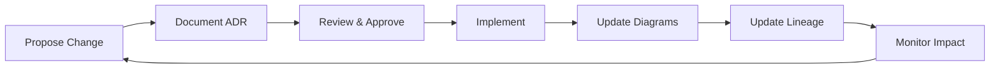

# Volume II: Architecture & Data

**The "What" - System Design, Decision History, Data Flows**

> "Architecture is about making decisions that will be expensive to change later."

---

## 📋 Overview

Volume II documents the **system architecture**, **architectural decisions**, and **data flows** of the KOSMOS AI-Native Operating System. This volume serves as the technical blueprint for understanding how the system is designed, why specific choices were made, and how data moves through the system.

### Purpose

This volume provides:

- **System Topology** - High-level view of components and their relationships
- **Architectural Decision Records (ADRs)** - History of key technical decisions
- **Data Lineage** - End-to-end tracking of data flows and transformations
- **C4 Diagrams** - Visual representations at multiple abstraction levels

---

## 📚 Contents

### [System Topology](topology)
Comprehensive overview of the KOSMOS system architecture including:
- Core components and services
- Infrastructure layers
- Integration points
- Technology stack
- Deployment architecture

### [Architectural Decision Records](adr/index)
Documented history of significant architectural decisions:
- [ADR-005: Data Storage Selection](adr/ADR-005-data-storage-selection)
- [ADR-006: LLM Provider Strategy](adr/ADR-006-llm-provider-strategy)
- [ADR-007: Observability Stack](adr/ADR-007-observability-stack)
- [ADR-009: LangGraph Selection](adr/ADR-009-langgraph-selection)
- [ADR-011: RAG Architecture](adr/ADR-011-rag-architecture)
- [ADR-018: Memory Architecture](adr/ADR-018-memory-architecture)
- [ADR-024: Security Architecture](adr/ADR-024-security-architecture)

### [Multi-Agent Architecture](agents/README)
Documentation for all 11 KOSMOS specialist agents:
- Zeus (Orchestration), Athena (Knowledge), Hermes (Communications)
- Chronos (Scheduling), Hephaestus (Operations), AEGIS (Security)
- Nur PROMETHEUS (Strategy), Iris (Interface), MEMORIX (Memory)
- Hestia (Personal), Morpheus (Learning)
- Inter-agent communication patterns

### [Data Lineage](data-lineage)
End-to-end data flow tracking:
- Data sources and destinations
- Transformation pipelines
- Quality checkpoints
- Compliance boundaries
- OpenLineage integration

### [C4 Diagrams](c4-diagrams/README)
Multi-level architecture visualizations:
- Context diagrams (system in environment)
- Container diagrams (major components)
- Component diagrams (internal structure)
- Code diagrams (implementation details)

---

## 🎯 Key Principles

### 1. **Design for Change**
Architecture must accommodate evolution without requiring complete rewrites.

### 2. **Document Decisions**
Every significant architectural choice must be captured in an ADR.

### 3. **Trace Data Flows**
All data transformations must be traceable from source to destination.

### 4. **Visual Communication**
Complex architectures require visual diagrams at multiple abstraction levels.

### 5. **Version Everything**
Architecture artifacts must be version-controlled alongside code.

---

## 🔄 Architecture Lifecycle



---

## 📝 When to Update

### System Topology
- New service or component added
- Integration points change
- Infrastructure updates
- Quarterly architecture review

### ADRs
- Any significant technical decision
- Technology selection
- Design pattern adoption
- Before major refactoring

### Data Lineage
- New data sources added
- Pipeline transformations change
- Compliance requirements evolve
- After data incidents

### C4 Diagrams
- Architecture changes impact system boundaries
- New containers/components added
- Deployment model changes
- Quarterly visual review

---

## 🛠️ Tools & Automation

### Diagram Generation
```bash
# Generate C4 diagrams from configuration
python scripts/generate_c4.py

# Generate data lineage from pipeline configs
python scripts/generate_lineage.py
```

### Validation
```bash
# Validate architecture documentation
python scripts/validate_volume.py --volume 2

# Check for broken links
mkdocs build --strict
```

### ADR Management
```bash
# Create new ADR from template
cp docs/02-architecture/adr/template.md \
   docs/02-architecture/adr/ADR-XXX-title.md
```

---

## 📊 Compliance & Standards

### Alignment
- **NIST AI RMF** - MAP function (system context and components)
- **ISO 42001** - Clause 7.5 (documented information)
- **EU AI Act** - Article 11 (technical documentation)
- **TOGAF** - Architecture Development Method (ADM)

### Standards
- **C4 Model** - Architecture visualization framework
- **OpenLineage** - Data lineage specification
- **ADR Format** - Lightweight decision documentation
- **ArchiMate** - Enterprise architecture language

---

## 🔗 Related Documentation

- **Volume I: Governance** - Strategic context for architectural decisions
- **Volume III: Engineering** - Implementation details for architecture
- **Volume IV: Operations** - Runtime behavior and monitoring
- **BUILD_PLAN.md** - Architecture build roadmap

---

## 📞 Architecture Contacts

| Role | Responsibility | Contact |
|------|----------------|---------|
| **Chief Architect** | Overall architecture direction | architect@nuvanta-holding.com |
| **Data Architect** | Data flows and lineage | data-arch@nuvanta-holding.com |
| **Infrastructure Architect** | Cloud and infrastructure | infra@nuvanta-holding.com |
| **Security Architect** | Security architecture | security@nuvanta-holding.com |

---

## 📈 Architecture Metrics

| Metric | Target | Current | Status |
|--------|--------|---------|--------|
| ADRs Documented | ≥10 | 11 | 🟢 Complete |
| Agent Documentation | 100% (11 agents) | 100% | 🟢 Complete |
| System Diagrams | 100% coverage | 90% | 🟢 Active |
| C4 Diagrams | All 4 levels | Complete | 🟢 Complete |
| Data Lineage Coverage | 100% critical flows | 60% | 🟡 In Progress |
| Architecture Review Cadence | Quarterly | On Track | 🟢 Active |

---

## 🚀 Getting Started

1. **New Team Members** - Start with [System Topology](topology)
2. **Understanding Decisions** - Review [ADR index](adr/index)
3. **Data Engineers** - Check [Data Lineage](data-lineage)
4. **Visual Learners** - Explore [C4 Diagrams](c4-diagrams/README)

---

## 📅 Review Schedule

- **System Topology** - Quarterly review (next: 2026-03-11)
- **ADRs** - Created as decisions are made
- **Data Lineage** - Monthly review or after pipeline changes
- **C4 Diagrams** - Updated with topology changes

---

**Last Updated:** 2025-12-11  
**Document Owner:** Chief Architect  
**Next Review:** 2026-03-11

---

[← Back to Home](../index) | [Volume I: Governance →](../01-governance/index) | [Volume III: Engineering →](../03-engineering/index)
