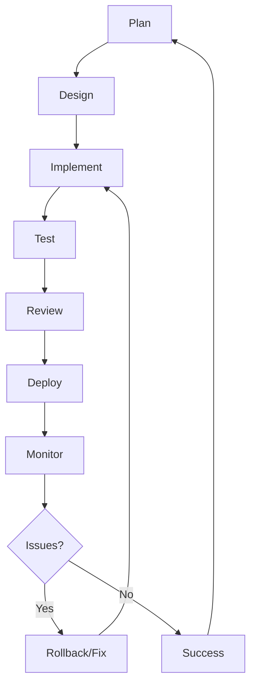

# Volume III: Engineering Handbook

**The "How" - Standards, SDLC, Quality Assurance**

> "Excellence in engineering comes from clear standards and consistent execution."

---

## 📋 Overview

Volume III defines the **engineering standards**, **development lifecycle**, and **quality practices** for building and maintaining AI systems in KOSMOS. This volume serves as the technical playbook for development teams, ensuring consistency, quality, and compliance across all engineering activities.

### Purpose

This volume provides:

- **Prompt Standards** - Versioning, testing, and governance of AI prompts
- **Model Cards** - Standardized documentation for AI models
- **AIBOM** - AI Bill of Materials for transparency and compliance
- **Canary Playbooks** - Safe deployment and rollback procedures
- **Watermarking** - Content authenticity and provenance tracking

---

## 📚 Contents

### [Prompt Standards](prompt-standards)
Guidelines for prompt engineering and management:
- Prompt versioning strategy
- Testing and validation
- Linting and quality checks
- Prompt registry management
- Security best practices

### [Model Cards](model-cards/README)
Standardized documentation for AI models:
- [Model Card Template](model-cards/template)
- Required metadata fields
- Performance metrics
- Limitations and biases
- Ethical considerations

### [AIBOM - AI Bill of Materials](aibom)
Transparency and component tracking:
- Model dependencies
- Dataset provenance
- Training pipeline
- Version management
- Compliance tracking

### [Canary Playbooks](canary-playbooks)
Safe deployment strategies:
- Gradual rollout procedures
- Health monitoring
- Rollback triggers
- Success criteria
- Post-deployment validation

### [Watermarking Standard](watermarking-standard)
Content authenticity and tracking:
- Metadata requirements
- Implementation patterns
- Verification processes
- Compliance tracking
- Provenance chain

---

## 🎯 Engineering Principles

### 1. **Quality First**
Code quality, test coverage, and documentation are non-negotiable standards.

### 2. **Automate Everything**
Manual processes are error-prone. Automate testing, deployment, and validation.

### 3. **Version All Artifacts**
Code, models, prompts, and configurations must be version-controlled.

### 4. **Document Decisions**
Every significant engineering choice should be documented and traceable.

### 5. **Security by Design**
Security considerations must be integrated from the start, not bolted on later.

### 6. **Fail Safely**
Systems should fail gracefully with clear error messages and rollback capabilities.

---

## 🔄 Development Lifecycle



### Phase Breakdown

| Phase | Activities | Artifacts | Quality Gates |
|-------|-----------|-----------|---------------|
| **Plan** | Requirements, estimation | User stories, specs | Requirements approved |
| **Design** | Architecture, ADRs | Design docs, diagrams | Design review passed |
| **Implement** | Coding, unit tests | Source code, tests | Code review approved |
| **Test** | Integration, E2E | Test reports, coverage | All tests passing |
| **Review** | Peer review, security | Review comments | All blockers resolved |
| **Deploy** | Canary, gradual rollout | Deployment logs | Health checks green |
| **Monitor** | Observability, alerts | Metrics, logs | SLOs met |

---

## 📝 Engineering Standards

### Code Quality

**Required Standards:**
- ✅ Code review by 2+ engineers
- ✅ 80%+ unit test coverage
- ✅ No critical security vulnerabilities
- ✅ Linting passes (zero errors)
- ✅ Documentation for public APIs

**Tools:**
- Static analysis (SonarQube, CodeQL)
- Dependency scanning (Snyk, Dependabot)
- Code formatters (Black, Prettier)
- Pre-commit hooks

### Prompt Engineering

**Required Standards:**
- ✅ All prompts versioned in registry
- ✅ No hardcoded prompts in code
- ✅ Prompt testing with RAGAS
- ✅ Bias evaluation completed
- ✅ Performance benchmarks documented

**Tools:**
- Prompt registry (custom)
- RAGAS for evaluation
- LangSmith for monitoring
- Prompt linting (custom)

### Model Documentation

**Required Standards:**
- ✅ Model card created before deployment
- ✅ Training data documented
- ✅ Limitations clearly stated
- ✅ Ethical review completed
- ✅ Performance metrics measured

**Tools:**
- Model card templates
- Model registry (MLflow)
- Experiment tracking
- Bias detection tools

---

## 🛠️ Development Tools

### Version Control
```bash
# Git workflow
git checkout -b feature/new-capability
git add .
git commit -m "feat: add new capability"
git push origin feature/new-capability
# Create PR in GitHub
```

### Testing
```bash
# Run all tests
pytest tests/ --cov=src --cov-report=html

# Run specific test suite
pytest tests/unit/

# Run with markers
pytest -m "not slow"
```

### Linting & Formatting
```bash
# Python
black src/
pylint src/
mypy src/

# JavaScript/TypeScript
npm run lint
npm run format
```

### Deployment
```bash
# Build and deploy
docker build -t kosmos-app:latest .
docker push registry.nuvanta.com/kosmos-app:latest

# Deploy with canary
kubectl apply -f k8s/canary.yaml
```

---

## 📊 Quality Metrics

### Code Quality Dashboard

| Metric | Target | Current | Trend |
|--------|--------|---------|-------|
| Test Coverage | ≥80% | 75% | 🟡 Improving |
| Code Review Time | &lt;24h | 18h | 🟢 Good |
| Deployment Frequency | Daily | 3x/week | 🟡 Improving |
| Mean Time to Recovery | &lt;1h | 45min | 🟢 Good |
| Change Failure Rate | &lt;5% | 3% | 🟢 Good |

### AI/ML Metrics

| Metric | Target | Current | Status |
|--------|--------|---------|--------|
| Model Cards Created | 100% models | 60% | 🟡 In Progress |
| Prompt Test Coverage | 100% prompts | 40% | 🟡 In Progress |
| AIBOM Completeness | 100% | 70% | 🟡 In Progress |
| Deployment Success Rate | ≥95% | 92% | 🟡 Improving |

---

## 🔒 Security Standards

### Required Security Practices

1. **Dependency Scanning**
   - All dependencies scanned for vulnerabilities
   - Critical CVEs patched within 24h
   - Monthly dependency updates

2. **Secret Management**
   - No secrets in code or configs
   - Use secret management tools (Vault, AWS Secrets Manager)
   - Rotate secrets quarterly

3. **Code Review**
   - Security-focused review for all changes
   - OWASP Top 10 awareness
   - Threat modeling for new features

4. **Prompt Injection Prevention**
   - Input validation and sanitization
   - Output filtering
   - Rate limiting
   - See [Prompt Injection Runbook](../04-operations/incident-response/prompt-injection)

---

## 📋 Compliance Checklist

Before deploying any AI component:

- [ ] Model card created and reviewed
- [ ] AIBOM generated and complete
- [ ] Prompt versioned in registry
- [ ] Security review completed
- [ ] Performance benchmarks documented
- [ ] Ethical review passed
- [ ] Canary deployment plan approved
- [ ] Rollback procedure tested
- [ ] Monitoring and alerts configured
- [ ] Documentation updated

---

## 🔗 Related Documentation

- **[Volume I: Governance](../01-governance/index)** - Strategic context and ethics
- **[Volume II: Architecture](../02-architecture/index)** - System design
- **[Volume IV: Operations](../04-operations/index)** - Deployment and monitoring
- **[Volume V: Human Factors](../05-human-factors/index)** - Training and adoption

---

## 📞 Engineering Contacts

| Role | Responsibility | Contact |
|------|----------------|---------|
| **VP Engineering** | Engineering leadership | vpe@nuvanta-holding.com |
| **Tech Lead** | Technical direction | techlead@nuvanta-holding.com |
| **AI/ML Lead** | Model development | ml-lead@nuvanta-holding.com |
| **QA Lead** | Quality assurance | qa@nuvanta-holding.com |
| **Security Lead** | Security review | security@nuvanta-holding.com |

---

## 🚀 Getting Started

### For New Engineers

1. **Read** the [Prompt Standards](prompt-standards)
2. **Review** existing [Model Cards](model-cards/README)
3. **Understand** [AIBOM](aibom) requirements
4. **Study** [Canary Playbooks](canary-playbooks)
5. **Complete** onboarding in [Volume V](../05-human-factors/training)

### For AI/ML Engineers

1. Start with [Model Cards](model-cards/README)
2. Review [Prompt Standards](prompt-standards)
3. Understand [AIBOM](aibom) tracking
4. Follow [Canary Playbooks](canary-playbooks) for deployment

### For DevOps Engineers

1. Focus on [Canary Playbooks](canary-playbooks)
2. Review [Watermarking Standard](watermarking-standard)
3. Check [Operations runbooks](../04-operations/index)

---

## 📅 Review Schedule

- **Prompt Standards** - Monthly review or after security incidents
- **Model Cards** - Updated with each model version
- **AIBOM** - Updated with each deployment
- **Canary Playbooks** - Quarterly review
- **Watermarking Standard** - Semi-annual review

---

## 📈 Improvement Roadmap

### Q1 2026
- [ ] Achieve 90%+ test coverage
- [ ] 100% model card coverage
- [ ] Automated prompt testing pipeline

### Q2 2026
- [ ] Zero critical vulnerabilities
- [ ] Daily deployment cadence
- [ ] Full AIBOM automation

### Q3 2026
- [ ] Advanced prompt optimization
- [ ] ML observability platform
- [ ] Continuous model monitoring

---

**Last Updated:** 2025-12-11  
**Document Owner:** VP Engineering  
**Next Review:** 2026-03-11

---

[← Back to Home](../index) | [Volume II: Architecture →](../02-architecture/index) | [Volume IV: Operations →](../04-operations/index)
