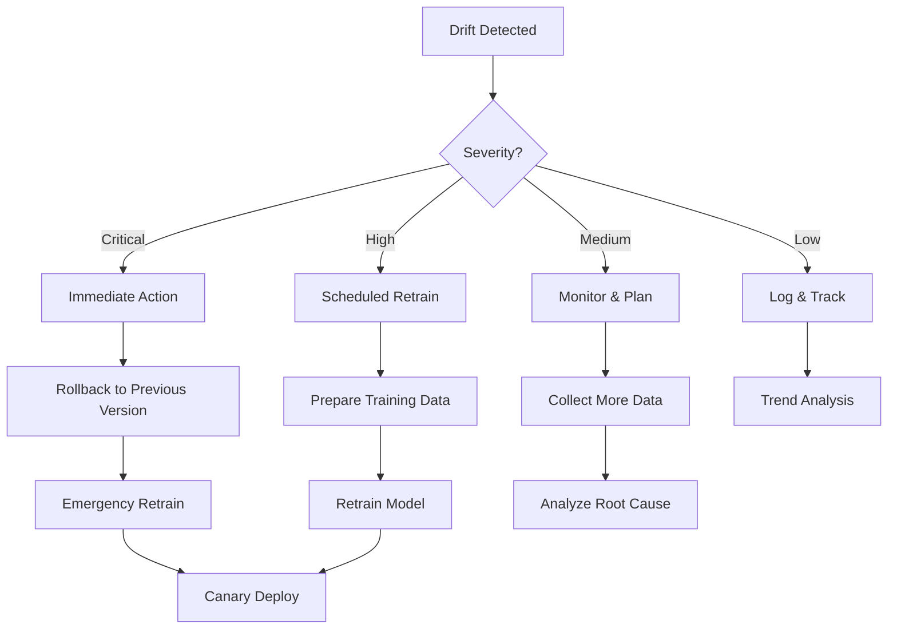

# Drift Detection

**Monitoring Model and Data Degradation**

> "Models don't age gracefully. Monitor drift, detect degradation, retrain promptly."

---

## 📋 Overview

Drift detection involves monitoring AI models for degradation in performance, changes in data patterns, and shifts in underlying assumptions. Drift is inevitable in production ML systems as the world changes over time.

### Types of Drift

1. **Model Drift (Concept Drift)** - The relationship between inputs and outputs changes
2. **Data Drift (Covariate Shift)** - The distribution of input data changes
3. **Label Drift** - The distribution of target labels changes
4. **Performance Drift** - Model accuracy degrades over time

---

## 🎯 Detection Methods

### 1. Model Performance Drift

**Metrics to Track:**
```yaml
performance_metrics:
  accuracy:
    baseline: 0.92
    current: 0.88
    threshold: 0.85
    status: WARNING
    
  precision:
    baseline: 0.91
    current: 0.87
    threshold: 0.83
    status: WARNING
    
  recall:
    baseline: 0.93
    current: 0.90
    threshold: 0.85
    status: OK
    
  f1_score:
    baseline: 0.92
    current: 0.88
    threshold: 0.84
    status: WARNING
```

**Detection Code:**
```python
from drift_detector import PerformanceDriftDetector

detector = PerformanceDriftDetector(
    baseline_metrics=baseline_metrics,
    alert_threshold=0.05  # 5% degradation
)

# Check current performance
current_metrics = evaluate_model(test_data)
drift_detected = detector.check_drift(current_metrics)

if drift_detected:
    alert = {
        "model_id": "MC-001",
        "drift_type": "performance",
        "baseline_accuracy": 0.92,
        "current_accuracy": 0.88,
        "degradation": "4.3%",
        "action": "retrain_recommended"
    }
    send_drift_alert(alert)
```

### 2. Data Distribution Drift

**Statistical Tests:**
```python
from scipy.stats import ks_2samp
import numpy as np

def detect_data_drift(baseline_data, current_data, feature_name):
    """Detect drift using Kolmogorov-Smirnov test"""
    statistic, pvalue = ks_2samp(baseline_data, current_data)
    
    # Significant drift if p-value < 0.05
    drift_detected = pvalue < 0.05
    
    return {
        "feature": feature_name,
        "drift_detected": drift_detected,
        "ks_statistic": statistic,
        "p_value": pvalue,
        "severity": "high" if statistic > 0.3 else "medium" if statistic > 0.1 else "low"
    }

# Monitor all features
for feature in features:
    result = detect_data_drift(
        baseline_data[feature],
        current_data[feature],
        feature
    )
    if result["drift_detected"]:
        log_drift_event(result)
```

**Population Stability Index (PSI):**
```python
def calculate_psi(baseline, current, bins=10):
    """Calculate Population Stability Index"""
    baseline_pct = np.histogram(baseline, bins=bins)[0] / len(baseline)
    current_pct = np.histogram(current, bins=bins)[0] / len(current)
    
    psi = np.sum((current_pct - baseline_pct) * np.log(current_pct / baseline_pct))
    
    # PSI interpretation
    # < 0.1: No significant change
    # 0.1-0.25: Minor change
    # > 0.25: Major change (retrain recommended)
    
    return psi

psi_score = calculate_psi(baseline_feature, current_feature)
if psi_score > 0.25:
    trigger_retraining()
```

### 3. Prediction Drift

**Monitor Output Distributions:**
```python
from drift_detector import PredictionDriftDetector

detector = PredictionDriftDetector()

# Track prediction distribution over time
weekly_predictions = get_predictions_last_7days()
baseline_predictions = get_baseline_predictions()

drift_score = detector.compare_distributions(
    baseline_predictions,
    weekly_predictions
)

if drift_score > threshold:
    alert_drift(
        type="prediction",
        score=drift_score,
        recommendation="investigate_model_behavior"
    )
```

---

## 📊 Monitoring Dashboard

### Drift Dashboard

```
Model Drift Dashboard - Document Summarizer v2.1.0
━━━━━━━━━━━━━━━━━━━━━━━━━━━━━━━━━━━━━━━━━━━━━━━━━

Performance Metrics (vs Baseline)
├── Accuracy: 88% (-4.3%) ⚠️ WARNING
├── Precision: 87% (-4.4%) ⚠️ WARNING
├── Recall: 90% (-3.2%) ✅ OK
└── F1 Score: 88% (-4.3%) ⚠️ WARNING

Data Drift (Feature-level)
├── Document Length: PSI = 0.15 🟡 Minor Drift
├── Language: PSI = 0.08 ✅ No Drift
├── Topic Distribution: PSI = 0.32 🔴 Major Drift
└── Sentiment: PSI = 0.12 🟡 Minor Drift

Prediction Drift
├── Output Length: KS = 0.18 🟡 Moderate
├── Confidence Scores: KS = 0.09 ✅ Stable
└── Response Time: +15% 🟡 Increased

Recommendation: 🔴 Retraining Required
Next Scheduled Retrain: 2025-12-15
Last Retrain: 2025-11-01 (41 days ago)
```

---

## 🚨 Alert Thresholds

### Performance-Based Alerts

```yaml
alerts:
  critical:
    accuracy_drop: >gt;10%
    error_rate_spike: >gt;5%
    action: immediate_investigation
    
  high:
    accuracy_drop: >gt;5%
    precision_drop: >gt;5%
    recall_drop: >gt;5%
    action: schedule_retraining
    
  medium:
    accuracy_drop: >gt;3%
    psi_score: &gt;0.25
    action: monitor_closely
    
  low:
    accuracy_drop: >gt;1%
    psi_score: &gt;0.1
    action: log_for_trending
```

---

## 🔄 Remediation Workflow

### Drift Response Procedure



### Retraining Decision Matrix

| Drift Type | Severity | Timeline | Action |
|------------|----------|----------|--------|
| Performance | >gt;10% drop | Immediate | Emergency retrain |
| Performance | 5-10% drop | 1 week | Scheduled retrain |
| Data | PSI &gt;0.25 | 2 weeks | Planned retrain |
| Prediction | Major shift | 1 week | Investigate + retrain |

---

## 🛠️ Drift Detection Tools

### Automated Monitoring

```python
# scripts/monitor_drift.py
from drift_monitor import DriftMonitor

monitor = DriftMonitor(
    models=["MC-001", "MC-002", "MC-003"],
    check_interval="1h",
    alert_channels=["slack", "pagerduty", "email"]
)

# Run continuous monitoring
monitor.start()

# Daily drift report
monitor.generate_daily_report()

# Weekly trend analysis
monitor.generate_weekly_trends()
```

### Integration with CI/CD

```yaml
# .github/workflows/drift-check.yml
name: Drift Detection

on:
  schedule:
    - cron: '0 */6 * * *'  # Every 6 hours

jobs:
  check-drift:
    runs-on: ubuntu-latest
    steps:
      - name: Check Model Drift
        run: |
          python scripts/monitor_drift.py --all-models
      
      - name: Alert if Drift Detected
        if: failure()
        run: |
          python scripts/send_drift_alert.py
```

---

## 📋 Best Practices

### 1. Establish Baselines

- Capture performance metrics at deployment
- Record input data distributions
- Document expected ranges
- Set appropriate thresholds

### 2. Monitor Continuously

- Track metrics in real-time
- Run drift checks hourly/daily
- Trend analysis weekly
- Comprehensive review monthly

### 3. Act Proactively

- Don't wait for critical drift
- Schedule retraining before severe degradation
- Maintain model refresh calendar
- Keep training pipeline ready

### 4. Root Cause Analysis

- Investigate why drift occurred
- Identify external factors
- Document learnings
- Update monitoring strategy

---

## 🔗 Related Documentation

- **[FinOps Metrics](finops-metrics)** - Cost impact of retraining
- **[Canary Playbooks](../03-engineering/canary-playbooks)** - Safe model updates
- **[Model Cards](../03-engineering/model-cards/README)** - Document baseline metrics
- **[SLA/SLO](sla-slo)** - Performance targets

---

## 📞 Support

| Issue Type | Contact |
|------------|---------|
| **Drift Alerts** | ml-team@nuvanta-holding.com |
| **Retraining** | ml-ops@nuvanta-holding.com |
| **Critical Drift** | oncall@nuvanta-holding.com |

---

**Last Updated:** 2025-12-11  
**Document Owner:** ML Operations Team  
**Next Review:** 2026-03-11

---

[← Back to Volume IV](index) | [SLA/SLO →](sla-slo)
