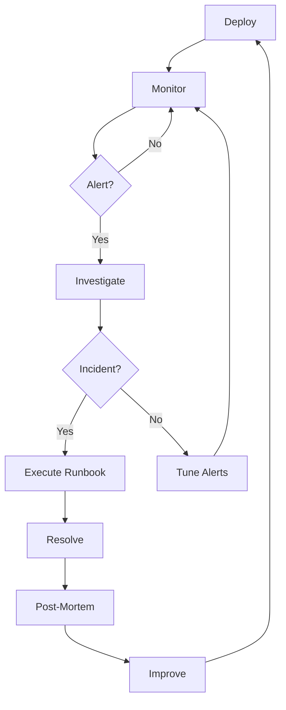
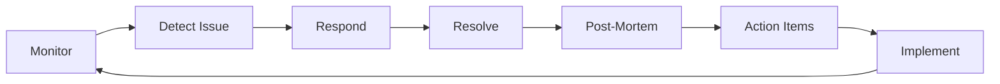

# Volume IV: Operations & FinOps

**The "Run" - Monitoring, Incident Response, Cost Control**

> "In production, everything that can break, will break. Be ready."

---

## 📋 Overview

Volume IV defines the **operational procedures**, **incident response protocols**, and **financial operations** for running AI systems in KOSMOS. This volume ensures systems run reliably, cost-effectively, and with proper observability.

### Purpose

This volume provides:

- **Infrastructure** - Kubernetes, database operations, disaster recovery
- **Observability** - Metrics, logging, tracing, alerting, dashboards
- **FinOps Metrics** - Cost tracking and optimization for AI systems
- **Drift Detection** - Monitoring for model and data drift
- **SLA/SLO Definitions** - Service level objectives and agreements
- **Incident Response** - Runbooks for common AI system incidents

---

## 📚 Contents

### [Infrastructure](infrastructure/README)
Platform and deployment operations:
- [Kubernetes Architecture](infrastructure/kubernetes) - K3s cluster configuration
- [Deployment Architecture](infrastructure/deployment) - CI/CD pipelines, canary deployments
- [Disaster Recovery](infrastructure/disaster-recovery) - RTO/RPO, backup procedures
- [Database Operations](infrastructure/database-ops) - PostgreSQL, Dragonfly runbooks

### [Observability](observability/README)
Monitoring and visibility:
- [Metrics Reference](observability/metrics) - Prometheus metrics, recording rules
- [Logging Standards](observability/logging) - Structured logging, Loki queries
- [Distributed Tracing](observability/tracing) - OpenTelemetry, Tempo
- [Alerting Rules](observability/alerting) - Alert definitions, routing
- [Dashboards](observability/dashboards) - Grafana dashboard catalog
- [LLM Observability](observability/llm-observability) - Langfuse integration

### [FinOps Metrics](finops-metrics)
Cost management and optimization:
- Cost per inference tracking
- Token usage monitoring
- Budget alerts and forecasting
- Optimization strategies
- Cloud cost allocation

### [Drift Detection](drift-detection)
Monitoring for system degradation:
- Model performance drift
- Data distribution drift
- Concept drift detection
- Alert thresholds
- Remediation workflows

### [SLA/SLO Definitions](sla-slo)
Service level objectives:
- Availability targets
- Performance thresholds
- Error rate budgets
- Escalation procedures
- Reporting cadence

### [Incident Response](incident-response/README)
Runbooks for critical incidents:
- [Prompt Injection Attacks](incident-response/prompt-injection)
- [Loop Detection & Remediation](incident-response/loop-detection)
- General incident response framework
- Post-mortem templates

---

## 🎯 Operational Principles

### 1. **Observe Everything**
Comprehensive monitoring is the foundation of reliable operations.

### 2. **Fail Gracefully**
Systems should degrade predictably with clear error messages.

### 3. **Automate Recovery**
Automated remediation reduces mean time to recovery (MTTR).

### 4. **Budget Consciously**
AI operations can be expensive. Track and optimize costs continuously.

### 5. **Learn from Incidents**
Every incident is an opportunity to improve systems and processes.

### 6. **Test Disaster Recovery**
Regular chaos engineering and disaster recovery drills are essential.

---

## 📊 Operations Dashboard

### System Health Overview

```
KOSMOS Operations Dashboard
━━━━━━━━━━━━━━━━━━━━━━━━━━━━━━━━━━━━━━━━━━

Service Availability: 99.95% ✅ (Target: 99.9%)
Error Rate: 0.3% ✅ (Target: &lt;1%)
P95 Latency: 1.2s ✅ (Target: &lt;2s)
Cost per Request: $0.042 🟡 (Budget: $0.040)

Active Incidents: 0
Open Alerts: 2 (both low severity)
Deployed Models: 5
Daily Requests: 2.5M

Last Deployment: 2 hours ago
Next Scheduled Maintenance: In 3 days
```

### Cost Dashboard

> **Note:** This dashboard shows the **Pilot Tier** budget (~$50k/month for limited deployment).
> For full enterprise cost projections (~$250k/month at scale), see [FinOps Metrics](finops-metrics).

```
AI Operations Cost Summary (Pilot Tier)
━━━━━━━━━━━━━━━━━━━━━━━━━━━━━━━━━━━━━━━━━━

Monthly Spend: $45,230 (of $50,000 budget)
Daily Average: $1,507
Projected Month-End: $47,715 ✅

Cost Breakdown:
├── Model Inference: $32,400 (72%)
├── Training: $8,100 (18%)
├── Storage: $2,700 (6%)
└── Networking: $2,030 (4%)

Top Cost Drivers:
1. Document Summarizer: $18,500
2. Code Reviewer: $12,300
3. Sentiment Analyzer: $6,600
```

---

## 🔄 Operations Lifecycle



---

## 🚨 Alert Severity Levels

### Critical (P0)
- **Response Time:** < 5 minutes
- **Examples:** 
  - Service completely down
  - Data breach detected
  - Critical security vulnerability
- **Actions:** 
  - Page on-call engineer immediately
  - Engage incident commander
  - Execute emergency runbook

### High (P1)
- **Response Time:** < 15 minutes
- **Examples:**
  - Elevated error rates (>gt;5%)
  - Severe performance degradation
  - Fairness violations detected
- **Actions:**
  - Notify on-call engineer
  - Begin investigation
  - Prepare rollback if needed

### Medium (P2)
- **Response Time:** < 1 hour
- **Examples:**
  - Minor performance degradation
  - Non-critical errors increasing
  - Cost overruns detected
- **Actions:**
  - Create ticket
  - Investigate during business hours
  - Monitor for escalation

### Low (P3)
- **Response Time:** < 1 day
- **Examples:**
  - Minor anomalies
  - Informational alerts
  - Capacity planning warnings
- **Actions:**
  - Log for trending
  - Address in next sprint
  - Document for future reference

---

## 📋 On-Call Responsibilities

### On-Call Engineer Duties

**During Shift:**
- ✅ Monitor dashboards actively
- ✅ Respond to alerts per SLA
- ✅ Execute incident runbooks
- ✅ Document all actions taken
- ✅ Escalate when needed
- ✅ Conduct handoff briefing

**Shift Duration:** 7 days (rotates weekly)

**Escalation Path:**
1. On-Call Engineer (you)
2. Senior Engineer / Team Lead
3. Engineering Manager
4. VP Engineering / CTO

**On-Call Kit:**
- Access to production systems
- Runbook documentation
- Escalation contact list
- VPN credentials
- Monitoring dashboard access
- Incident management tool

---

## 🛠️ Operational Tools

### Monitoring & Observability

**Metrics:**
```bash
# Prometheus for metrics
prometheus_endpoint: https://prometheus.nuvanta.com

# Key metrics to watch
- model_requests_total
- model_request_duration_seconds
- model_errors_total
- model_cost_per_request
- model_fairness_score
```

**Logging:**
```bash
# Centralized logging
elasticsearch: https://logs.nuvanta.com

# Log aggregation
- Application logs (stdout/stderr)
- Access logs
- Error logs
- Audit logs
```

**Tracing:**
```bash
# Distributed tracing
jaeger: https://tracing.nuvanta.com

# Trace every request
- Request ID propagation
- Service dependencies
- Latency breakdown
```

### Incident Management

```bash
# PagerDuty integration
pagerduty_service: kosmos-ai-ops

# Status page
status_page: https://status.nuvanta.com

# Post-mortem template
template: docs/04-operations/incident-response/post-mortem-template.md
```

---

## 📊 Key Performance Indicators

### Reliability Metrics

| Metric | Target | Current | Status |
|--------|--------|---------|--------|
| **Availability** | 99.9% | 99.95% | 🟢 Exceeding |
| **Error Rate** | &lt;1% | 0.3% | 🟢 Good |
| **P95 Latency** | &lt;2s | 1.2s | 🟢 Good |
| **MTTR** | &lt;1h | 45min | 🟢 Good |
| **Deployment Frequency** | Daily | 3x/week | 🟡 Improving |

### Cost Metrics (Pilot Tier)

| Metric | Target | Current | Status |
|--------|--------|---------|--------|
| **Monthly Budget** | $50k | $45k | 🟢 Under Budget |
| **Cost per Request** | $0.040 | $0.042 | 🟡 Slightly Over |
| **Token Efficiency** | &gt;80% | 78% | 🟡 Needs Improvement |
| **Waste Reduction** | &gt;90% | 92% | 🟢 Good |

*Enterprise tier targets: See [FinOps Metrics](finops-metrics) for full-scale projections.*

### Quality Metrics

| Metric | Target | Current | Status |
|--------|--------|---------|--------|
| **Model Accuracy** | &gt;90% | 92% | 🟢 Good |
| **Fairness Score** | &gt;0.8 | 0.85 | 🟢 Good |
| **Data Quality** | &gt;95% | 96% | 🟢 Good |
| **Drift Detection** | &lt;5% | 2% | 🟢 Good |

---

## 🔗 Related Documentation

- **[Volume II: Architecture](../02-architecture/index)** - System design
- **[Volume III: Engineering](../03-engineering/index)** - Deployment procedures
- **[Canary Playbooks](../03-engineering/canary-playbooks)** - Safe deployments
- **[Kill Switch Protocol](../01-governance/kill-switch-protocol)** - Emergency shutdown

---

## 📞 Operations Contacts

| Role | Contact | Responsibility |
|------|---------|----------------|
| **On-Call Engineer** | oncall@nuvanta-holding.com | 24/7 incident response |
| **DevOps Lead** | devops@nuvanta-holding.com | Operations leadership |
| **SRE Team** | sre@nuvanta-holding.com | Reliability engineering |
| **FinOps Lead** | finops@nuvanta-holding.com | Cost optimization |
| **Security Operations** | secops@nuvanta-holding.com | Security incidents |

---

## 🚀 Getting Started

### For Operations Engineers

1. **Read** [SLA/SLO Definitions](sla-slo)
2. **Study** [Incident Response](incident-response/README) runbooks
3. **Review** [Drift Detection](drift-detection) procedures
4. **Understand** [FinOps Metrics](finops-metrics)
5. **Complete** on-call training

### For On-Call Engineers

1. Verify access to all monitoring tools
2. Review current system status
3. Read recent incident post-mortems
4. Test alert delivery mechanisms
5. Familiarize with escalation procedures

### For Managers

1. Review SLA compliance reports
2. Check cost trends and forecasts
3. Assess team workload
4. Plan capacity increases
5. Review incident trends

---

## 📅 Operational Cadence

### Daily
- Morning standup (9:00 AM)
- On-call handoff (if shift change)
- Review overnight alerts
- Check cost trends

### Weekly
- Operations review meeting
- Cost optimization review
- Alert tuning session
- On-call rotation

### Monthly
- SLA/SLO review
- Incident trend analysis
- Capacity planning
- Budget reconciliation
- Disaster recovery drill

### Quarterly
- Architecture review
- Tool evaluation
- Process improvements
- Team retrospective

---

## 📈 Continuous Improvement

### Feedback Loops



### Improvement Metrics

- Incident frequency trending down
- MTTR decreasing
- Alert accuracy improving
- Cost efficiency increasing
- Customer satisfaction rising

---

**Last Updated:** 2025-12-11  
**Document Owner:** DevOps Lead  
**Next Review:** 2026-03-11

---

[← Back to Home](../index) | [Volume III: Engineering →](../03-engineering/index) | [Volume V: Human Factors →](../05-human-factors/index)
