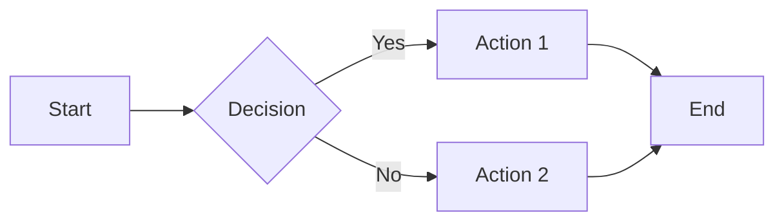

# KOSMOS Living Constitution - Getting Started

## 🎉 Welcome!

You now have a **production-ready foundation** for the KOSMOS Living Constitution documentation system. This guide will help you get up and running.

---

## ✅ What's Been Built

### Core Infrastructure
- ✅ **MkDocs Configuration** (`mkdocs.yml`) - Fully configured with Material theme
- ✅ **Python Dependencies** (`requirements.txt`) - All required packages defined
- ✅ **Scaffolding Script** (`scripts/scaffold.py`) - Automated directory creation
- ✅ **Complete Directory Structure** - All 5 volumes scaffolded

### Volume I: Governance & Legal (Fully Documented)
- ✅ **Index Page** - Overview of governance volume
- ✅ **RACI Matrix** - Comprehensive decision accountability matrix
- ✅ **Kill Switch Protocol** - Emergency shutdown procedures
- 🟡 **AI Ethics Scorecard** - Template ready for customization
- 🟡 **Risk Registry** - Template ready for customization
- 🟡 **Legal Framework** - Template ready for customization

### Documentation Features
- ✅ Mermaid diagram support
- ✅ Code syntax highlighting
- ✅ Admonitions (warnings, tips, notes)
- ✅ Task lists and checklists
- ✅ Tabbed content
- ✅ Table of contents
- ✅ Dark/light mode toggle
- ✅ Full-text search

---

## 🚀 Quick Start (5 Minutes)

### Step 1: Install Dependencies

```bash
# Navigate to project
cd kosmos-docs

# Install Python packages
pip install -r requirements.txt
```

**Expected output:**
```
Successfully installed mkdocs-1.5.x mkdocs-material-9.x.x ...
```

### Step 2: Start Documentation Server

```bash
# Serve documentation locally
mkdocs serve
```

**Expected output:**
```
INFO     -  Building documentation...
INFO     -  Cleaning site directory
INFO     -  Documentation built in 0.52 seconds
INFO     -  [16:38:00] Serving on http://127.0.0.1:8000/
```

### Step 3: View Your Documentation

1. Open browser to **http://localhost:8000**
2. Navigate through the 5 volumes
3. Test the search functionality
4. Toggle dark/light mode

---

## 📝 Next Steps

### Immediate Actions (Day 1)

1. **Customize RACI Matrix**
   - Edit `docs/01-governance/raci-matrix.md`
   - Add your organization's stakeholder names and contacts
   - Define your specific roles and responsibilities

2. **Complete Kill Switch Protocol**
   - Update emergency contacts in `docs/01-governance/kill-switch-protocol.md`
   - Add your organization's specific procedures
   - Schedule first quarterly drill

3. **Initialize Git Repository**
   ```bash
   cd kosmos-docs
   git init
   git add .
   git commit -m "Initial KOSMOS Living Constitution"
   ```

4. **Deploy to Cloudflare Pages**
   ```bash
   # Option 1: Quick deployment with Wrangler CLI
   wrangler login
   mkdocs build
   wrangler pages deploy site --project-name=kosmos-docs
   
   # Option 2: Set up GitHub auto-deployment
   # See CLOUDFLARE_PAGES_SETUP.md for detailed instructions
   ```

### Short-term Goals (Week 1)

1. **Populate Volume I Templates**
   - Complete AI Ethics Scorecard
   - Initialize Risk Registry with top 10 risks
   - Draft Legal Framework based on your jurisdiction

2. **Start Volume II: Architecture**
   - Document current system topology
   - Create first 3 ADRs (Architectural Decision Records)
   - Map data lineage for key flows

3. **Set Up CI/CD** (Optional but recommended)
   - Configure GitHub Actions (templates in `.github/workflows/`)
   - Enable automatic deployment to GitHub Pages
   - Set up documentation linting

### Medium-term Goals (Month 1)

1. **Complete All 5 Volumes**
   - Volume II: Architecture & Data
   - Volume III: Engineering Handbook
   - Volume IV: Operations & FinOps
   - Volume V: Human Factors

2. **Implement Automation**
   - Set up automated diagram generation
   - Configure metrics hydration from RAGAS
   - Enable prompt linting

3. **Conduct First Governance Review**
   - Review RACI Matrix with stakeholders
   - Test Kill Switch protocol in staging
   - Validate compliance alignment

---

## 📖 Documentation Patterns

### Adding a New Document

1. Create markdown file in appropriate volume directory:
   ```bash
   # Example: New security policy in Volume I
   touch docs/01-governance/security-policy.md
   ```

2. Add frontmatter and content:
   ```markdown
   # Security Policy
   
   ## Overview
   [Your content here]
   
   ## Related Documents
   - [RACI Matrix](raci-matrix)
   - [Risk Registry](risk-registry)
   ```

3. Update navigation in `mkdocs.yml`:
   ```yaml
   nav:
     - Volume I - Governance & Legal:
       - Security Policy: 01-governance/security-policy.md
   ```

4. Preview changes:
   ```bash
   mkdocs serve
   ```

### Using Mermaid Diagrams

```markdown
## Process Flow


\```
```

### Using Admonitions

```markdown
:::warning Important
    This is a critical warning that requires attention.

:::tip Pro Tip
    Here's a helpful suggestion.

:::note Additional Information
    Supplementary details go here.
```

---

## 🛠️ Customization Guide

### Branding

1. **Update Site Name** in `mkdocs.yml`:
   ```yaml
   site_name: Your Organization - KOSMOS Docs
   site_author: Your Organization Name
   ```

2. **Change Theme Colors** in `mkdocs.yml`:
   ```yaml
   theme:
     palette:
       - scheme: default
         primary: blue  # Change to your brand color
         accent: cyan
   ```

3. **Add Logo** (optional):
   ```yaml
   theme:
     logo: assets/logo.png
     favicon: assets/favicon.ico
   ```

### Repository Links

Update repository URLs in `mkdocs.yml` and `README.md`:
```yaml
repo_url: https://github.com/YOUR-ORG/kosmos-docs
repo_name: YOUR-ORG/kosmos-docs
```

---

## 🔍 Validation & Quality

### Build Documentation

```bash
# Build static site
mkdocs build

# Build with strict mode (fails on warnings)
mkdocs build --strict
```

### Check for Issues

```bash
# Validate internal links
# (Script to be created in scripts/validate_all.py)
python scripts/validate_all.py

# Markdown linting (if markdownlint-cli2 installed)
markdownlint-cli2 "docs/**/*.md"
```

---

## 📦 Deployment Options

### Option 1: GitHub Pages (Recommended)

```bash
# Build and deploy
mkdocs gh-deploy

# This will:
# 1. Build documentation
# 2. Push to gh-pages branch
# 3. Enable GitHub Pages automatically
```

### Option 2: Manual Deployment

```bash
# Build static site
mkdocs build

# Copy site/ directory to your web server
rsync -avz site/ user@server:/var/www/docs/
```

### Option 3: CI/CD Pipeline

GitHub Actions workflow already created in `.github/workflows/deploy.yml`. Configure your repository secrets and enable Actions.

---

## 🆘 Troubleshooting

### Issue: `mkdocs: command not found`

**Solution:**
```bash
pip install mkdocs mkdocs-material
# Or ensure virtual environment is activated
source venv/bin/activate  # Linux/Mac
venv\Scripts\activate     # Windows
```

### Issue: Mermaid diagrams not rendering

**Solution:**
```bash
pip install mkdocs-mermaid2-plugin
```

### Issue: Port 8000 already in use

**Solution:**
```bash
# Use different port
mkdocs serve -a localhost:8001
```

### Issue: Navigation not updating

**Solution:**
- Check `mkdocs.yml` for syntax errors
- Ensure file paths are relative to `docs/` directory
- Restart `mkdocs serve`

---

## 📚 Resources

### MkDocs Documentation
- [MkDocs Official Docs](https://www.mkdocs.org/)
- [Material for MkDocs](https://squidfunk.github.io/mkdocs-material/)
- [Mermaid Diagrams](https://mermaid.js.org/)

### Compliance Standards
- [NIST AI Risk Management Framework](https://www.nist.gov/itl/ai-risk-management-framework)
- [ISO 42001 Overview](https://www.iso.org/standard/81230.html)
- [EU AI Act Information](https://artificialintelligenceact.eu/)

### Best Practices
- [Diátaxis Documentation Framework](https://diataxis.fr/)
- [Docs as Code](https://www.writethedocs.org/guide/docs-as-code/)
- [Architectural Decision Records](https://adr.github.io/)

---

## 💡 Tips for Success

1. **Start Small, Scale Fast**
   - Begin with Volume I (Governance)
   - Iterate based on stakeholder feedback
   - Gradually expand to other volumes

2. **Automate Everything**
   - Use CI/CD for automatic deployment
   - Generate diagrams from code
   - Pull metrics from production systems

3. **Make it Living**
   - Schedule regular review cycles
   - Update on every architecture change
   - Keep stakeholder contacts current

4. **Engage Stakeholders**
   - Share documentation URL widely
   - Solicit feedback regularly
   - Track usage via analytics

5. **Test in Production**
   - Run Kill Switch drills quarterly
   - Validate runbooks during incidents
   - Update based on real-world usage

---

## 🎯 Success Metrics

Track these KPIs to measure effectiveness:

| Metric | Target | How to Measure |
|--------|--------|----------------|
| Documentation Coverage | &gt;80% | % of systems with docs |
| Time to Audit Ready | &lt;4 hours | From request to report |
| Stakeholder Engagement | &gt;70% | % contributing updates |
| Search Usage | &gt;50 searches/week | Analytics dashboard |
| Incident Reference | &gt;3 times/incident | Runbook usage tracking |

---

## 🤝 Getting Help

**Questions?**
- Create an issue in GitHub repository
- Tag documentation owner in Slack
- Email: kosmos-docs@your-org.com

**Found a bug?**
- Open GitHub issue with `bug` label
- Include steps to reproduce
- Attach screenshots if applicable

**Want to contribute?**
- Read [Contributing Guidelines](README#contributing)
- Follow commit message format
- Submit pull request

---

## 🏁 Ready to Begin?

```bash
# Start your KOSMOS journey
cd kosmos-docs
pip install -r requirements.txt
mkdocs serve

# Open http://localhost:8000
# Begin with Volume I: Governance
```

**Welcome to the future of AI governance documentation! 🚀**

---

**Last Updated:** 2025-12-11  
**Guide Version:** 1.0  
**Maintainer:** KOSMOS Project Team
