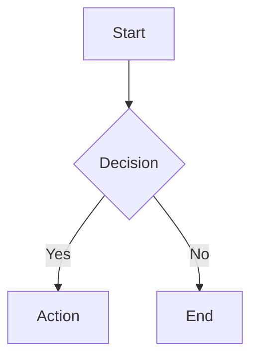

# Contributing to KOSMOS Documentation

Thank you for your interest in contributing to the KOSMOS Living Constitution documentation. This document provides guidelines and instructions for contributing.

## Table of Contents

- [Code of Conduct](#code-of-conduct)
- [Getting Started](#getting-started)
- [Development Environment](#development-environment)
- [Documentation Standards](#documentation-standards)
- [Submitting Changes](#submitting-changes)
- [Review Process](#review-process)

---

## Code of Conduct

All contributors are expected to adhere to professional conduct standards. Be respectful, constructive, and collaborative in all interactions.

---

## Getting Started

### Prerequisites

Before contributing, ensure you have:

- Git 2.30+ installed
- Python 3.10+ installed
- Node.js 18+ (for MCP server testing)
- Docker Desktop (for local services)
- A GitHub account with repository access

### Repository Structure

```
kosmos-docs-main/
├── docs/                    # Documentation source files
│   ├── 01-governance/       # Volume I: Governance
│   ├── 02-architecture/     # Volume II: Architecture
│   │   ├── adr/            # Architecture Decision Records
│   │   ├── agents/         # Agent specifications
│   │   └── c4-diagrams/    # C4 model diagrams
│   ├── 03-engineering/      # Volume III: Engineering
│   ├── 04-operations/       # Volume IV: Operations
│   ├── 05-human-factors/    # Volume V: Human Factors
│   ├── appendices/          # Glossary and templates
│   └── developer-guide/     # Developer documentation
├── schemas/                 # JSON schemas for validation
├── scripts/                 # Automation scripts
├── aibom/                   # AI Bill of Materials
└── mkdocs.yml              # Documentation site configuration
```

---

## Development Environment

### Local Setup

1. **Clone the repository:**

   ```bash
   git clone https://github.com/Nuvanta-Holding/kosmos-docs.git
   cd kosmos-docs
   ```

2. **Create virtual environment:**
   ```bash
   python -m venv venv
   source venv/bin/activate  # Linux/macOS
   # or: .\venv\Scripts\activate  # Windows
   ```

3. **Install dependencies:**
   ```bash
   pip install -r requirements.txt
   ```

4. **Run local documentation server:**
   ```bash
   mkdocs serve
   ```
   
   Access documentation at `http://localhost:8000`

### Validation

Before submitting changes, run validation:

```bash
# Validate all schemas and structure
python scripts/validate_all.py

# Check YAML files
python scripts/check_yaml_files.py

# Validate volume completeness
python scripts/validate_volume.py
```

---

## Documentation Standards

### File Naming

- Use lowercase with hyphens: `my-document-name.md`
- ADRs: `ADR-NNN-short-title.md`
- Model Cards: `MC-NNN-model-name.md`

### Document Structure

Every document should include:

1. **Title** (H1)
2. **Metadata header** (document type, owner, status, dates)
3. **Purpose section** (what and why)
4. **Main content** (organized with H2/H3)
5. **References** (if applicable)
6. **Document control** (version history)

### Frontmatter Template

```markdown
# Document Title

**Document Type:** [Type]  
**Owner:** [Team/Person]  
**Reviewers:** [List]  
**Review Cadence:** [Frequency]  
**Last Updated:** YYYY-MM-DD  
**Status:** 🟢 Active | 🟡 Draft | 🔴 Deprecated

---

## Purpose

[Document purpose statement]
```

### Markdown Guidelines

**Do:**
- Use ATX-style headers (`#`, `##`, `###`)
- Include alt text for images
- Use fenced code blocks with language identifiers
- Add blank lines before and after lists
- Use tables for structured data

**Don't:**
- Skip header levels (H1 → H3)
- Use HTML unless absolutely necessary
- Leave broken links
- Commit files with trailing whitespace


### Mermaid Diagrams

Use Mermaid for diagrams when possible:

```markdown

```

### Code Examples

Always specify language for syntax highlighting:

```markdown
```python
def example():
    return "Hello, KOSMOS"
```
```

---

## Submitting Changes

### Branch Naming

Use descriptive branch names:

| Type | Format | Example |
|------|--------|---------|
| Feature | `feature/description` | `feature/add-agent-docs` |
| Fix | `fix/description` | `fix/broken-links` |
| ADR | `adr/number-title` | `adr/011-rag-architecture` |
| Update | `update/description` | `update/deployment-guide` |

### Commit Messages

Follow conventional commits:

```text
<type>(<scope>): <description>

[optional body]

[optional footer]
```

**Types:**
- `docs`: Documentation changes
- `feat`: New documentation feature
- `fix`: Bug fixes (broken links, typos)
- `refactor`: Restructuring without content change
- `chore`: Maintenance tasks

**Examples:**
```
docs(agents): add Zeus orchestrator specification

feat(adr): add ADR-010 for MCP adoption

fix(nav): correct broken link to deployment guide
```

### Pull Request Process

1. **Create a feature branch** from `main`
2. **Make your changes** following documentation standards
3. **Run validation** locally
4. **Commit changes** with descriptive messages
5. **Push branch** to remote
6. **Open Pull Request** with:
   - Clear title describing the change
   - Description of what and why
   - Link to related issues (if any)
   - Checklist of completed items

### PR Template

```markdown
## Description
[What does this PR do?]

## Type of Change
- [ ] New documentation
- [ ] Update existing documentation
- [ ] Fix (broken links, typos)
- [ ] ADR
- [ ] Other (describe)

## Checklist
- [ ] Followed documentation standards
- [ ] Ran validation scripts successfully
- [ ] Updated mkdocs.yml navigation (if needed)
- [ ] Verified links work correctly
- [ ] Added to CHANGELOG.md

## Related Issues
Closes #[issue number]
```


---

## Review Process

### Review Criteria

PRs are reviewed for:

1. **Accuracy** - Technical correctness
2. **Completeness** - All required sections present
3. **Consistency** - Follows established patterns
4. **Clarity** - Easy to understand
5. **Standards** - Adheres to documentation standards

### Approval Requirements

| Change Type | Required Approvals |
|-------------|-------------------|
| Typo/formatting fix | 1 reviewer |
| Content update | 1 domain expert |
| New documentation | 2 reviewers |
| ADR | Architecture Review Board |
| Security documentation | Security Lead |

### Response Time SLAs

| Priority | Initial Response | Review Complete |
|----------|-----------------|-----------------|
| Critical | 4 hours | 1 business day |
| High | 1 business day | 3 business days |
| Normal | 2 business days | 5 business days |
| Low | 1 week | 2 weeks |

---

## Special Documentation Types

### Architecture Decision Records (ADRs)

1. Copy template from `docs/02-architecture/adr/template.md`
2. Assign next sequential number (check existing ADRs)
3. Complete all required sections
4. Submit for Architecture Review Board approval
5. Update ADR index in `mkdocs.yml`

### Agent Documentation

1. Copy template from `docs/02-architecture/agents/template.md`
2. Complete all sections following Zeus as example
3. Ensure inter-agent communication documented
4. Update agents index

### Model Cards

1. Copy template from `docs/03-engineering/model-cards/template.md`
2. Fill in all required fields
3. Include performance metrics
4. Document known limitations and biases

---

## Getting Help

- **Questions:** Open a GitHub Discussion
- **Bug Reports:** Use the bug report issue template
- **Feature Requests:** Open an issue with `[Feature Request]` prefix
- **Security Issues:** Email security@nuvanta-holding.com (do not open public issues)

---

## Recognition

Contributors are recognized in:
- Release notes
- Documentation credits
- Annual contributor acknowledgments

Thank you for contributing to KOSMOS!

---

**Last Updated:** 2025-12-13  
**Document Owner:** Documentation Team  
**Next Review:** 2026-03-13
