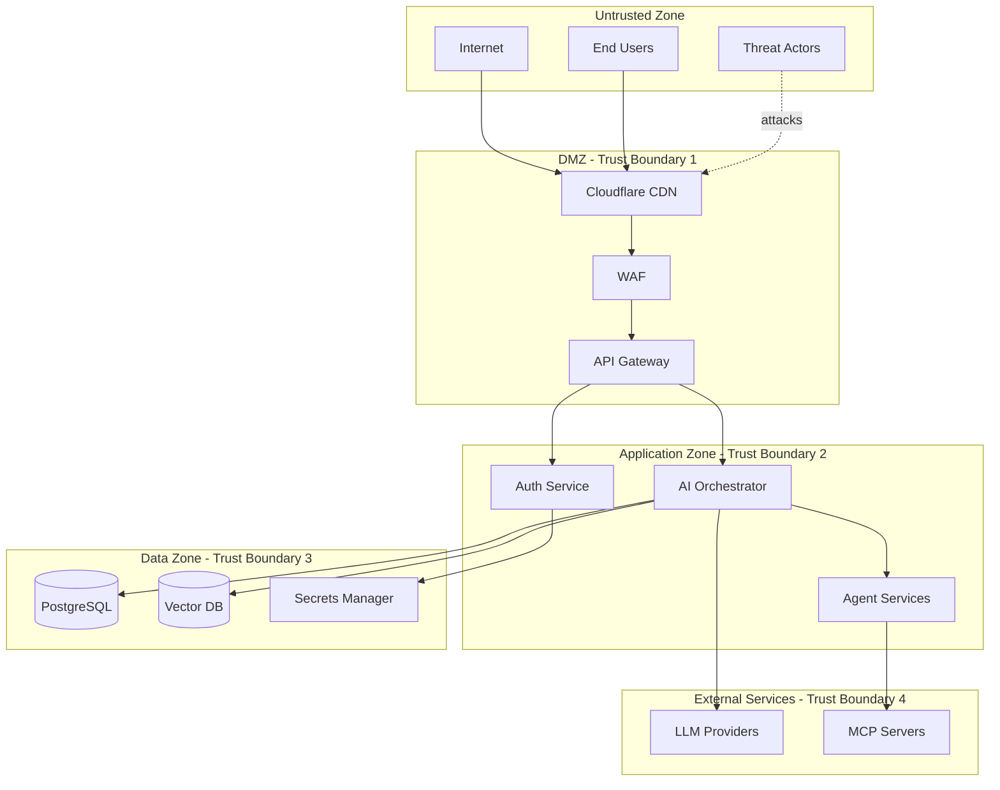

# KOSMOS Threat Model

**Document Type:** Security Analysis  
**Owner:** Security Lead  
**Reviewers:** CISO, Architecture Review Board, Engineering Leadership  
**Review Cadence:** Quarterly  
**Last Updated:** 2025-12-13  
**Status:** 🟢 Active  
**Classification:** Internal Use Only

---

## Executive Summary

This threat model identifies and analyzes security threats to the KOSMOS AI Operating System using the STRIDE methodology. It documents trust boundaries, threat actors, attack vectors, and mitigation strategies to inform security architecture decisions and operational procedures.

---

## Scope

### In Scope

- KOSMOS multi-agent orchestration system
- LLM integration points (HuggingFace, OpenAI, Anthropic)
- Data persistence layers (PostgreSQL, Vector DB, Object Storage)
- API Gateway and authentication services
- MCP server integrations
- Administrative interfaces

### Out of Scope

- Third-party LLM provider internal security
- Cloud provider infrastructure security (covered by shared responsibility)
- Physical security of data centers
- End-user device security

---

## System Assets

### Critical Assets

| Asset | Classification | Impact if Compromised |
|-------|---------------|----------------------|
| User credentials | Confidential | Identity theft, unauthorized access |
| Conversation data | Confidential | Privacy violation, data breach |
| System prompts | Internal | Prompt injection, behavior manipulation |
| API keys | Secret | Service abuse, financial impact |
| LLM model weights | Confidential | IP theft, competitive disadvantage |
| Vector embeddings | Internal | Knowledge extraction |

### Important Assets

| Asset | Classification | Impact if Compromised |
|-------|---------------|----------------------|
| Agent configurations | Internal | Service disruption |
| Operational metrics | Internal | Intelligence gathering |
| Audit logs | Internal | Forensic capability loss |
| Backup data | Confidential | Data breach |

---

## Trust Boundaries

---

## Threat Actors

### Actor Profiles

| Actor | Motivation | Capability | Likelihood |
|-------|------------|------------|------------|
| **Script Kiddies** | Curiosity, notoriety | Low | High |
| **Hacktivists** | Ideological | Medium | Medium |
| **Organized Crime** | Financial gain | High | Medium |
| **Competitors** | IP theft, disruption | Medium | Low |
| **Malicious Insiders** | Revenge, financial | High (access) | Low |
| **Nation-State** | Espionage, disruption | Very High | Low |

### Attacker Goals

1. **Data Exfiltration** - Steal user data, conversations, system prompts
2. **Service Disruption** - DDoS, resource exhaustion
3. **Model Manipulation** - Prompt injection, jailbreaking
4. **Financial Fraud** - Credit abuse, token theft
5. **Reputation Damage** - Generate harmful content

---

## STRIDE Analysis

### Spoofing Identity

| Threat ID | Threat | Target | Risk | Mitigation |
|-----------|--------|--------|------|------------|
| S-001 | Session hijacking | User sessions | High | Short-lived JWTs, refresh token rotation |
| S-002 | API key theft | Service accounts | High | Key rotation, scoping, monitoring |
| S-003 | Credential stuffing | User accounts | Medium | MFA, rate limiting, breach detection |
| S-004 | Token forgery | JWT tokens | Medium | Strong signing keys, short expiry |

### Tampering with Data

| Threat ID | Threat | Target | Risk | Mitigation |
|-----------|--------|--------|------|------------|
| T-001 | Prompt injection | LLM inputs | Critical | Input validation, guardrails |
| T-002 | Data modification | Database records | High | Audit logging, integrity checks |
| T-003 | Model poisoning | Training data | High | Data validation, provenance tracking |
| T-004 | Configuration tampering | Agent configs | Medium | Version control, approval workflow |

### Repudiation

| Threat ID | Threat | Target | Risk | Mitigation |
|-----------|--------|--------|------|------------|
| R-001 | Action denial | User actions | Medium | Comprehensive audit logging |
| R-002 | Log tampering | Audit logs | High | Immutable logging, log signing |
| R-003 | Transaction disputes | Billing events | Medium | Transaction logs, receipts |

### Information Disclosure

| Threat ID | Threat | Target | Risk | Mitigation |
|-----------|--------|--------|------|------------|
| I-001 | Conversation leakage | User data | Critical | Encryption, access controls |
| I-002 | System prompt extraction | AI prompts | High | Prompt protection, guardrails |
| I-003 | API key exposure | Credentials | Critical | Secret management, scanning |
| I-004 | Error message leakage | System info | Medium | Error handling, message sanitization |
| I-005 | Vector embedding extraction | Knowledge base | Medium | Access controls, rate limiting |

### Denial of Service

| Threat ID | Threat | Target | Risk | Mitigation |
|-----------|--------|--------|------|------------|
| D-001 | Network DDoS | API endpoints | High | CDN, rate limiting, WAF |
| D-002 | Resource exhaustion | LLM calls | High | Quotas, circuit breakers |
| D-003 | Agent loops | Orchestrator | Medium | Loop detection, timeouts |
| D-004 | Database overload | PostgreSQL | Medium | Connection pooling, query limits |

### Elevation of Privilege

| Threat ID | Threat | Target | Risk | Mitigation |
|-----------|--------|--------|------|------------|
| E-001 | Role escalation | User permissions | High | RBAC, privilege auditing |
| E-002 | Agent privilege abuse | Agent actions | High | Least privilege, sandboxing |
| E-003 | Admin account compromise | System access | Critical | MFA, privileged access management |
| E-004 | Container escape | Infrastructure | High | Security contexts, Pod security |

---

## AI-Specific Threats

### Prompt Injection Attacks

| Attack Type | Description | Severity | Mitigation |
|-------------|-------------|----------|------------|
| Direct injection | Malicious prompts in user input | Critical | Input validation, guardrails |
| Indirect injection | Malicious content in retrieved documents | Critical | Content scanning, sandboxing |
| Jailbreaking | Bypassing safety guardrails | High | Multi-layer guardrails, monitoring |
| Role confusion | Manipulating agent identity | High | System prompt protection |

### Data Leakage via LLM

| Vector | Description | Severity | Mitigation |
|--------|-------------|----------|------------|
| Training data extraction | Extract memorized data | High | Model selection, output filtering |
| Context window leakage | Access other users' context | Critical | Strict context isolation |
| System prompt exposure | Reveal operational prompts | Medium | Prompt protection patterns |

### Model Manipulation

| Attack | Description | Severity | Mitigation |
|--------|-------------|----------|------------|
| Model poisoning | Corrupt training/fine-tuning data | High | Data validation, provenance |
| Adversarial inputs | Inputs designed to cause errors | Medium | Input normalization, testing |
| Resource exhaustion | Expensive queries to drain credits | High | Cost limits, query analysis |

---

## Risk Matrix

### Likelihood vs Impact

|  | Low Impact | Medium Impact | High Impact | Critical Impact |
|--|------------|---------------|-------------|-----------------|
| **Very Likely** | Low | Medium | High | Critical |
| **Likely** | Low | Medium | High | Critical |
| **Possible** | Low | Low | Medium | High |
| **Unlikely** | Low | Low | Medium | High |
| **Rare** | Low | Low | Low | Medium |

### Risk Register Summary

| Risk ID | Threat | Current Risk | Target Risk | Owner |
|---------|--------|--------------|-------------|-------|
| R-HIGH-001 | Prompt injection | High | Medium | Security |
| R-HIGH-002 | Data breach | High | Low | Security |
| R-HIGH-003 | Service disruption | Medium | Low | Operations |
| R-MED-001 | Credential theft | Medium | Low | Security |
| R-MED-002 | Insider threat | Medium | Low | Security |

---

## Mitigation Priorities

### Immediate (P0)

1. Implement comprehensive prompt injection defenses
2. Enable MFA for all administrative access
3. Deploy WAF with AI-specific rules
4. Implement audit logging across all services

### Short-term (P1 - 30 days)

1. Complete penetration testing
2. Implement secrets rotation automation
3. Deploy SIEM with AI threat detection
4. Complete security training for all engineers

### Medium-term (P2 - 90 days)

1. Achieve SOC 2 Type II certification
2. Implement zero-trust network architecture
3. Deploy continuous security monitoring
4. Complete disaster recovery testing

---

## Review and Updates

### Review Triggers

- Major architecture changes
- New threat intelligence
- Security incidents
- Quarterly review cycle
- Compliance audit findings

### Version History

| Version | Date | Author | Changes |
|---------|------|--------|---------|
| 1.0 | 2025-12-13 | Security Team | Initial threat model |

---

**Classification:** Internal Use Only  
**Next Review:** 2026-03-13  
**Document Owner:** Security Lead  
**Approval Required From:** CISO
